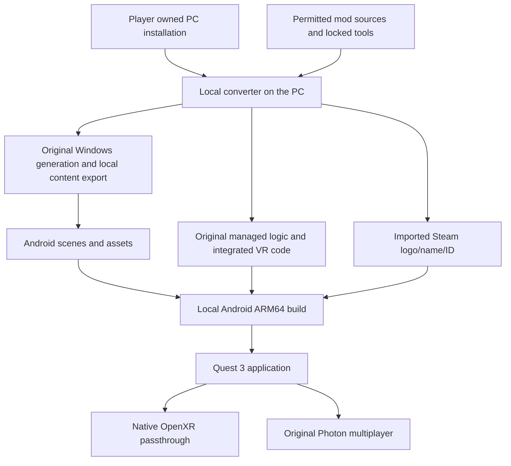

# Quest 3 standalone port plan

This plan describes a future Android ARM64 port of Gloomhaven Digital and
GloomhavenVR. Players build their own APK on a PC from their legally acquired
game installation. The first scope is the base game campaign, with official
scenario DLCs as an optional extension. The local builder embeds the original
Steam logo/name/ID; Quest supplies native passthrough. The original gameplay
and existing VR experience remain the reference.

**Status: planning only, 2026-10-02.** The maintainer explicitly deferred
implementation until the game is running satisfactorily standalone on Steam
Frame. This document authorizes no implementation, SDK installation, Android
project generation, game export, service registration, account configuration or
APK publication now. Resume implementation only on the maintainer's subsequent
instruction after that milestone. All milestones below are future work.

**Profile/service decision revised on 2026-10-02:** embed Steam logo, name
and ID during the local build. Exclude cloud and other store services on Quest.
Required EOS multiplayer operations are explicitly allowed by the maintainer's
2026-10-02 clarification; cloud, profiles and storefront features stay excluded.
Registered Meta apps and Horizon services remain permanently excluded.
Personalization and basic source-install checks provide a
small sharing hurdle; the open-source builder is not intended to enforce DRM.
Do not add device binding, an ownership server or a registered profile helper.
This supersedes the initial Quest-account API and later personal-avatar/cloud
service options. The imported ID is not a live authentication credential.

Concrete solution paths, bounded feasibility experiments and fallback decisions
are recorded in [Quest 3 critical solution paths](QUEST3-CRITICAL-SOLUTIONS.md).
Those experiments are future work, subject to the same Frame prerequisite.
The [preflight and builder maintenance assessment](QUEST3-PREFLIGHT-AND-BUILDER.md)
adds explicit stop conditions and the requirement to keep ordinary mod changes
automatically consumable by the builder.

The inspected baseline is `dev` at `a182d057aedf`, with runtime ModBuild 605.
Other agents are working on `dev`; this is a dated source assessment rather
than a claim that the branch remains at that commit. Recheck the current source,
build notes, project instructions and hardware evidence when implementation
starts. The maintenance/blocker follow-up uses ModBuild 606 at `f400f30c`,
without replacing the original dated content assessment. This planning change
does not increment ModBuild or alter game data.

## Maintainer requirements

The following requirements come from this conversation, including the final
scope and platform clarifications on 2026-10-02.

| Area | Required behavior |
| --- | --- |
| Timing | Finish the Steam Frame effort first. Do not start the Quest implementation now. |
| Device | Run locally on Quest 3 as an Android ARM64 application, without a PC required during ordinary play. |
| Distribution | Distribute the converter and permitted mod/tool components. Read the player's acquired PC installation and build their APK locally. Do not distribute an APK containing the original game or its exported content. |
| Campaign | Include the base game campaign. Preserve its rules, progression, saves, tutorials, map, town services and existing VR interactions. |
| DLCs | Plan optional support for Jaws of the Lion and Solo Scenarios when the player owns the necessary content. Establish base game feasibility first. |
| Guildmaster | Exclude Guildmaster. Its Quest menu entries remain visible, grey and non-activatable, with an explanatory hover tooltip. |
| Workshop | Exclude Steam Workshop. Its Quest entries remain visible, grey and non-activatable, with an explanatory hover tooltip. |
| Profile | Embed the Steam logo, original PC Steam display name and stable full ID during the local build. Use the existing PC client or verified account data; no personal-avatar lookup or live Steam login on Quest. |
| Horizon services | Never register a Meta app or depend on Horizon account, entitlement or social services. Use native OpenXR passthrough independently of these services. |
| Sharing hurdle | Personalize the locally built APK and check the source installation and available ownership/DLC information. Deliberately avoid DRM, device binding and a new ownership server; the open-source builder can be modified. |
| Mixed reality | Use native Quest passthrough rather than a green chroma-key background. Preserve the existing MR content, controls and layout. |
| Multiplayer | Preserve shared play with compatible PC, Steam Frame and supported original crossplay clients, with or without GloomhavenVR. |
| Saves | Preserve local campaign save compatibility and explicit PC import/export. No cloud synchronization, provider cloud API or PC cloud bridge. |
| Store services | Exclude Valve/Epic/GOG account/store services on Quest. Keep original Photon gameplay/voice; allow EOS authentication/session operations only if required for original multiplayer, as explicitly approved on 2026-10-02. |
| Builder maintenance | Use the normal current mod source/behavior and generate integration/resource manifests. Ordinary supported mod changes must not require handwritten Quest counterparts or per-build builder edits. |
| Other behavior | Preserve the existing game and VR feature set except for the explicitly requested platform substitutions and scope exclusions. Do not silently remove features or approve new visual compromises. |
| Integration | Commit and push only to `dev`. Preserve other agents' work and never force-push or use stash. |

Excluding Workshop also excludes its download, publishing, ruleset subscription
and external mod support. No new standalone scenario editor or custom scenario
support is part of this campaign port. This does not authorize indiscriminate
removal of shared editor classes, tutorial loaders, mod settings or menu entries
that the campaign still needs.

## Evidence and limits

### Scenario content

Read-only inspection of the installed ruleset archives produced these counts:

| Installed package | Authored scenario files | Variable scenario templates |
| --- | ---: | ---: |
| `Campaign.ruleset` | 95 `.lvldat` files | 0 `Scenario/*.yml` files |
| `DLC_JoTL_Campaign.ruleset` | 25 `.lvldat` files | 0 `Scenario/*.yml` files |
| `DLC_Solo_Campaign.ruleset` | 17 `.lvldat` files | 0 `Scenario/*.yml` files |
| `Guildmaster.ruleset` | 19 `.lvldat` files | 157 `Scenario/*.yml` files |

The corresponding assets are under
`ressources/GH_Data/StreamingAssets/Rulebase/`. The campaign and the two DLCs
provide up to 137 authored scenarios. This bounds the scenario definitions;
it does **not** prove that there are only 137 possible generated environments.

`CMapScenarioState.CreateNewScenario` selects variable rooms for the YML path.
The authored path loads `CCustomLevelData`, which can still set
`RandomiseOnLoad`. `ProceduralStyle.WriteStyleParameters` passes scenario,
room and object seeds to Apparance. Cosmetic variants, party-dependent content,
door context and scripted changes need a separate inventory before claiming
that all visual results can be baked in advance.

### Runtime and platform dependencies

The original is Unity 2021.3.5f1 Mono; the desktop mod targets `net472` and uses
BepInEx 5 and HarmonyX. Its shipped asset pipeline uses Unity 2021.3.5f1.
The asset project's current package manifest declares OpenXR 1.13.0. Older
planning notes mentioning OpenXR 1.10 are not an authoritative package lock.

The installed Apparance native library is Windows x64. Its managed wrappers do
not supply an Android ARM64 engine. Precomputing output on the player's PC is
the proposed way to remove this runtime dependency. No complete export and
replacement lifecycle have yet been demonstrated.

The original multiplayer uses Photon Bolt and session codes. The VR mod carries
additional presentation messages over original side actions. The inspected
`EventDispatcher.Global_Others` in the installed `bolt.dll` queues an event on
connections other than its source before invoking local handlers. That is
source evidence for relay through an unmodified host, not a completed Quest
or console interoperability test. Photon documents Android and IL2CPP support,
but the installed versions still need device validation. [Photon SDK history][photon-sdk]

The Steam build's `PlatformUserData.IsSignedIn`, user identifiers and DLC checks
depend on Steamworks. Replacing profile presentation alone will not replace
all these dependencies. The original connection token carries a name and
platform identifiers, but no profile image or image URL. Its Steam avatar
service uses a default image for non-Steam players. Do not assume that an
unmodified PC or console can display an embedded image merely because Quest
has a local copy. Genuine imported Steam IDs may permit the original Steam
avatar lookup if their original provider fields remain compatible; prove that
mapping rather than inventing a Steam identity.

### Hardware evidence

The initial Frame605 analysis records a frame-weighted mean of 52.67 ms at
3408 by 3408 per eye with MultiPass. See
[the Frame605 hardware report](../docs/performance/FRAME-605-ANALYSIS.md).
The newer [Frame606 report](../docs/performance/FRAME-606-ANALYSIS.md) records
the maintainer's smoother, nearly playable observation and substantial figure
bank storage. It does not establish an isolated before/after frame-time gain,
Quest compatibility or final standalone acceptance.

A successful Steam Frame run will be the maintainer's prerequisite for starting
the port. It will establish useful optimization evidence, not a Quest frame
rate prediction: the processor, GPU, operating system, graphics API, translation
overhead, memory budget and XR compositor differ.

## Proposed architecture

Keep the desktop mod's behavior as the common implementation where practical.
Introduce explicit target-specific boundaries rather than replacing shared
gameplay or presentation code with a separate reduced experience.

The diagram is a proposed dependency flow, not an existing converter. The
Windows game player cannot be renamed into an APK. The local builder must
produce a real Android Unity player and usable Android content.

| Boundary | Desktop and Steam Frame | Quest target |
| --- | --- | --- |
| Platform identity | Existing platform service | Embedded Steam logo/name/ID, separate from Quest device capabilities |
| Ownership and DLC availability | Existing platform checks | Basic PC source-install checks and imported owned/available DLC manifest |
| XR startup | Existing desktop bootstrap | Build-configured Android OpenXR startup and one XR session |
| MR background | Existing chroma-key backend | Native passthrough composition with transparent application background |
| Procedural presentation | Existing Apparance runtime | Exported presentation assets and compatible lifecycle adapter |
| Mod integration | BepInEx and HarmonyX runtime integration | AOT-compatible integration established during the local build |
| Gameplay and multiplayer | Original rules and network implementation | Preserve original logic, protocol and identifiers |
| Feature availability | Existing desktop availability | Campaign enabled; Guildmaster and Workshop disabled with hover explanations |

These are proposed seams, not committed class names. Choose actual ownership
and interfaces after auditing the current source. Keep desktop initialization
and configuration contracts intact. Existing persisted keys must not be removed
or reinterpreted globally just because the Quest backend differs.

## Early feasibility decisions

Resolve these questions before spending time exporting every scenario.

1. **Local Steam identity.** Capture the owned PC account's name/full ID and
   use a static Steam logo without credentials or personal-avatar services.
   Generic game assets do not reliably contain the active account's name.
   Original multiplayer acceptance without store services remains separate.
2. **Unity and XR compatibility.** Pin an Android ARM64/IL2CPP editor, OpenXR
   and passthrough integration that can run the game's assemblies and assets.
   Start with the original editor family and a focused OpenXR feature. No Meta
   Platform SDK is required. Do not migrate the engine merely to install the
   newest Meta package. Unity's Android ARM64 path requires IL2CPP; desktop
   Mono/BepInEx compatibility is not the target backend. [ARM64 backend][unity-arm64]
3. **Original backend acceptance.** Prove that the Android client can reach
   the game's existing Photon sessions using legitimate client configuration.
   The embedded profile does not replace the publisher's Photon application
   or any required backend authentication. Audit EOS necessity and prove an
   accepted Android authentication route if required; the maintainer permits
   that narrow multiplayer dependency, not unrelated services.
4. **Android content reconstruction.** Prove a usable original scene and its
   required assets, including materials and scripts, on the real headset.
   Decompilable C# is not an exported Unity project.
5. **Complete Apparance replacement.** Prove generated output extraction and
   room/prop readiness without the Windows library. Determine whether visual
   variants can be represented by reusable baked components while keeping
   original seeds and semantics.
6. **Maintenance feasibility.** Prove generated patches/helper bindings and a
   normal N -> N+1 mod change without builder edits. A per-patch manual Quest
   fork fails the requested development workflow.

The selected XR/native SDK requirements still need device evidence. Meta's
off-platform distribution policy does not provide general Horizon service
access for sideloaded apps; the revised design removes that dependency instead
of seeking app registration. [Distribution options][meta-distribution]

If an early decision fails, record the blocking fact and alternatives. Do not
substitute a fake Steam identity, silently drop the imported profile requirement,
change the distribution model, require a permanent PC companion or claim the
port is complete. Any resulting scope change belongs to a later maintainer
decision, after concrete findings are available.

## Local conversion and build pipeline

The future converter should implement distinct, resumable stages:

1. Locate the player's installation and determine its actual game build,
   managed assemblies and installed/owned DLCs. Inspect official source
   content only; ignore Workshop subscriptions and modded rulesets.
2. Record input hashes and a supported-version manifest. Reject unsupported
   input combinations with an actionable explanation instead of producing a
   nominally compatible APK. Preserve the original installation, saves,
   settings and Steam Cloud data.
3. Check the source installation and available legitimate PC ownership/DLC
   information, and capture the associated profile. Presence of copied files
   or a name alone is not proof of purchase. Keep these checks proportionate to
   the requested small sharing hurdle; do not design a DRM or Horizon entitlement
   system. Never transfer PC session tickets or launcher credentials to Quest.
4. Run the necessary original Windows generation in an isolated local
   workspace. Choose between driving the owned player and a reconstructed
   export host only after proving the real native dependency and asset path.
   Do not assume Unity batch mode can automatically load the shipped game.
5. Export complete presentation assets and their provenance, readiness data
   and dependencies. Inventory original menus, campaign map, town, tutorials,
   scenario rooms, doors and props; baking only dungeon floors is insufficient.
6. Reconstruct Android scenes, prefabs, materials, shader variants, fonts,
   textures, animation, audio, video and Addressables. Windows AssetBundles
   and D3D shader binaries are not the finished Android payload.
7. Integrate original managed logic and the VR mod for the selected scripting
   backend. Preserve assembly/type identities needed by serialization and
   reflection. Prefer importing suitable original assemblies into the build
   over recompiling every decompiled source file without a demonstrated need.
8. Produce Android ARM64 assets and the Unity player using locked tools and
   matching SDK/NDK/JDK versions. Preserve a build manifest identifying input
   game version, converter version, mod compatibility, editor and package lock.
9. Embed the profile and source/DLC manifest, sign locally and provide
   install/update instructions. Use a persistent per-player signing keystore.
   Never distribute a maintainer signing secret. Keep package identity and
   update signing stable so updates do not erase the player's saves.

Cache reusable export/build stages by their complete inputs. A changed game
build, shader backend, scene schema or generator setting must invalidate the
affected cache. Interrupted exports must not be mistaken for successful output.
Detect temporary storage needs before starting and retain useful failure logs.

The public deliverable is the converter, permitted mod components and clear
instructions. Game assemblies, original assets, exported game content and
finished game APKs stay local. Audit redistribution conditions for Unity,
Meta, Photon and any extraction tools before packaging dependencies. Do not
promise that a free compiler or middleware redistribution path is already
established.

## Replacing Apparance at runtime

Capture the engine's output as Unity presentation data, not a single flattened
level image or mesh. Preserve room and object boundaries, transforms,
materials, colliders, animations, effects and identifiers used by the game.

The runtime adapter must reproduce the observable placement lifecycle:
creation starts, content becomes available, completion callbacks run, visibility
changes, and teardown releases the right objects. Review `ProceduralBase`,
`ProceduralMapTile`, `ProceduralWall`, `ProceduralDoorway`, `ProceduralProp`,
`ProceduralStyle`, room visibility and placement loading. Door opening, room
reveal and reload must continue without native generation or a stuck loader.

Build a coverage manifest for:

- All 95 base campaign definitions, then the 25 and 17 optional DLC definitions.
- Required tutorials and shared content, including authored tutorial data
  stored in packages associated with Guildmaster. Excluding the mode does not
  justify deleting every resource whose name contains Guildmaster.
- Party sizes, scenario-specific events, spawned/destroyed objects, saved
  intermediate states, door states and relevant geometry/style combinations.
- Cosmetic seeds, neighbouring-room joins, quality choices and native
  generated effects outside the dungeon scene.

Evaluate baking reusable geometry plus deterministic runtime assembly where
possible. It still requires evidence that the native output can be decomposed
without losing its appearance. Do not promise exhaustive precomputation of
all seed values. Baking one cosmetic seed is not an approved parity exception,
and changing the gameplay seed is not an acceptable export shortcut.

Validate one representative scenario first, including opening all rooms,
dynamic props and a reload after changes. Then exercise a scenario with unusual
scripted geometry. Only expand the full export after these lifecycle and
representation questions have passed.

Removing synthesis cost does not remove draw calls, geometry, shading, particles
or texture memory. Offline batching, mobile material equivalents and authored
detail variants are possible optimization work, but each must preserve
gameplay, picking and the maintainer's visual requirements. Do not treat the
existing Frame compromise settings as permission for additional Quest changes.

## Embedded Steam logo, name and ID

The converter captures the original PC Steam account's display name and full
Steam ID, together with consistent original account fields and build provenance.
Embed these as immutable build data and include a static Steam logo. The latest
maintainer decision replaces the personal-avatar requirement with this logo.
Generic game installation files are not reliable proof of the active account;
use the legitimate PC client context or an established local account record.

The Quest provider reads the resource before native menus start. Preserve the
full Steam ID separately from its 32-bit account number, session player IDs,
save ownership and voice association. A renamed account needs a refreshed local
APK build; a name change must not change the stable account association or key.

There are no Quest-side Steam/Epic/GOG profile requests, cloud saves, friends,
achievements, storefront invites, SteamKit or full native Steam client port.
No PC user login token, ticket, password or publisher server-side secret is
embedded. Original client service configuration remains a separate local input;
it does not authenticate the account. The identity is an offline snapshot of
the source account, not proof of a live Steam session. Additional storefront
import recipes are not required by the
first Steam input; compatible original Epic/GOG multiplayer peers remain in scope.

A shared APK retains its builder's name/ID. This is the requested small hurdle,
not DRM. Keep source/DLC checks proportionate, with no device binding, new
ownership server or Horizon registration.

Use real provider fields in the original multiplayer tokens only after checking
platform-icon, privilege, save-owner and duplicate-identity semantics. Unchanged
Steam peers may display the real account's avatar through their own PC client;
Quest does not call that service. Retain peer names/IDs and existing presentation
from the original/mod channel. Document unavailable unknown peer pictures;
the local-logo decision does not relax gameplay/card/UI parity.

EOS, if compulsory for the original multiplayer, is explicitly permitted by
the maintainer's 2026-10-02 clarification. This permits only necessary
authentication/session operations; it restores no cloud or storefront features.
Preserve Photon gameplay/voice and first prove session-code play through the local
platform adapter. A compulsory excluded authentication service is a scope
blocker, not permission to invent an authorized flag. The
[necessary EOS authentication path](QUEST3-CRITICAL-SOLUTIONS.md#necessary-eos-authentication-if-the-audit-requires-it)
starts with the original Account Portal/Auth -> Connect contract, if required.

## Native Quest mixed reality

Retain the existing MR toggle and all diorama, cards, UI, figures, town services,
interaction and layout. Substitute the local composition backend only. Keep
desktop and Frame chroma-key behavior available on their existing targets.

The proposed Quest backend uses a compositor passthrough layer behind the
application's virtual content, with the appropriate transparent application
background. A green clear color is not this backend. Select an SDK layer or
an OpenXR implementation of `XR_FB_passthrough` that works with the chosen
Unity player. Configure the Android feature flag and register required XR
extensions before creating the existing XR instance. Meta documents these
native prerequisites. [Native passthrough setup][meta-passthrough-native]

Integrate with the current rig and a single XR session. Meta's example camera
rig is an example of SDK usage, not authorization to replace this mod's rig,
create another tracking origin or start a second XR runtime. Maintain one
passthrough owner across scene changes and release it on XR shutdown.
[Unity passthrough lifecycle][meta-passthrough-unity]

The future implementation must:

1. Verify runtime capability and initialize the layer asynchronously. Change
   background ownership when it can display the requested MR result, avoiding
   a green flash or an opaque application frame covering the passthrough.
2. Preserve transparent clear alpha through the selected render path,
   postprocessing, MSAA, eye textures and composition. Check cards, particles,
   ghost figures and translucent UI in both eyes.
3. Reuse the existing sky/backdrop eligibility and approved MR rules. Backing
   geometry is permitted for UI only, never water, fog, unseen terrain or other
   scenery inside the play area. Preserve actual board content and effects.
4. Switch VR to MR and back with the existing controls. Restore camera state,
   sky/backdrops and layer ownership on disable, headset sleep/resume, scene
   changes and session shutdown. Report failures once with useful normal logs.
5. Keep the chroma-key setting persisted but irrelevant to Quest passthrough.
   Audit its Quest options presentation so it does not suggest that changing
   green/magenta/blue affects the native room view. Do not rename old keys.
6. Keep passthrough local to the viewer. Do not transmit camera imagery or
   modify multiplayer board poses, window authoring or other players' MR state.

Compositor passthrough does not imply access to raw camera frames. This scope
does not request camera capture, room scanning, depth occlusion, spatial anchors,
new colocation or replacement of the existing hand/controller presentation.
Use only the platform capabilities and permissions needed by the selected
composition path. On a passthrough failure, give an actionable explanation and
preserve a functioning VR view; do not silently call that successful MR support.

## Guildmaster and Workshop availability

Introduce a Quest-only availability decision shared by native menu presentation,
VR conversion and actual entry paths. It must not alter desktop availability.

Keep the requested entries in their original order and positions. Show native
disabled styling and keep their hover hit targets usable. A disabled action
must not disable the raycast/hover surface needed to explain it. Reuse the
existing tooltip style and timing for pointer hover, VR laser hover and any
equivalent supported controller/gaze focus. Test both flat captured menus and
world-space menus; do not add a tooltip mechanism that consumes ordinary clicks.

Proposed localized strings, to be introduced through `Core/Loc` only later:

| Entry | English tooltip | German tooltip |
| --- | --- | --- |
| Guildmaster | Guildmaster is not available in the Quest version. | Guildmaster ist in der Quest-Version nicht verfügbar. |
| Steam Workshop | Steam Workshop is not supported in the Quest version. | Steam Workshop wird in der Quest-Version nicht unterstützt. |

The tooltip explains a real Quest scope restriction. It must not make adjacent
campaign, DLC, multiplayer or VR Options entries grey, change their focus,
hide native dialogs, reorder the menu or steal their continuation callbacks.
Respect the existing independent VR Options toggle behavior.

Guard the corresponding activation callbacks, resume/continue paths, imported
saves, pending invites and multiplayer joins. In particular, reject a
Guildmaster `GameToken.GameModeID` before downloading/loading the incompatible
game state, with a Quest-local explanation. An unchanged host can offer a
Guildmaster code; the Quest client must fail cleanly without disrupting that
host. Workshop dependencies must not begin downloading during an unsupported
join. Test direct paths as well as the visible menu buttons.

Do not remove shared assets or classes by filename. Identify the actual
campaign dependency graph before omitting Guildmaster-only content from the
APK. Preserve common tutorials, NPCs, map widgets and town resources.

## Multiplayer compatibility

Retain the original Photon application and compatible Bolt protocol, generated
event/state definitions, protocol-token registration, session codes, rules and
save transfer. Preserve the original game network version; changing only its
reported value does not make divergent logic compatible. Photon configuration
also determines matchmaking and relay behavior. [Photon connection settings][photon-settings]

Maintain the existing split between gameplay and the mod's presentation
channel. The Quest build integrates the mod's receive/send seam during the
build instead of assuming desktop Harmony runtime patching will work on AOT.
Keep `GVR1`, wire Version 3, existing message layouts and existing TLV IDs.
Any new record must be additive and reviewed against golden vectors; the
static Steam logo does not require a new avatar record.

Compatible modded clients currently require the same ModBuild. Release a
coordinated desktop/Frame/Quest compatibility level; do not weaken this guard
merely to connect platforms. Preserve the existing explicit flat-net fallback,
where local VR continues but mod networking is disabled for that session.

The required future device matrix is:

| Host | Clients | Required evidence |
| --- | --- | --- |
| Unmodified PC | Quest | Join, name, assignments, actions, saves, reconnect and room reveal |
| PC or Frame with matching VR mod | Quest | Original play plus full VR presentation and control request behavior |
| Unmodified PC | Quest and another modded client | Original play plus client-to-client avatar/window/card relay through the host |
| Quest | Unmodified PC | Host authority, invitations, save ownership and reconnection |
| Quest | Quest and compatible modded PC | Full presentation parity and stable identity with multiple providers |
| Epic or GOG client/host | Quest | Actual installed-version interoperability and provider identity handling |
| Supported original console client/host | Quest | Crossplay privileges, protocol/version agreement and original presentation fallback |

Use the original game's supported crossplay combinations as the baseline;
do not promise every storefront/OS/console combination from one successful
Steam test. [Official crossplay support][game-crossplay]

Cover all supported party sizes, private selection/public action visibility,
short rest, long rest, damage sacrifice, held figures, town interactions,
events, reward continuation, late joins and disconnects. Preserve the current
owner-authored geometry, content, ordering, animation and privacy contracts.

Inspect voice separately: Photon Voice, microphone capture, Opus and audio
processing include native desktop components. Plan ARM64 equivalents and the
appropriate microphone lifecycle/permission, provider-qualified speaker mapping
and existing spatial voice behavior. A playable game channel does not prove
voice parity, and voice is not silently removed from the requested experience.

## Local saves and manual campaign transfer

Cloud integration is removed from the active scope. There is no direct provider
cloud client, SteamKit/OAuth path or PC cloud-synchronization bridge. Preserve
original PC files and any existing cloud settings without changing them.

Keep local Quest saves under Android's persistent data directory, preserving
original type identities, game version and owning-account fields. Campaign
files and their shared root/global metadata, checkpoints and backups need one
consistent transfer contract. Support an explicit local PC-to-Quest/return
operation using backups, complete idle snapshots, version/account/DLC checks
and conflicts against the last transferred state. Preserve unrelated campaigns
and Guildmaster records. A PC is needed only for the deliberate transfer.

See the [local save solution](QUEST3-CRITICAL-SOLUTIONS.md#local-campaign-saves-and-manual-transfer).
Prove a real original-PC save -> Quest progress -> original-PC continuation
round trip and an APK update that retains data. No service login or cloud
permission is required.

## Native and managed dependency audit

Before finalizing the editor and native integration, produce an inventory
of every managed assembly and native plugin, its call sites, required features
and Android replacement or removal rationale.

| Dependency | Proposed treatment or investigation |
| --- | --- |
| Apparance engine | Bake complete presentation and implement its observable lifecycle; Android engine remains a fallback investigation if baking cannot preserve the required behavior. |
| Steamworks and Galaxy desktop libraries | No headset store service implementation. Route local identity/readiness/files/DLC availability through the Quest adapter and prevent desktop startup/shutdown calls. |
| EOS Windows SDK | Audit actual startup/crossplay requirements. If required, use a compatible Android SDK and prove legitimate authentication accepted by the original backend under the approved narrow multiplayer exception. |
| Photon Bolt, Realtime and UdpKit | Preserve compatible versions and registrations; prove Android sockets, reflection metadata and managed/AOT behavior. |
| Photon Voice, Opus, WebRTC and AudioIn | Audit microphone, codecs, native libraries and spatial voice on ARM64. |
| OpenXR Windows plugins | Build Android OpenXR integration and passthrough features with one session. |
| BepInEx, Harmony and dynamic patch code | Generate prefix/postfix/finalizer/direct-registration and helper coverage; prove generic AOT integration and explicit handling of future unsupported patch patterns. |
| InControl and XInput native code | Retain working Quest input through the selected provider; preserve original game input contracts and tutorial transitions. |
| Burst and other compiled plugins | Rebuild from permitted sources where necessary or prove the original feature has a compatible alternative. |
| Video, capture and remaining plugins | Check startup/load requirements, original video presentation and Android media playback; do not remove an unclassified dependency. |

Audit `Reflection.Emit`, dynamic assembly loading, generic reflection, threading,
callback delegates, stripping and original binary serialization against the
selected IL2CPP toolchain. IL2CPP is the standard ARM64 route, not an already
validated conversion; desktop Mono support does not remove these AOT checks.

Keep network-generated IDs, script references and assembly/type identities
stable when reconstructing assets and integrating code. Addressables catalogue
reconstruction, shader translation and AOT preservation are distinct work
items; a successful C# compilation does not validate any of them.

The additional [preflight assessment](QUEST3-PREFLIGHT-AND-BUILDER.md) records
source-proven desktop assumptions and open feasibility gates, including dynamic
helper code, native startup guards, Android content paths, shared serialization,
new figure banks and coherent input snapshots. Full storefront SDK ports are
removed from the active target. Necessary EOS multiplayer use is approved;
its actual necessity and accepted Android authentication remain unresolved.

## Milestones and completion criteria

No duration estimate is committed before the early decisions are resolved.
Each phase produces a reviewable result with a recorded input version and an
explicit source, automated or headset evidence classification.

| Phase | Work and deliverable | Completion criterion |
| --- | --- | --- |
| 0 Steam Frame prerequisite | Continue the existing Frame project; capture matched hardware results and an accepted playable baseline. | The maintainer confirms the Frame milestone and subsequently requests Quest implementation. |
| 1 Platform and build feasibility | Dependency inventory, selected editor/IL2CPP/OpenXR lock, PC profile import, local signing, passthrough capability probe and original backend requirements. | A local ARM64 probe displays the imported profile offline and native passthrough, without Meta app registration or Horizon services. |
| 2 Minimal Android game | Reconstruct startup, one original scene, storage and required managed assemblies in a genuine ARM64 player. | Cold start, scene load, original UI, clean exit and persisted local save on Quest, without unsupported desktop libraries. |
| 3 Representative scenario and early network proof | Bake one complete campaign scenario and replace generation/readiness; preserve original game identifiers. Exercise one basic connection to an unmodified PC host. | All rooms, doors, changes and reload work; the session joins, assigns characters and executes several rounds without divergence. Do not export the full campaign before these findings. |
| 4 VR and mixed reality parity | Integrate existing rig, hands/controllers, cards, windows, input, native passthrough and profile surfaces. | Device screenshots/video and interaction checks demonstrate the existing behavior, correct imported identity and VR/MR transitions. |
| 5 Complete base campaign | Campaign/map/town/tutorial export coverage, progression, save/reload and Quest-only availability controls. | All base scenario definitions are covered by the manifest; representative special mechanics and ingress restrictions pass. Coverage listings alone do not prove every scenario's rendered outcome. |
| 6 Multiplayer and voice | Execute the mixed-platform matrix, profile handling, full VR presentation, hosting, reconnect and voice checks. | Required device sessions pass; source-proven relay is confirmed in a multi-client session and profile limitations are resolved or explicitly decided by the maintainer. |
| 7 Optional DLCs | Import and verify acquired Jaws of the Lion and Solo content, characters, items and mechanics. | DLC-enabled saves and sessions work only with the appropriate acquired content; no-DLC operation remains correct. |
| 8 Quest performance | Measure CPU/GPU frame times, memory, load spikes, passthrough cost and thermal stability; optimize within the required behavior. | The maintainer accepts sustained real Quest play at an agreed refresh rate and quality, including large scenarios, town and multiplayer. |
| 9 Player build and update workflow | Reproducible converter, dependency-aware caches, generated current-mod integration, local identity/signing, diagnostics and packaging audit. | A clean-PC user builds/updates their APK without save loss or a runtime PC; representative ordinary N -> N+1 mod changes need no builder edits. |

After the minimal Android game exists, perform the cheapest available original
backend test early; phase 3 is the latest intended point for a real game
interoperability proof. Phases 4 and 5 may expose additional bake requirements.
Phase 6 is the full matrix, not permission to defer all networking until then.
ARM64 runtime compatibility and generation lifecycle can stop the selected design
before later phases are worthwhile.

## Verification and performance

For future implementation, use focused worker checks, then the complete final
`dev` gate required by `AGENTS.md`, including `scripts/wire-tests.sh` and golden
vectors. Preserve desktop bundle checks and validation; new Android artifacts
need their own format, ABI, manifest and load checks. Use isolated worktrees
from the then-current `dev` with disjoint ownership when independent
implementation tasks are delegated. Only integrate and push `dev`.

Automated evidence must cover the actual boundaries being changed: original
serialization and registration compatibility, retained asset identity,
readiness and cancellation, feature ingress, hover on disabled entries,
local identity and generated helper handling, MR state restoration and
unchanged wire vectors.
Tests that merely duplicate a new adapter's own assumptions are insufficient.

Headset acceptance must include:

- Cold/warm start, tutorial hand/controller transitions, both hands, all card
  tasks, figure holding, table/window manipulation and existing input prompts.
- Both-eye rendering, text, UI opacity, particles, figures, door/room transitions,
  town interactions and the approved UI-only MR backings.
- Repeated VR/MR toggles, sleep/resume, tracking loss, scene changes and
  restoration after a passthrough error, with no green background on Quest.
- Embedded Steam logo/name/ID, offline start, deliberate account selection,
  name refresh, relaunch and stable save/session ownership; actual modded/flat
  peer behavior, with no Quest store or Horizon service requests.
- Guildmaster/Workshop disabled styling and tooltips with mouse-equivalent
  pointer, VR hover and relevant controller focus; all bypass routes rejected.
- Large scenarios, campaign map, town, all supported party sizes, voice and
  repeated multiplayer sessions under thermal steady state.

Agree a native refresh target before performance acceptance. A proposed initial
target is 72 application frames/s, corresponding to 13.89 ms per frame; it is
not a measured Quest outcome. Record real application CPU/GPU timings,
missed-frame counts, sustained frame distributions, memory and load hitches at
fixed eye resolution, render mode, settings and scene/view. Do not count
reprojection as proof of native frame rate.

Measure multiview/single-pass rendering and fixed foveation only with verified
material/UI compatibility. Quest 3 has no eye-tracked foveation input. Determine
the applicable application memory allowance from the target OS/runtime rather
than treating physical RAM as available to the game. Reserve measured headroom
for room reveal, static profile resources, multiplayer state, voice and passthrough.

Keep build/version and lifecycle/failure information at normal log level, with
bounded repetition. Detailed measurements stay at Debug with guards before
sampling/formatting, following the existing logging ruling. Store hardware
evidence in the main checkout's gitignored `.planning/debug/` and peer logs
in its `remote/` location. A green gate is not a headset image or FPS result.

## Open decisions and failure conditions

| Decision or risk | Required resolution |
| --- | --- |
| Original Steam identity import | Prove the selected account and full/32-bit field mapping; do not infer ownership or the active account from generic game assets. |
| Offline profile presentation | Local Steam logo is the requested substitution; verify real name/ID and unchanged peers' own presentation without any Quest store lookup. |
| Original multiplayer with only necessary EOS | Prove actual provider readiness/admission and any required EOS Android authentication; the narrow EOS exception is approved, but a static identity does not supply credentials. |
| Original Photon service acceptance | Verify original configuration and any authentication requirements on Android; an imported profile does not itself grant backend access. |
| Unity and SDK versions | Prove the selected matrix with real content; an engine upgrade is a separate technical decision, not implicit approval to rewrite visuals. |
| Complete procedural presentation replacement | Demonstrate extraction, seed/variant coverage and lifecycle; a room screenshot is insufficient. |
| Shared assets despite mode exclusion | Keep every campaign/tutorial dependency; strip only proven Guildmaster/Workshop-only content. |
| Serialization and AOT | Preserve actual types, layouts, callbacks and tokens across the Android player and original peers. |
| Campaign transfer and shared save metadata | Prove complete compatible campaign snapshots and PC round trips while preserving unrelated campaigns, Guildmaster records and recovery data. |
| Maintainable automatic mod conversion | Derive the full effective patch/helper/resource/config closure, reject unknown constructs precisely and prove ordinary N -> N+1 changes without a builder fork. |
| APK paths and converted figure-bank identity | Replace desktop assembly/file assumptions and preserve correct source-to-Android mesh associations, local rule hashes and save isolation. |
| Local ownership and DLC checks | Use proportionate source-install/provider checks and a local manifest. Accept that an open-source builder can be modified; no DRM infrastructure is requested. |
| Voice and other native features | Establish Android equivalents and behavior; no automatic feature deletion. |
| Update compatibility | Pin supported input game versions, coordinated mod releases, cache invalidation, stable signing and save migration. |
| Quest performance | Establish it on Quest hardware after the Frame prerequisite; do not project a Frame frame time onto Quest. |

The maintainer's requested substitutions are recorded decisions. SDK selection,
backend acceptance, bake completeness, signing, profile interoperability and
performance are unresolved engineering questions. Preserve that distinction
when resuming this plan; documentation is not a claim that an APK already runs.

## Source entry points

Relative repository paths below are read-only evidence or future audit targets,
not an instruction to edit them now. Recheck source symbols rather than relying
on historical line numbers.

| Area | Source entry points |
| --- | --- |
| Workflow and standing behavior | [AGENTS.md](../AGENTS.md), [CLAUDE.md](../CLAUDE.md), [STATE.md](STATE.md), [NetProtocol](../src/GloomhavenVR/Net/NetProtocol.cs) |
| Scenario selection and loading | [CMapScenarioState](../decompiled/MapRuleLibrary/MapRuleLibrary.MapState/CMapScenarioState.cs), [CCustomLevelData](../decompiled/ScenarioRuleLibrary/ScenarioRuleLibrary.CustomLevels/CCustomLevelData.cs), [CSRLYML](../decompiled/ScenarioRuleLibrary/CSRLYML.cs), [Choreographer](../decompiled/GH.Runtime/Choreographer.cs) |
| Procedural lifecycle and styles | [ProceduralBase](../decompiled/GH.Runtime/ProceduralBase.cs), [ProceduralMapTile](../decompiled/GH.Runtime/ProceduralMapTile.cs), [ProceduralStyle](../decompiled/GH.Runtime/ProceduralStyle.cs), [ApparanceDetailFocus](../src/GloomhavenVR/Core/Environment/ApparanceDetailFocus.cs) |
| Steam platform binding and avatars | [PlatformLayer](../decompiled/GH.Runtime/PlatformLayer.cs), [PlatformUserData](../decompiled/GH.Runtime/PlatformUserData.cs), [PlatformDLC](../decompiled/GH.Runtime/PlatformDLC.cs), [NetworkPlayer](../decompiled/GH.Runtime/FFSNet/NetworkPlayer.cs), [NetPlayerActors](../src/GloomhavenVR/Net/NetPlayerActors.cs) |
| Original network and DLC admission | [NetworkManager](../decompiled/GH.Runtime/FFSNet/NetworkManager.cs), [GHNetworkCallbacks](../decompiled/GH.Runtime/GHNetworkCallbacks.cs), [GHClientCallbacks](../decompiled/GH.Runtime/GHClientCallbacks.cs), [UserToken](../decompiled/GH.Runtime/FFSNet/UserToken.cs), [PlayerToken](../decompiled/GH.Runtime/FFSNet/PlayerToken.cs) |
| Save paths, metadata and asynchronous writing | [PathsManager](../decompiled/Utilities/PathsManager.cs), [PlatformFileSystem](../decompiled/GH.Runtime/PlatformFileSystem.cs), [RootSaveData](../decompiled/GH.Runtime/RootSaveData.cs), [SaveData](../decompiled/GH.Runtime/SaveData.cs), [SaveQueue](../decompiled/GH.Runtime/SaveQueue.cs) |
| Mod transport and compatibility | [FfsNetTransport](../src/GloomhavenVR/Net/FfsNetTransport.cs), [VersionGuard](../src/GloomhavenVR/Net/VersionGuard.cs), [NetSession](../src/GloomhavenVR/Net/NetSession.cs), [network invariants](refactor/INVARIANTS-Net-Rig.md) |
| XR and mixed reality | [OpenXRBootstrap](../src/GloomhavenVR/Core/Startup/OpenXRBootstrap.cs), [MixedReality](../src/GloomhavenVR/Core/MixedReality/MixedReality.cs), [asset package manifest](../unity/GloomhavenVR.Assets/Packages/manifest.json) |
| Menus and tutorials | [UIMainOptionsMenu](../decompiled/GH.Runtime/GLOOM.MainMenu/UIMainOptionsMenu.cs), [MainOptionMultiplayer](../decompiled/GH.Runtime/GLOOM.MainMenu/MainOptionMultiplayer.cs), [TutorialService](../decompiled/GH.Runtime/TutorialService.cs) |
| Build and hardware context | [build-bundles.sh](../scripts/build-bundles.sh), [Frame605 analysis](../docs/performance/FRAME-605-ANALYSIS.md), [Frame605 scenery work](STEAM-FRAME-SCENERY-605.md) |

External references were consulted on 2026-10-02. Recheck the chosen SDK's exact
versions, platform requirements and service behavior at implementation time.

[meta-distribution]: https://developers.meta.com/vr/policy/distribution-options/
[unity-arm64]: https://docs.unity3d.com/Packages/com.unity.xr.arcore@5.1/manual/project-configuration-arcore.html#target-architecture
[meta-passthrough-native]: https://developers.meta.com/vr/documentation/native/android/mobile-passthrough/
[meta-passthrough-unity]: https://developers.meta.com/vr/documentation/unity/unity-passthrough-gs/
[photon-sdk]: https://doc.photonengine.com/bolt/current/getting-started/sdk-release-history
[photon-settings]: https://doc.photonengine.com/bolt/current/in-depth/bolt-settings
[game-crossplay]: https://asmodee.helpshift.com/hc/en/75-gloomhaven/faq/1102-is-there-a-crossplay-feature/
