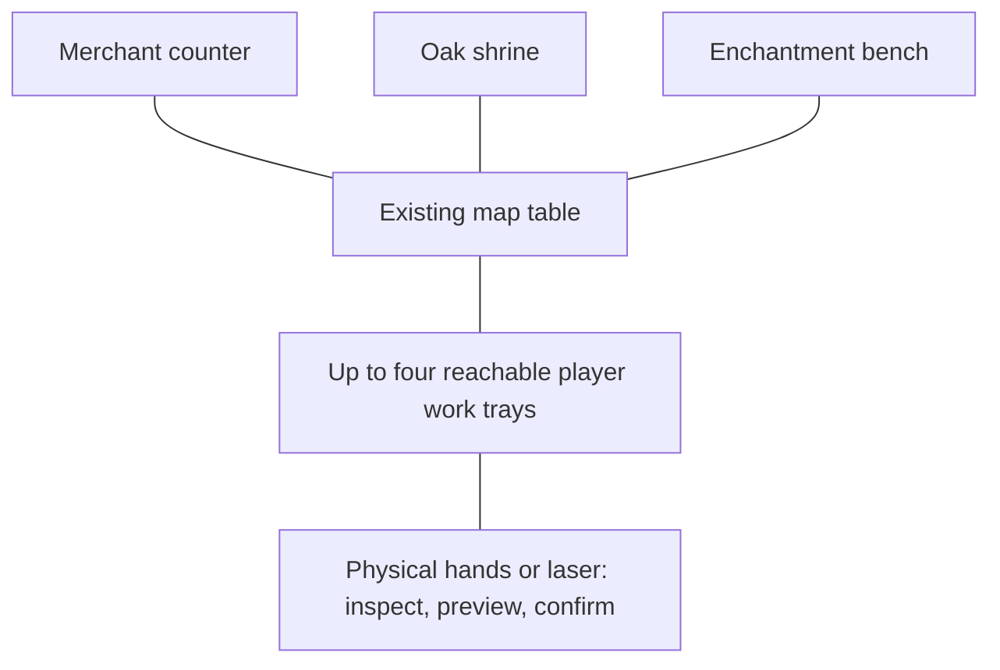

# Immersive town services

Design proposal, 2026-09-20. Based on dev `ff59a14e`, version 1.0.7 / ModBuild 537.
The user requested original NPC image extraction and a complete VR interaction concept;
runtime implementation and new NPC asset production have not started.

## Scope and evidence

Replace the merchant, temple and enchantress flat presentation with tangible service
stations and animated, three-dimensional NPCs. The user's request authorizes this visual
redesign for these three services. It does not relax owner-to-observer visual parity or
change prices, unlocks, progression, ownership, confirmations or native game rules.

The German screenshot title is **Magierin** (English source: **Enchantress**). The temple
help text names **Tempel der Großen Eiche**. Do not assign either woman a personal name
without original localization or narrative evidence.

Sources and detailed coverage:

- [Native function inventory](TOWN-SERVICES-FUNCTIONS.md).
- [Environment and multiplayer integration](TOWN-SERVICES-INTEGRATION.md).
- [Original image exports and reproduction](TOWN-SERVICES-ART.md).
- [Derived gpt-image-2 modelling reference sheets](TOWN-SERVICES-GENERATED-REFERENCES.md).
- Existing screenshots: `../debug/händler_mixed_reality.jpg`,
  `../debug/kirche_hintergrund.jpg`, `../debug/magierin.jpg`.

The subsequently supplied `ressources/GH_Data/` enabled original texture extraction.
All three full illustrations are exported at 1920 x 1080, with no UI covering the NPCs;
their backgrounds are baked into the source art. Three additional 94 x 118 portraits
are included. See the art record for asset names, source IDs and the reproduction command.

## Recommended spatial arrangement

Use three compact, recognizable stations around the existing map table: a merchant's
counter, an oak shrine and an enchantment workbench. Keep the map, character board and
quest list in their established positions. NPCs have believable human scale, intentional poses,
hand contact with their own furniture and a coherent art style derived from their portraits.
They are not enlarged cards, face-camera billboards or floating torsos. The enchantress's
illustration suggests a hovering pose; restrained, deliberately authored levitation is
appropriate for her, with a fixed station anchor and identical motion for observers.

Author a small set of station anchors for each environment, outside the tabletop play area,
the party's seats and required paths. Exact transforms require the actual station meshes
and headset fitting; this document does not invent coordinates before those exist.
Use a common table-relative interaction layout for shared objects. Decorative room dressing
may attach to the room, but must not move a peer's counter, hands or transaction relative
to its owner. A different environment setting cannot produce a different remote work tray.

Opening a service through its existing map button introduces that NPC and station using a
short entrance/materialization. The NPC remains at the assigned station until everyone
using the service has left. One NPC per service, not one duplicate merchant per player.
Switching services does not force a scene load or teleport. Unlocked, inactive services
can be indicated by their small recognizable sign; do not keep three large animated stalls
in the player's view solely as decoration.

Each active player gets a **physical work tray** in comfortable reach beside their own
board. It belongs visibly to that player and selected character. This is a small extension
of the service station: the NPC presents merchandise, a donation bowl or an engraving pad
there. Its position, objects, readable details and animation are shared with observers.
Up to four independent trays let everyone browse concurrently without standing in a queue.
The single NPC directs attention to the last accepted interaction through a shared attention
state; it never looks directly at every viewer independently.

The tray can be brought closer with an ordinary grab handle. The NPC does not follow the
head. Physical reach is optional: laser selection/grab offers the same actions, so seated
players and players with limited reach never need to stand, lean through a table or use
both hands. There is always a visible way to leave the service.

### Environment treatment

| Environment | Station treatment |
|---|---|
| Original game map room, Campaign | Freestanding furniture in clear space around the map table; merchant boxes and fabric, a small oak shrine, and a rune workbench. Preserve the original map and service controls. |
| Original game map room, Guildmaster | The same services adapted around the corrected table, bench, barrel and knife. Preserve the separated vertical map-switch buttons and standing quest list during browsing. Do not occupy their usable space. |
| Cellar | Worn wood, iron fittings and restrained warm lighting; shrine against a clear masonry area and enchantment bench in an alcove if the actual geometry permits it. Match the room without adding a second enclosing room. |
| Night forest (`SwampNight` internally) | Travel stall, portable oak shrine and a field workbench; dark wood, cloth and restrained rune light. Avoid placing feet/furniture in decorative water or trees. |
| Mixed reality | NPCs, furniture and trays only, with optional small contact shadows. No backdrop wall, grey rectangle, scenery backing or new floor plane inside the game area. Keep placement adjustable where physical room space is limited. |
| Black/disabled environment | Self-contained station furniture and readable local lighting; do not silently turn another environment on. |

The interaction content and transactions are identical across these settings. Room dressing
is not a substitute for synchronization. First-open placement is stable; no periodic
head-follow or background rearrangement. Any necessary opening-time window room making
must retain the existing rule: only older visibly overlapping windows move.

Logical arrangement, not a scale drawing:



## Merchant: inspect, offer, buy or sell

The merchant stands behind a counter with a small number of display objects and storage
drawers. Browsing uses an actual sample rack or a compact catalogue book. Tabs carry the
original equipment-slot icons. Turning pages or sliding the rack changes the displayed
selection while preserving the game's filters, order, stock and new-item markers.

1. Select a controlled character using their portrait token on the tray. Display the
   actual payer: party gold or that character's gold. Browsing another character's visible
   equipment must not grant permission to spend or sell for them.
2. Lift an item sample to inspect it. Use an actual item mesh where one exists; otherwise
   use its original illustrated item card in a physical holder. Do not substitute a generic
   sword for an item whose actual art is different. Original descriptions, effects, price,
   stock, discount, ownership and equipped state remain readable beside the held object.
3. Place it on the purchase mat. The merchant gestures toward a clear quote containing
   item, recipient, total price and the native buy/equip choices. This is a preview, not
   a purchase. Removing the object cancels the offer.
4. Press the purchase seal, by finger or laser, to activate the original confirmation.
   The label states exactly what happens: buy or buy and equip, wherever the game allows
   that choice. Picking something up never spends gold.
5. Once the game accepts the transaction, the item moves to the character's inventory or
   equipment area and the merchant acknowledges the sale. Visual coins represent the
   native amount; players need not count or physically place individual coins.

For selling, open the character/party inventory compartment and place an owned item on a
separate appraisal mat. The quote says **sell**, shows its actual sale value and identifies
the owner. Confirm once. Preserve equipped-item restrictions and any native confirmation;
the gesture cannot silently unequip, rebind or sell another player's item.

Large inventories remain navigable with pages, category tabs and laser scrolling. All
available stock can be reached; the physical rack is a view of inventory, not a new capacity
limit. Preserve native unavailable states and explain their reason close to the object.

## Temple: a donation with a visible recipient and outcome

The priestess stands beside a small oak shrine, with her original staff and book. A shallow
offering bowl and a book of available blessings occupy the work tray. This works for both
the familiar campaign donation and the data-driven blessing list used by the native service.

1. Place/select the character token at the shrine. The token identifies who receives the
   effect; gold source remains explicit.
2. Select one of the currently available blessings from the book or its physical symbol
   tokens. Show the original effect, quantity, duration, cost and availability. Do not
   hardcode a single blessing, a ten-gold price, or a permanent effect.
3. Lift the offered coin pouch and place it in the bowl to prepare the donation. The pouch
   represents the exact quoted amount. A labeled seal on the bowl confirms it; returning
   the pouch or pressing cancel leaves gold unchanged.
4. Only native acceptance triggers payment and the blessing presentation. The priestess
   raises a hand or staff, a restrained effect reaches the recipient token, and the native
   condition/modifier information updates. Do not turn a status effect into a playable
   ability card or invent an extra reward.

The donation ledger shows total donated gold, devotion level and progress toward the next
threshold, with exact numbers as well as a physical visual indication. Any native threshold
reward or mandatory follow-up remains visible and confirmable. Already received/unavailable
blessings and insufficient funds keep their original restrictions and explanations.

## Enchantress: place a card and apply a rune

The enchantress works across a shallow engraving desk. A book or rack holds **all cards
eligible in the native enhancement screen**, including cards outside the current hand
selection. Original card art remains central; a rune drawer contains the currently valid
enhancement symbols. The NPC's gesture follows the actual chosen point on the card.

1. Select the character and lift a card onto the engraving pad. The card becomes comfortably
   readable without making a second independent game card. The native card selection and
   eligible enhancement points drive the presentation.
2. Touch or point at an enhancement point. Only valid targets respond. The selected action
   line and target are unmistakable; neither tiny flat hitboxes nor pixel-perfect placement
   should be required.
3. Take a valid rune token from the drawer and hover it over that point. It snaps into a
   temporary preview. The original effect name, price breakdown and any enhancement-point
   limit appear on a small ledger beside the card. Invalid combinations explain why they
   cannot be applied.
4. Press the labeled enchantment seal to confirm the exact card, point, rune and price through
   the original game flow. The NPC traces the rune after native acceptance; the original
   card updates to its actual persistent state. This is not a dexterity minigame, and hand
   steadiness cannot change the outcome or cost.
5. Where the current enhancement mode supports selling/removing enhancements, a separate
   removal tool selects the existing rune. Show the native refund before a distinct
   confirmation. Do not offer removal in modes where it is forbidden.

Card switching, character switching, buy/sell mode, line filters, gold, point capacity,
tooltips and first-visit explanations remain available. A preview is cancelled on relevant
selection changes; it can never apply later to the newly selected character or card.

## NPC asset brief

The exported original illustration is a reference, not a complete character turnaround.
Use it before final modelling. Rear clothing, concealed limbs and material detail
will require explicit art interpretation; keep those additions separately identifiable.

| NPC | Visible reference evidence | Required performance and contact poses |
|---|---|---|
| Merchant | Broad build, bald head, grey beard, green tunic, burgundy cloak, belt pouches and medallion in the supplied screenshot. | Breathing/blinking, greeting, present item, inspect sale item, point at quote, acknowledge accepted purchase, return to idle. Hands meet the counter and chosen prop. |
| Priestess | Brown hood/cloak, pale robe, book, staff with green/gold leaf-like ornament. | Calm idle, read book, indicate offering, acknowledge donation, bless selected recipient, return to idle. Separate book/staff grip and free-hand gesture. |
| Enchantress / Magierin | Original export shows teal hood/cloak, pale mask-like face with dark eye openings, dark wavy hair, purple scarf, wrapped clothing, belt pouches/flask and cyan magic in both hands. Hovering pose. | Controlled hovering idle, inspect card, indicate target, apply rune, remove rune when allowed, acknowledge completion. Hand aim follows the actual work point. |

Deliver a full-body rigged mesh with articulated fingers, blink/facial support, separate
props, material maps, lower-detail meshes and authored animation clips. Match the game's
painted fantasy proportions through physically plausible materials; do not interpret
"realistic" as requiring photorealistic faces that clash with the environment.

Use simple collision shapes on intentional interactable props. Decorative sleeves and
hair must not intercept the laser. Prefer authored cloth motion/bones initially, because
unconstrained live cloth introduces contact and performance risks without adding a service
function. NPC audio can use existing suitable game lines/sounds; new speech is not assumed.

## Multiplayer and transaction contracts

- Everyone sees the same shared NPC attention, chosen props, work-tray pose, previews,
  original readable details, confirmations and intermediate animations for each active
  player. Do not derive a remote selection from the viewer's current character or language.
  The entire map's cards remain public under the existing ruling.
- Manipulation and spending remain bound to native character ownership and edit permissions.
  An observer sees the owner's highlighted/selected state, but cannot activate their controls.
  Service-wide party gold and stock contention are resolved by the original game, not a new
  mod economy or local optimistic write.
- Multiple players may inspect the same last stock item. Their copies are previews, not
  reservations. Native acceptance decides the sale. A rejected or stale quote returns to
  a readable, usable state without a success animation or phantom debit.
- The native open/select/confirm/cancel/exit routes stay authoritative, including host
  validation and normal save behaviour. Never call low-level purchase methods as a shortcut
  around their UI/network validation.
- Observers contain presentation only: no cloned gameplay controllers, native callbacks,
  duplicate save operations or repeated purchases on reconnect. Shared cosmetic packets
  must not become gameplay commands. Flat players keep the native service interface.
- Presentation states carry actor/service/session identity and a monotonically changing
  operation identity. A late join reconstructs current preview and progress; a duplicate
  packet never restarts an enchantment, donation or delivery.

## Closing, recovery and performance

Use this presentation sequence around the native transaction:

```text
Browse -> Preview -> Native confirmation -> Await native result -> Present result -> Browse
             |              |                     |
           Cancel         Cancel                Rejected -> Refresh quote
```

Cosmetic animation is never the only way to release native continuation. An interrupted
animation, disabled station, lost tracking, scene change or disconnected owner must leave
the original confirm/cancel/exit path usable. Once a transaction was accepted, cleanup reads
its result; it never resends the transaction or silently refunds it. No mandatory tutorial,
reward or story dialog may be hidden behind a claimed service surface.

Render only the open inventory page and active trays, with pooled holders and loaded artwork
ready before reveal. Shared NPCs need bounded material/mesh counts, mipmapped textures and
predictable update cost. Avoid one camera per object and per-frame whole-scene scans.
Synchronize changed selections and a common animation phase/seed; send pose updates for
actually moving objects. Skipping hidden work may reduce cost, but cannot remove visible
effects, intermediate animation or alter what observers see. Mesh budgets and timing are
measurement targets to determine with real assets, not a promise of unmeasured frame rates.

## Delivery sequence

1. Original artwork extraction and inspection are complete. Agree the NPC asset brief next.
   PNGs preserve native resolution; the supplied source textures have no alpha channel.
   Keep their baked backgrounds in the originals and label any later cutout as edited.
2. Build a merchant greybox with one physical rack, preview and native purchase/sale flow,
   including four simultaneous trays, a flat peer and cancellation. This proves the common
   station/transaction system before polishing three NPCs.
3. Add temple and enchantress using the same interaction and lifecycle conventions, while
   preserving their different native rules. Check every row in the function inventory.
4. Replace greybox NPCs with final meshes, contact animation and environment dressing.
5. Verify in hardware: all environments, both map modes, seated/standing, dominant-hand
   swap, repeated open/close, character switch during preview/animation, scene transitions,
   reconnect, exhausted stock, changed gold, native rejection and mixed VR/flat multiplayer.

Design completion and original image extraction are not implementation or headset validation.
No new runtime service presentation or NPC mesh has been shipped by this research.
