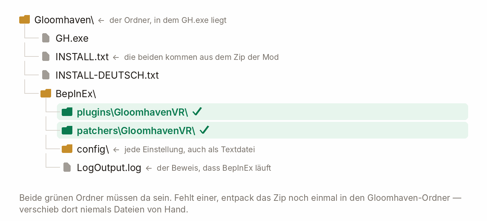

# GloomhavenVR — Installationsanleitung

  <a href="INSTALL.md">&nbsp;English</a>
  &nbsp;&nbsp;|&nbsp;&nbsp;
  &nbsp;<b>Deutsch</b>

  

## Was du brauchst

| | |
|---|---|
| **Spiel** | Gloomhaven (digital) für den PC — Steam oder GOG; getestet mit 1.1.8307.0 |
| **PC** | Windows, ein PC-VR-Headset, zwei getrackte Controller mit Thumbsticks |
| **Loader** | BepInEx 5.4.23.5 (x64) — Schritt 1 installiert ihn, einmalig |

> **Das ist eine PC-VR-Mod.** Das Spiel läuft auf deinem PC, und du streamst das Headset dorthin oder
> hängst es per Kabel an — wie bei jedem anderen PC-VR-Titel. Entwickelt und gespielt auf einer
> **Quest 3 über Virtual Desktop**.

  

## 1. BepInEx installieren

1. Lade **`BepInEx_win_x64_5.4.23.5.zip`** von der
   [BepInEx-Release-Seite](https://github.com/BepInEx/BepInEx/releases/tag/v5.4.23.5).
2. Entpack es in deinen **Gloomhaven-Ordner** — den, in dem `GH.exe` liegt.
   *(Bei Steam: Rechtsklick auf das Spiel → Verwalten → Lokale Dateien durchsuchen.)*
3. Starte das Spiel einmal, dann beenden. Prüf, ob `BepInEx/LogOutput.log` vorhanden ist.

  

## 2. Die Mod installieren

Hol dir **`GloomhavenVR-<version>.zip`** von der
[Releases-Seite](https://github.com/McFredward/GloomhavenVR/releases) und entpack es in **denselben**
Ordner; lass Windows `BepInEx/` zusammenführen. Dann kontrollier, ob diese zwei Ordner da sind:

  

  

## 3. OpenXR-Runtime einstellen

Aktiv sein kann immer nur **eine OpenXR-Laufzeit**, und *vor* dem Spielstart muss das deine sein.
Stell sie in der App ein, mit der du streamst:

- **Virtual Desktop** — in den Streamer-Einstellungen **VDXR** auswählen.
- **Quest Link / Air Link** — Meta-Quest-Link-App → Einstellungen → Allgemein → OpenXR-Laufzeit → *als aktiv festlegen*.
- **Steam Link / SteamVR** — SteamVR-Einstellungen → OpenXR → *SteamVR als OpenXR-Laufzeit festlegen*.

  

## 4. Das Spiel starten

Setz das Headset auf und starte Gloomhaven wie immer. Du solltest am Tisch stehen.

> **Wenn die Mod ihre Rendering-Einstellungen aktiviert, kann das Spiel einmal von selbst neu starten.**
> Das ist normal, meist bei der ersten Installation; es passiert nicht bei jedem Update.

Deine Spielstände, deine Kampagne und deine Einstellungen bleiben unangetastet.

Die Mod ändert Rendering-Einstellungen in `GH_Data/boot.config` und legt das Original als
`boot.config.gloomhavenvr-backup` daneben. Falls das Spiel irgendwann gar nicht mehr startet, kopier
es zurück über `boot.config`.

Warum sie neu startet und wie du es vermeidest:
[docs/DEVELOPING.md](docs/DEVELOPING.md#the-restart-on-the-first-start) (nur auf Englisch)

  

## Updates

Die Mod prüft einmal pro Sitzung im VR-Hauptmenü auf Updates. Bei einer neueren Version wählst
du im Update-Fenster **Ignorieren** oder **Update**.

Drückst du Update, lädt sie herunter (~70 MB), tauscht die Dateien, schließt das Spiel und startet es
wieder. **Deine Spielstände, deine Kampagne und deine Einstellungen bleiben unangetastet.**

- **Scheitert der Download oder die Prüfung, bleiben die installierten Dateien unverändert.**
  Das Panel nennt den Fehler; installier dann von Hand.
- **Die alte Version bleibt liegen** in `BepInEx/GloomhavenVR-update/backup/`, bis die neue
  erfolgreich gestartet ist. Solange das Backup vorhanden ist, kannst du die zwei Ordner zurückkopieren.
- **Im Mehrspieler brauchen alle VR-Spieler denselben Mod-Build.** Ein Dialog blockiert
  unterschiedliche Builds. Aktualisiert gemeinsam.

  

## Einstellungen

Du kannst alles im Headset einstellen. Öffne das **Optionen**-Fenster des Spiels, aus dem Hauptmenü
oder dem Pausenmenü, und geh auf den Reiter **VR Optionen**. Änderungen wirken sofort und werden
gespeichert.

| Reiter | Was drinsteht |
|---|---|
| **Komfort** | Drehen, Fortbewegung, Welt greifen und zoomen, Hände, Zielen |
| **Bild** | Darstellung, Fenster & Tafeln, Mixed Reality, der Desktop-Monitor |
| **Brett & Karten** | Kontrollbrett, Figuren, Karten, Stapel & Hinweise |
| **Tafeln** | Tafeln & Anzeigen, Lebensbalken, der 2D-Bildschirm, Zeigen, Texteingabe |
| **Avatar & Mehrspieler** | Dein Handstil und deine Kopfmaske, und das Zusammenspielen |
| **Umgebung & Ton** | Umgebung, die Erscheinungen, Ton, Sichtbarkeit, die Kampagnenkarte |
| **Erweitert** | Der tiefe Zwilling von allem oben, dazu jede einzelne Einstellung |

Der Text der Mod folgt der Sprache des Spiels: **Englisch und Deutsch**; alles andere fällt auf
Englisch zurück.

Um die VR-Mod zu deaktivieren, setz `[General] Enabled = false` in
`BepInEx/config/dev.gloomhavenvr.cfg`. Die Einstellungen stehen auch in den Konfigurationsdateien
der Mod unter `BepInEx/config/`.

  

## Fehlersuche

| Was du siehst | Was du machst |
|---|---|
| Headset schwarz, oder das Spiel läuft flach auf dem Monitor | Schritt 3 prüfen. Dann `-force-d3d11` in die Startoptionen eintragen |
| „VR konnte nicht starten, etwas fehlt“ | Ein Teil des Zips ist nicht angekommen. Noch einmal in den Gloomhaven-Ordner entpacken |
| Die falsche Laufzeit wird genommen, oder gar keine | `[General] RuntimeOverride` auf die JSON-Datei deiner Laufzeit setzen, z. B. `…\SteamVR\steamxr_win64.json` |
| Das Spiel startet gar nicht mehr | `GH_Data/boot.config.gloomhavenvr-backup` über `GH_Data/boot.config` kopieren |
| Ein Update hat die Mod zerlegt | Die zwei Ordner aus `BepInEx/GloomhavenVR-update/backup/` zurückkopieren |

**Ein Problem melden:** Schick `BepInEx/LogOutput.log`, dazu was du gerade gemacht hast, dein
Headset und deine Streaming-App. Bewahre das Log des betroffenen Durchlaufs auf. Bei einem
reproduzierbaren Problem setz `[General] LogLevel = Debug` und wiederhole es für ein genaueres Log.

  

## Deinstallieren

Lösch `BepInEx/plugins/GloomhavenVR/` und `BepInEx/patchers/GloomhavenVR/`, dazu
`BepInEx/GloomhavenVR-update/`, falls es da ist. Für die Rendering-Änderung kopier
`GH_Data/boot.config.gloomhavenvr-backup` über `GH_Data/boot.config`. Löschst du ganz `BepInEx/`,
ist auch der Loader weg.

Diese hier sind optional und tun ohne die Mod nichts: `GH_Data/Plugins/x86_64/UnityOpenXR.dll`,
`GH_Data/Plugins/x86_64/openxr_loader.dll`, `GH_Data/UnitySubsystems/UnityOpenXR/`.

  

Eine Kurzfassung dieser Seite liegt als `INSTALL-DEUTSCH.txt` im Release-Zip. Aus dem Quellcode
bauen: [`docs/DEVELOPING.md`](docs/DEVELOPING.md) (nur auf Englisch).
