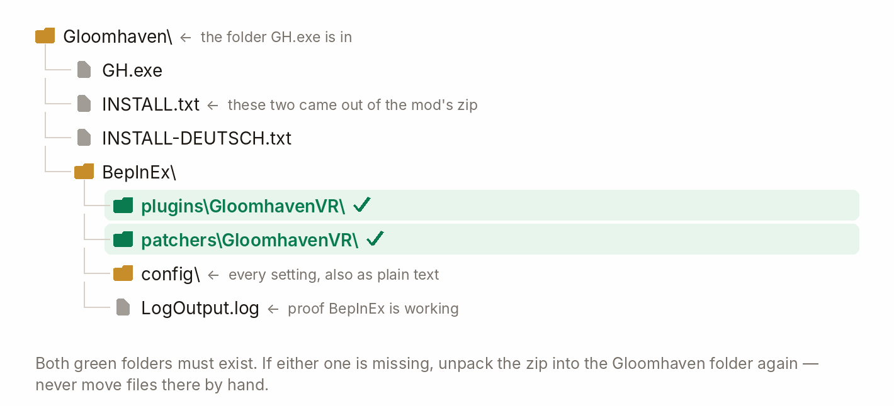

# GloomhavenVR — install guide

  &nbsp;<b>English</b>
  &nbsp;&nbsp;|&nbsp;&nbsp;
  <a href="INSTALL.de.md">&nbsp;Deutsch</a>

**Two archives into the game folder. About five minutes.**

---

## What you need

| | |
|---|---|
| **Game** | Gloomhaven (digital) for PC, v1.1.x — Steam or GOG |
| **PC** | Windows, a PC-VR headset, two tracked controllers with thumbsticks |
| **Loader** | BepInEx 5.4.23.5 (x64) — step 1 installs it, once |
| **Space** | Room-scale or standing. A small room is fine. |

> **This is a PC-VR mod.** The game runs on your PC and you stream or tether the headset to it, like
> any other PC-VR title. Developed and played on a **Quest 3 over Virtual Desktop**.

---

## 1. Install BepInEx

1. Download **`BepInEx_win_x64_5.4.23.5.zip`** from the
   [BepInEx release page](https://github.com/BepInEx/BepInEx/releases/tag/v5.4.23.5).
2. Extract it into your **Gloomhaven folder** — the one with `GH.exe` in it.
   *(Steam: right-click the game → Manage → Browse local files.)*
3. Start the game once, then quit. `BepInEx/LogOutput.log` now exists — that is your proof.

---

## 2. Install the mod

Get **`GloomhavenVR-<version>.zip`** from the
[releases page](https://github.com/McFredward/GloomhavenVR/releases) and extract it into the **same**
folder, letting Windows merge `BepInEx/`. Then check these two folders exist:

  

---

## 3. Point your headset at the game

Only one **OpenXR runtime** can be active at a time, and it has to be yours *before* you start the
game. Set it in whichever app you stream with:

- **Virtual Desktop** — pick **VDXR** in the Virtual Desktop streamer settings.
- **Quest Link / Air Link** — Meta Quest Link app → Settings → General → OpenXR Runtime → *Set as active*.
- **Steam Link / SteamVR** — SteamVR Settings → OpenXR → *Set SteamVR as OpenXR runtime*.

---

## 4. Start it

Headset on, launch the game the way you always do. You are at the table.

  

> **On the first start after installing or updating, the game closes and reopens itself — once.**
> That is meant to happen. It is not a crash.

It switches on one Windows rendering setting the engine only reads while starting up — worth a
locked 45 Hz becoming a clean 90 on the test machine. It cannot loop, and it happens before any save
is touched.

**This is the only game file the mod ever writes:** two lines added to `GH_Data/boot.config`, with
the original kept beside it as `boot.config.gloomhavenvr-backup`. If the game ever refuses to start,
copy that backup back over `boot.config`.

Rather do it yourself? Either set `[Core] AutoRestartForGraphicsJobs = false` in
`BepInEx/config/dev.gloomhavenvr.cfg` and restart when the log asks, or set
`[Core] EnableGraphicsJobs = false` and add `-force-gfx-jobs native` to the game's launch options —
that works from the very first start and writes no game file at all.

---

## Updating

**The mod updates itself, and it asks first.** Once a session, while you stand in the main menu in
VR, it checks its releases page. If there is a newer version, an **Update available** panel floats in
front of you: *Ignore* or *Update*.

Press Update and it downloads (~70 MB), swaps the files, closes the game and starts it again.
**Your saves, your campaign and your settings are not touched.**

- **If it fails, nothing changed.** The panel says what went wrong; install by hand instead.
- **The old version is kept** in `BepInEx/GloomhavenVR-update/backup/` until the new one has started
  successfully. Copy those two folders back if an update ever leaves you worse off.
- **Everyone in a multiplayer session needs the same version.** A mismatch is blocked with a dialog
  rather than allowed to go quietly wrong. Update together.

---

## Settings

Everything is adjustable in the headset: open the game's own **Options** window — main menu or pause
menu — and pick the **VR Options** tab. Changes apply live and are saved for you.

| Tab | What is in it |
|---|---|
| **Comfort** | Turning, locomotion, world grab and zoom, hands, aiming |
| **Picture** | Presentation, windows & panels, mixed reality, the desktop monitor |
| **Board & cards** | Control board, figures, cards, piles & hints |
| **Panels** | Panels & readouts, health bars, the 2D screen, pointing, text entry |
| **Avatar & multiplayer** | Your hand style and head mask, and playing together |
| **World & sound** | Environment, the apparitions, sound, visibility, the campaign map |
| **Advanced** | The deep twin of all of the above, plus every single setting |

The mod's text follows the game's language: **English and German**; anything else falls back to
English.

Every setting is also a plain text file under `BepInEx/config/` (`dev.gloomhavenvr*.cfg`), each with
its own explanation. You should not need them. **To play completely unmodified for a while**, set
`[General] Enabled = false` there — better than uninstalling.

---

## Something went wrong

| What you see | What to do |
|---|---|
| Headset black, or the game runs flat on the monitor | Check step 3. Then add `-force-d3d11` to the game's launch options |
| "VR could not start, something is missing" | Part of the zip did not land. Unpack it into the Gloomhaven folder again |
| The wrong runtime is picked, or none is | Set `[General] RuntimeOverride` to your runtime's JSON file, e.g. `…\SteamVR\steamxr_win64.json` |
| The game will not start at all | Copy `GH_Data/boot.config.gloomhavenvr-backup` over `GH_Data/boot.config` |
| An update left the mod broken | Copy the two folders out of `BepInEx/GloomhavenVR-update/backup/` back over the installed ones |

**Reporting it:** send the whole of `BepInEx/LogOutput.log`, plus what you were doing, your headset
and the app you stream with. Set **`[General] LogLevel = Debug`** and reproduce it first — the
default log is far too quiet to answer a report. Things
[already known](docs/PLAYING.md#known-limitations) are not worth reporting.

---

## Uninstall

Delete `BepInEx/plugins/GloomhavenVR/` and `BepInEx/patchers/GloomhavenVR/`, plus
`BepInEx/GloomhavenVR-update/` if it is there. Restore `GH_Data/boot.config` from
`boot.config.gloomhavenvr-backup` to undo the rendering change. Deleting all of `BepInEx/` removes
the loader too.

Optional, and inert without the mod: `GH_Data/Plugins/x86_64/UnityOpenXR.dll`,
`GH_Data/Plugins/x86_64/openxr_loader.dll`, `GH_Data/UnitySubsystems/UnityOpenXR/`.

---

A short version of this page ships inside the release zip as `INSTALL.txt`. Building from source:
[`docs/DEVELOPING.md`](docs/DEVELOPING.md).
