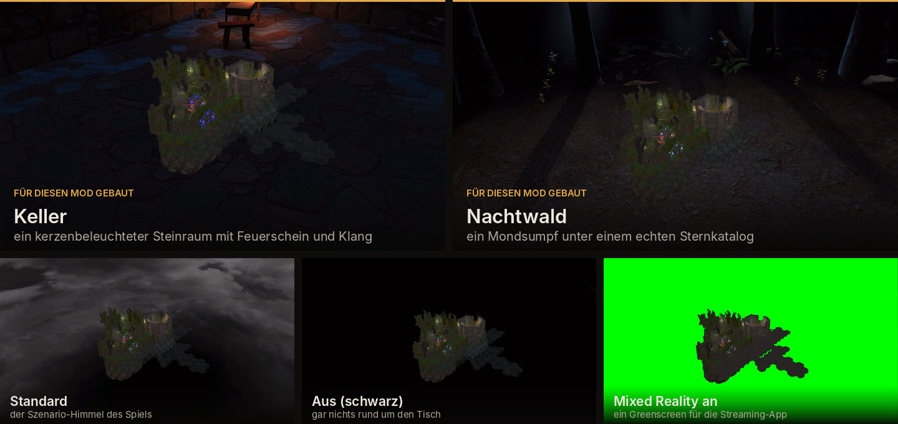

  

  
  
  
  

  

  <a href="README.md">&nbsp;English</a>
  &nbsp;&nbsp;|&nbsp;&nbsp;
  &nbsp;<b>Deutsch</b>

  <b>Eine Room-Scale-VR-Mod für <a href="https://store.steampowered.com/app/780290/Gloomhaven/">Gloomhaven (Digital)</a>.</b> 
  Motion-Controller, ein Kartenblatt in der Hand, ein physisches Kontrollbrett 
  und vollwertiger VR-Mehrspieler.

  <a href="INSTALL.de.md"><b>Installieren →</b></a> &nbsp;·&nbsp;
  <a href="docs/PLAYING.de.md#die-steuerung">Steuerung</a> &nbsp;·&nbsp;
  <a href="docs/PLAYING.de.md">Spielanleitung</a>

  

<table>
<tr>
<td width="50%"><video src="https://github.com/user-attachments/assets/f23ad920-838c-4c2f-aba2-24378b3323e8" controls muted loop></video></td>
<td width="50%"><video src="https://github.com/user-attachments/assets/5bc45e99-89d1-4b3b-aa7d-47a74c184805" controls muted loop></video></td>
</tr>
</table>

Heb eine Figur hoch, und sie kommt vom Brett in deine Hand. Sie bleibt so groß, wie du sie gezogen
hast, und ihre Karte kommt mit: Gesundheit, Bewegung, Angriff, Modifikatoren und der Zug, den sie
gleich macht. Leg sie zurück, dann setzt sie sich wieder auf ein Feld.

- Dein Kartenblatt liegt in deiner Handfläche. Dreh die Hand nach oben, dann geht der Fächer auf;
  nimm eine Karte mit den Fingern heraus und leg sie in ein Fach deines Bretts.
- Ein Kontrollbrett, das du mitnimmst. Rückgängig, beide Rasten, die Stapel und die
  Entscheidungs-Schublade, alles auf einem Tisch an einer Stange, den du hinstellst, wo du willst.
- Greif ins Szenario hinein. Heb eine Miniatur hoch, um ihren nächsten Zug zu lesen, oder pack das
  ganze Brett mit beiden Händen, um es zu ziehen, zu drehen und zu zoomen.
- Die Kampagnenkarte. Zwischen den Szenarien stehst du in einem Gewölbe über der Karte
  von Gloomhaven, und die Aufträge hängen daneben an der Wand.
- Vollwertiger VR-Mehrspieler. Masken, Hände, Bretter und zeigende Finger sehen alle anderen auch.
  Wer kein Headset hat, spielt in derselben Partie am flachen Bildschirm mit.
- Zwei Umgebungen, die für die Mod gebaut wurden: ein Keller drinnen und ein Nachtwald draußen,
  beide reagieren auf die Elemente des Szenarios.
- Mixed Reality. Der Himmel verschwindet, und der Tisch steht in deinem echten Zimmer.

  

## Vollwertiger VR-Mehrspieler

Jeder VR-Spieler hat eine Maske, Hände und ein eigenes Kontrollbrett. Wenn du eine Miniatur
hochhebst, ein Fenster verschiebst oder auf etwas zeigst, sehen die anderen das. Wer kein Headset
hat, spielt am flachen
Bildschirm in derselben Partie mit.

  <video src="https://github.com/user-attachments/assets/df3e1980-e719-4b95-8832-bc7236431f14" width="720" controls muted loop></video>

  

## Karten, Kontrollbrett und Tisch

Das Kontrollbrett ist ein Tisch, der vor dir steht: zwei Fächer für die Karten dieser Runde, Tasten,
die du mit der Fingerspitze eindrückst, und darunter eine Stange zum Tragen. Im
[Spielhandbuch](docs/PLAYING.de.md#karten-und-kontrollbrett) ist jedes Teil davon auf einem Bild
beschriftet.

  <video src="https://github.com/user-attachments/assets/51b8518b-6bd9-4ab8-9699-a201e8bd1342" width="720" controls muted loop></video>

Das Szenario selbst liegt auf dem Tisch vor dem Brett. Ziel mit dem Strahl und drück den Trigger, um
ein Feld, einen Gegner, eine Tür oder eine Truhe zu nehmen. Oder halt den Griff und tipp es mit der
Fingerspitze an.

  <video src="https://github.com/user-attachments/assets/8ab499e0-0140-4e84-807b-1752b41cf625" width="720" controls muted loop></video>

  

## Die Kampagnenkarte

  <video src="https://github.com/user-attachments/assets/dadbad52-bde7-48bc-9518-b3a831096550" width="720" controls muted loop></video>

Zwischen den Szenarien stehst du in einem Gewölbe, und die Karte von Gloomhaven liegt ausgebreitet
auf dem Tisch vor dir. Die Aufträge hängen an der Wand, wo du sie lesen kannst, und wenn einer
freigeschaltet wird, leuchtet der ganze Raum auf.

  

## Umgebungen

Ein Keller drinnen und ein Nachtwald draußen, beide für die Mod gebaut. Sie haben Feuerschein,
Umgebungsklang, ein Sternfeld aus einem echten Katalog, und das, was ab und zu passiert, wenn man
lange genug herumsteht.

Dafür gibt es eine Einstellung mit fünf Möglichkeiten. Derselbe Tisch, dasselbe Szenario in allen.
Die beiden Räume oben sind die, die für die Mod gebaut wurden. Die anderen drei sind der Himmel des
Spiels, gar kein Himmel, und ein Greenscreen, damit deine Streaming-App den Tisch in dein echtes
Zimmer setzen kann.

  

### Reaktionen auf die Elemente

Die Elemente des Szenarios verändern den Raum an den Rändern, nicht über der Spielfläche. Feuer
setzt Requisiten in Brand, Eis lässt Frost wachsen, Luft bewegt Flammen und Blattwerk, Erde treibt
Bewuchs hervor, Licht hebt die Grundhelligkeit, Dunkelheit verfinstert den Mond.

   
  <i>Dieselbe Kamera, links Element aus, rechts an.</i>

  

## Hände, Masken und Brett-Stile

Drei Handpaare, drei Masken und drei Kontrollbretter, jeweils in einem eigenen Dropdown. Du kannst
mitten in der Sitzung umstellen, und die anderen sehen es.

  

Jedes Fenster und jedes Brett hängt an einer gedrechselten Stange, und du bewegst es, indem du die
Stange greifst, mit der Hand oder mit dem Zeigestrahl von weiter weg. Das Brett von jemand anderem
behält dessen Stange, nicht deine.

  

## Voraussetzungen und Installation

**Gloomhaven (Digital)** für den PC (Steam oder GOG) · Windows · ein PC-VR-Headset mit zwei
getrackten Controllern · Room-Scale. Entwickelt wurde die Mod auf einer Quest 3 über
Virtual Desktop.

[→ Installationsanleitung](INSTALL.de.md). Es läuft auf zwei Archive hinaus, die in den Spielordner
entpackt werden. Danach [die Steuerung](docs/PLAYING.de.md#die-steuerung) und die
[Spielanleitung](docs/PLAYING.de.md).

  

Die Mod ist kostenlos und bleibt es. Damit klar ist, was dahintersteckt: zwei Monate Arbeit, 3.000
Commits und 481 Testbuilds, und das Commit-Log weist Aktivität in über 500 einzelnen Stunden aus —
die Teile, die darüber entscheiden, ob sich das im Headset richtig anfühlt, sind nicht einmal
geschrieben, sondern Runde für Runde gegen echte Hardware nachgemessen worden. Wenn sie dir einen
guten Abend am Tisch beschert hat und du Danke sagen möchtest:
[ein Kaffee](https://buymeacoffee.com/mcfredward) geht immer.

<b>Danksagungen und Lizenz</b>

- **ARMA** und **JJ-Pueppi** haben das über viele Sitzungen im Headset getestet. Vieles von dem, was
  auf dieser Seite zu sehen ist, sieht nur deshalb so aus, weil einer von beiden es ausprobiert und
  gesagt hat, dass es so noch nicht stimmt.
- **ARMA** hat außerdem die 3D-Assets gemacht: die Hände, die Masken und die Bretter. Sie sind als
  KI-generierte Rohformen gestartet, und so wie sie herauskommen, kann man sie nicht gebrauchen. Er
  hat sie in Blender nachmodelliert, aufgeräumt, neu gerigged und texturiert, bis sie auf Armlänge
  im Headset standhalten.
- **[LCVR](https://github.com/DaXcess/LCVR)** und **[RepoXR](https://github.com/DaXcess/RepoXR)**
  (GPL-3.0), für das VR-Startmuster, das Headset-Failover und die Fingerkrümmung, die diese Mod
  übernimmt.
- **[UUVR](https://github.com/Raicuparta/uuvr)** (GPL-3.0), für das Muster „flacher Bildschirm in
  VR“, das überall dort greift, wo ein Weltpanel nicht die richtige Antwort ist.
- **Demeo** (Resolution Games), dessen Interaktionsmodell diese Mod folgt. Es werden weder Assets
  noch Code daraus verwendet.

**Lizenz: GPL-3.0**, siehe [LICENSE](LICENSE). Die Mod liefert nur eigenen Code und eigene
lizenzierte Grafik aus. Keine Spieldateien, keine Spiel-Assets, keine dekompilierten Quellen.

Nicht verbunden mit Flaming Fowl Studios, Twin Sails Interactive, Asmodee oder Cephalofair Games.
Gloomhaven und die zugehörigen Grafiken gehören ihren Eigentümern.

**Du arbeitest an der Mod?** [docs/DEVELOPING.md](docs/DEVELOPING.md) (nur auf Englisch)

