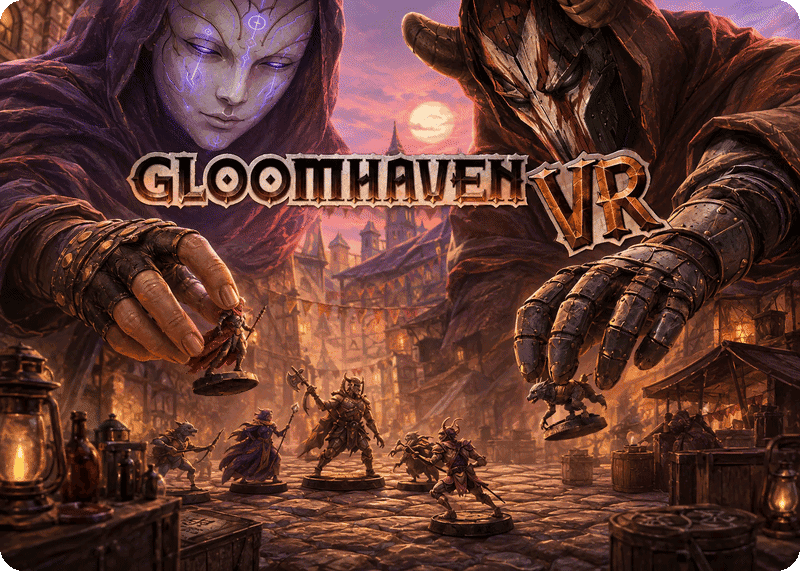
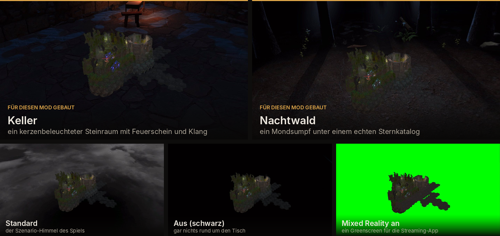
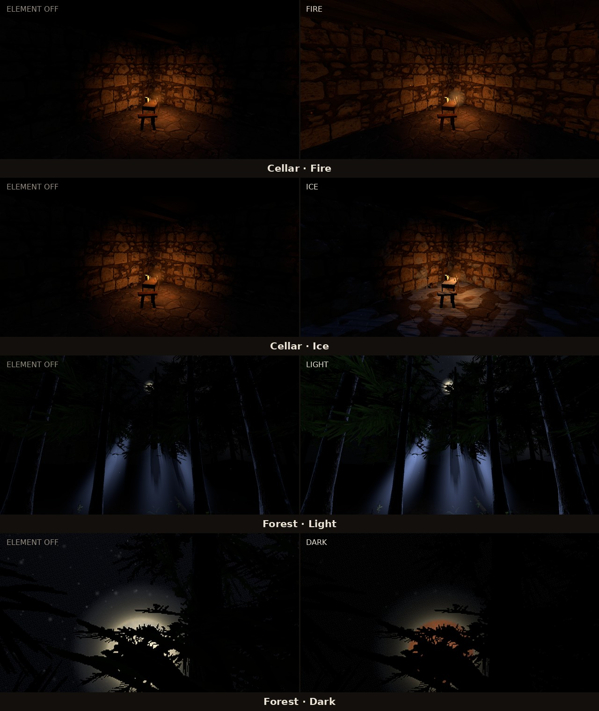
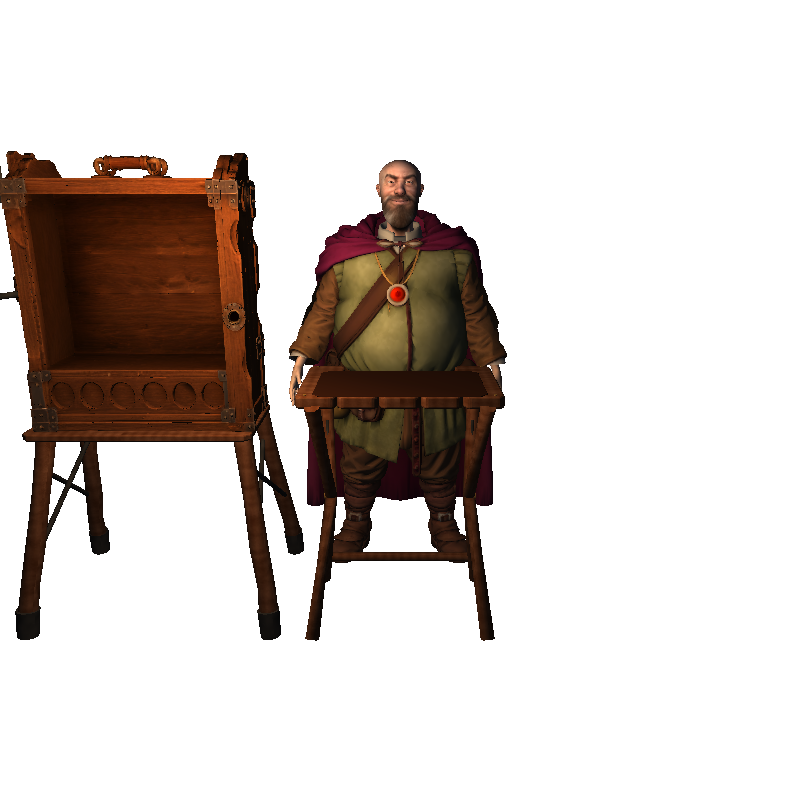
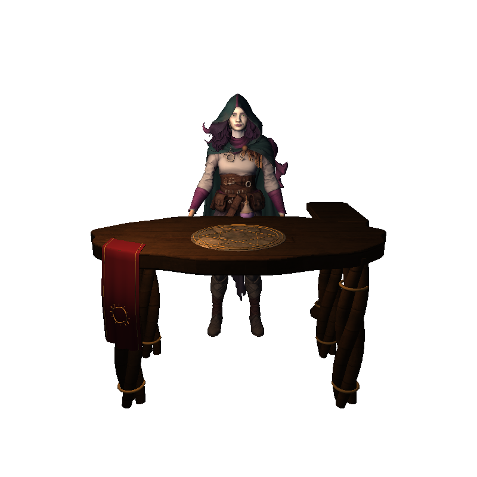
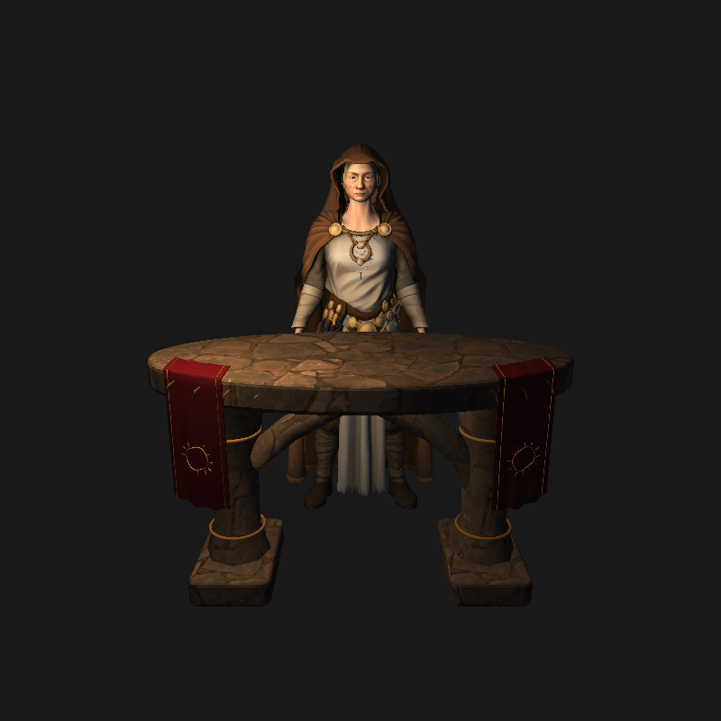
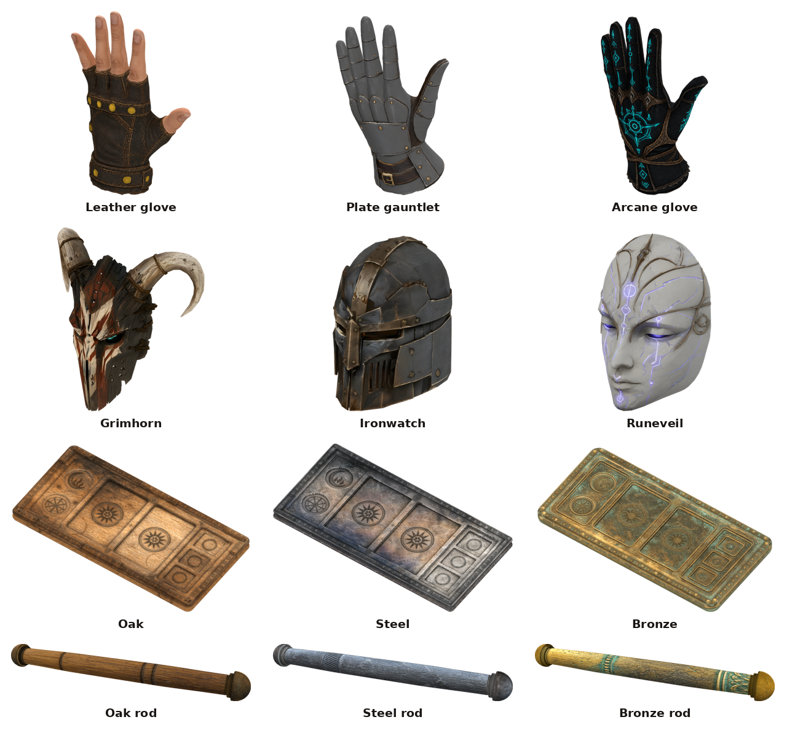
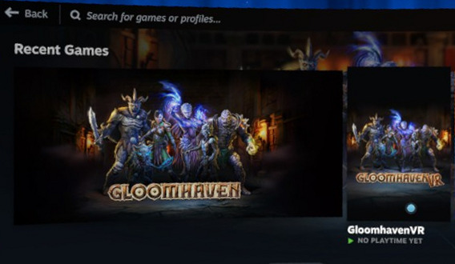

  

  
  
  
  

  

  <a href="README.md">&nbsp;English</a>
  &nbsp;&nbsp;|&nbsp;&nbsp;
  &nbsp;<b>Deutsch</b>

  <b>Eine Room-Scale-VR-Mod für <a href="https://store.steampowered.com/app/780290/Gloomhaven/">Gloomhaven (Digital)</a>.</b> 
  Motion-Controller, ein Kartenblatt in der Hand, ein physisches Kontrollbrett 
  und vollwertiger VR-Mehrspieler.

  <a href="docs/install/INSTALL.de.md"><b>Installieren →</b></a> &nbsp;·&nbsp;
  <a href="docs/install/INSTALL-STEAM-FRAME.de.md"><picture><source media="(prefers-color-scheme: dark)" srcset="docs/img/steam-frame-icon-dark.svg"></picture>&nbsp;<b>Auf Steam Frame installieren →</b></a> &nbsp;·&nbsp;
  <a href="docs/PLAYING.de.md">Spielablauf &amp; Steuerung</a>

> **Empfehlung: Spiele zuerst das erste Tutorial.** Es erklärt die Spielgrundlagen und viele Besonderheiten der VR-Bedienung.

  

<table>
<tr>
<td width="50%"><video src="https://github.com/user-attachments/assets/e03c2053-7da2-48c4-a022-05af58362b09" controls muted loop></video></td>
<td width="50%"><video src="https://github.com/user-attachments/assets/5bc45e99-89d1-4b3b-aa7d-47a74c184805" controls muted loop></video></td>
</tr>
</table>

Heb eine Figur hoch, und sie kommt vom Brett in deine Hand. Sie bleibt so groß, wie du sie gezogen
hast, und ihre Karte kommt mit: Gesundheit, Bewegung, Angriff, Modifikatoren und der Zug, den sie
gleich macht. Leg sie zurück, dann setzt sie sich wieder auf ein Feld.

- Dein Kartenblatt liegt in deiner Handfläche. Dreh die Hand nach oben, dann geht der Fächer auf;
  nimm eine Karte mit den Fingern heraus und leg sie in ein Fach deines Bretts.
- Ein Kontrollbrett, das du mitnimmst. Rückgängig, beide Rasten, die Stapel und die
  Entscheidungs-Schublade, alles auf einem Tisch an einer Stange, den du hinstellst, wo du willst.
- Greif ins Szenario hinein. Heb eine Miniatur hoch, um ihren nächsten Zug zu lesen, oder pack das
  ganze Brett mit beiden Händen, um es zu ziehen, zu drehen und zu zoomen.
- Eine 3D-Kampagnenkarte. Die Karte liegt im Gewölbe auf einem Tisch; die Questliste schwebt
  über dessen rechter Kante.
- Vollwertiger VR-Mehrspieler. Masken, Hände, Bretter und zeigende Finger sehen alle anderen auch.
  Wer kein Headset hat, spielt in derselben Partie am flachen Bildschirm mit.
- Zwei Umgebungen, die für die Mod gebaut wurden: ein Keller drinnen und ein Nachtwald draußen,
  beide reagieren auf die Elemente des Szenarios.
- Mixed Reality. Der Himmel verschwindet, und der Tisch steht in deinem echten Zimmer, auch mit
  nativem Passthrough auf Steam Frame standalone bei kompatibler SteamVR-/Proton-Version.

  

## Vollwertiger VR-Mehrspieler

Jeder VR-Spieler hat eine Maske, Hände und ein eigenes Kontrollbrett. Andere sehen, wie du Miniaturen
hochhebst und auf den Tisch zeigst. Fenster mit 
sind geteilt; **Fenster ohne dieses Symbol siehst nur du**.
Wer kein Headset hat, spielt am flachen Bildschirm in derselben Partie mit.

  <video src="https://github.com/user-attachments/assets/df3e1980-e719-4b95-8832-bc7236431f14" width="720" controls muted loop></video>

  

## Karten, Kontrollbrett und Tisch

Das Kontrollbrett hat zwei Fächer für die Karten dieser Runde, Tasten,
die du mit der Fingerspitze eindrückst, und darunter eine Stange zum Tragen. Im
[Spielhandbuch](docs/PLAYING.de.md#karten-und-kontrollbrett) ist jedes Teil davon auf einem Bild
beschriftet.
Es kann dir folgen, fest im Raum stehen oder über **VR Optionen** am Handgelenk befestigt werden.

  <video src="https://github.com/user-attachments/assets/51b8518b-6bd9-4ab8-9699-a201e8bd1342" width="720" controls muted loop></video>

Das Szenario selbst liegt auf dem Tisch vor dem Brett. Ziel mit dem Strahl und drück den Trigger, um
ein Feld, einen Gegner, eine Tür oder eine Truhe zu nehmen. Oder halt den Griff und tipp es mit der
Fingerspitze an.

  <video src="https://github.com/user-attachments/assets/8ab499e0-0140-4e84-807b-1752b41cf625" width="720" controls muted loop></video>

  

## Die Kampagnenkarte

  <video src="https://github.com/user-attachments/assets/dadbad52-bde7-48bc-9518-b3a831096550" width="720" controls muted loop></video>

Wenn die 3D-Kampagnenkarte aktiv ist, liegt die Karte von Gloomhaven im Gewölbe auf dem Tisch vor
dir. Die Questliste schwebt über der rechten Tischkante.

  

## Umgebungen

Ein Keller drinnen und ein Nachtwald draußen, beide für die Mod gebaut. Beide haben Feuerschein
und Umgebungsklang; der Nachtwald zeigt ein Sternfeld aus einem echten Katalog. Wer lange genug
bleibt, bemerkt vielleicht noch etwas anderes.

Dafür gibt es eine Einstellung mit fünf Möglichkeiten. Derselbe Tisch, dasselbe Szenario in allen.
Die beiden Räume oben sind die, die für die Mod gebaut wurden. Die anderen drei sind der Himmel des
Spiels, gar kein Himmel und Mixed Reality. Steam Frame standalone nutzt natives Passthrough;
PC-Streaming nutzt einen Greenscreen mit einer kompatiblen Streaming-App. Auf der Frame wählst du
**Mixed Reality** unter **VR-Optionen → Umgebung & Ton**. Ist die Option grau, gibt der Mouseover-Hinweis
Hinweise zum Aktualisieren von SteamVR und der Proton-Version des Spiels.

  

### Reaktionen auf die Elemente

Die Elemente des Szenarios verändern den Raum an den Rändern, nicht über der Spielfläche. Feuer
setzt Requisiten in Brand, Eis lässt Frost wachsen, Luft bewegt Flammen und Blattwerk, Erde treibt
Bewuchs hervor, Licht hebt die Grundhelligkeit, Dunkelheit verfinstert den Mond.

   
  <i>Dieselbe Kamera, links Element aus, rechts an.</i>

  

## Immersive NPC-Interaktionen

Bei aktiven immersiven NPCs stehen freigeschaltete Stadtbewohner dauerhaft an ihren Ständen um
die 3D-Karte.

<table>
<tr>
<td width="33%" align="center"></td>
<td width="33%" align="center"></td>
<td width="33%" align="center"></td>
</tr>
<tr>
<td><b>Händler:</b> Nimm eine Ware aus seinem Schrank zum Kaufen oder aus deinem Gegenstandsfächer zum Verkaufen. Leg sie in seine Hand und bestätige.</td>
<td><b>Verzauberin:</b> Gib ihr eine Fähigkeitenkarte in die Hand und wähle die Stelle aus, die du verbessern möchtest.</td>
<td><b>Priesterin:</b> Leg den Geldbeutel aus deiner Hand zum Spenden in ihre Schale.</td>
</tr>
</table>

Im Multiplayer teilen alle den Warenschrank des Händlers. Bild und Name über dem Händler oder
der Verzauberin zeigen, wer ihre Hand gerade nutzt; ohne die Karte ist der NPC wieder frei.

Die immersiven Stadt-NPCs sind bei PCVR standardmäßig aktiv, bei neuen Steam-Frame-Standalone-Profilen
ausgeschaltet. Gespeicherte Einstellungen bleiben erhalten. Für die ursprünglichen Fenster schalte sie unter
**VR Optionen ▸ Umgebung & Ton ▸ Kampagnenkarte** aus. Bei aktiver 2D-Karte ist diese Einstellung ausgeblendet.

  

## Hände, Masken und Brett-Stile

Wähle Hände, Masken und Kontrollbretter über Bildkacheln in den **VR Optionen**. Es gibt jeweils
drei Stile. Änderungen wirken sofort und sind für andere Spieler sichtbar.

  

Jedes Fenster und jedes Brett hängt an einer gedrechselten Stange, und du bewegst es, indem du die
Stange greifst, mit der Hand oder mit dem Zeigestrahl von weiter weg. Das Brett von jemand anderem
behält dessen Stange, nicht deine.

  

## Voraussetzungen und Installation

**Gloomhaven (Digital)** von Steam, GOG oder Epic Games Store · Windows-PC-VR oder Steam Frame
standalone · zwei getrackte Controller · Room-Scale. Entwickelt wurde die Mod auf einer Quest 3
über Virtual Desktop.

[→ Installation](docs/install/INSTALL.de.md) · <a href="docs/install/INSTALL-STEAM-FRAME.de.md"><picture><source media="(prefers-color-scheme: dark)" srcset="docs/img/steam-frame-icon-dark.svg"></picture>&nbsp;→ Installation auf Steam Frame</a> · [→ Spielablauf & Steuerung](docs/PLAYING.de.md)

Auf Steam Frame fügt das Setup einen zweiten Bibliothekseintrag hinzu: Starte **GloomhavenVR** für VR.
Der ursprüngliche Eintrag **Gloomhaven** bleibt für Flat-Spiel; beide nutzen dieselben Spielstände.

  

  

## Danksagungen und Lizenz

- **ARMA**, **JJ-Pueppi** und **Kronosbasher** für die Tests der Mod in VR.
- **ARMA** hat außerdem die 3D-Assets gemacht: die Hände, die Masken und die Bretter. Sie sind als
  KI-generierte Rohformen gestartet, und so wie sie herauskommen, kann man sie nicht gebrauchen. Er
  hat sie in Blender nachmodelliert, aufgeräumt, neu gerigged und texturiert, bis sie auf Armlänge
  im Headset standhalten.
- **[LCVR](https://github.com/DaXcess/LCVR)** und **[RepoXR](https://github.com/DaXcess/RepoXR)**
  (GPL-3.0), für das VR-Startmuster, das Headset-Failover und die Fingerkrümmung, die diese Mod
  übernimmt.
- **[UUVR](https://github.com/Raicuparta/uuvr)** (GPL-3.0), für das Muster „flacher Bildschirm in
  VR“, das überall dort greift, wo ein Weltpanel nicht die richtige Antwort ist.
- **fingoldfish (gummyboars)**, Autor von [Bug Fixes](https://www.nexusmods.com/gloomhaven/mods/8?tab=description)
  (MIT), für ausgewählte Spiel-UI-Fixes, die in diese Mod übernommen wurden.
- **Demeo** (Resolution Games), dessen Interaktionsmodell diese Mod folgt. Es werden weder Assets
  noch Code daraus verwendet.

**Lizenz: GPL-3.0**, siehe [LICENSE](LICENSE). Die Mod liefert eigenen Code und lizenzierte
Assets aus; Rechte Dritter stehen in [packaging/THIRD-PARTY.txt](packaging/THIRD-PARTY.txt).
Spieldateien, Spiel-Assets und dekompilierte Quellen sind nicht enthalten.

Nicht verbunden mit Flaming Fowl Studios, Twin Sails Interactive, Asmodee oder Cephalofair Games.
Gloomhaven und die zugehörigen Grafiken gehören ihren Eigentümern.

**Du arbeitest an der Mod?** [docs/DEVELOPING.md](docs/DEVELOPING.md) (nur auf Englisch)
