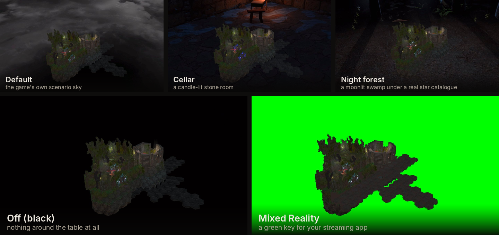

  

  
  
  
  

  

  &nbsp;<b>English</b>
  &nbsp;&nbsp;|&nbsp;&nbsp;
  <a href="README.de.md">&nbsp;Deutsch</a>

  <b>A room-scale VR mod for <a href="https://store.steampowered.com/app/780290/Gloomhaven/">Gloomhaven (Digital)</a>.</b> 
  Motion controls, a hand of cards you hold, a physical control board, 
  and full VR multiplayer.

  <a href="INSTALL.md"><b>Install →</b></a> &nbsp;·&nbsp;
  <a href="docs/PLAYING.md#the-controls">Controls</a> &nbsp;·&nbsp;
  <a href="docs/PLAYING.md">Playing guide</a>

  

<table>
<tr>
<td width="50%"><video src="https://github.com/user-attachments/assets/f23ad920-838c-4c2f-aba2-24378b3323e8" controls muted loop></video></td>
<td width="50%"><video src="https://github.com/user-attachments/assets/5bc45e99-89d1-4b3b-aa7d-47a74c184805" controls muted loop></video></td>
</tr>
</table>

Pick up a figure and it comes off the board into your hand. It stays whatever size you pulled it
to, and its card follows it: health, movement, attack, modifiers, and the turn it is about to take.
Drop it and it settles back onto a hex.

- Your hand of cards sits in your palm. Turn your hand up and the fan opens; take a card out with
  your fingers and drop it into a slot on the board.
- A control board you carry around with you. Undo, both rests, the piles and the decision drawer,
  all on one desk that hangs off a rod you can put wherever you like.
- Reach into the scenario. Lift a miniature to read the turn it is about to take, or grab the whole
  board with both hands to drag, turn and zoom it.
- The campaign map. Between scenarios you stand in a cellar over the map of Gloomhaven,
  with the quests on the wall next to you.
- Full VR multiplayer. Masks, hands, boards and pointing fingers are visible to everyone, and people
  without a headset can play in the same game on a flat screen.
- Rooms built for the mod. A candle-lit cellar and a night forest under a real star catalogue, both
  reacting to the scenario's elements.
- Mixed reality. The sky drops away and the table stands in your actual room.

  

## Full VR multiplayer

Every VR player has a mask, hands and their own control board. If you lift a miniature, move a
window or point at something, the others see it. People without a headset join the same game on a
flat screen.

  <video src="https://github.com/user-attachments/assets/df3e1980-e719-4b95-8832-bc7236431f14" width="720" controls muted loop></video>

  

## Cards and the control board

  <video src="https://github.com/user-attachments/assets/51b8518b-6bd9-4ab8-9699-a201e8bd1342" width="720" controls muted loop></video>

The control board is a desk that stands in front of you: two recesses for this round's cards, keys
you press with a fingertip, and a rod underneath for moving the whole thing. There is a labelled
picture of every part of it in the [playing guide](docs/PLAYING.md#cards-and-the-control-board).

  

## The scenario board

  <video src="https://github.com/user-attachments/assets/8ab499e0-0140-4e84-807b-1752b41cf625" width="720" controls muted loop></video>

Point the laser and pull the trigger to pick a hex, an enemy, a door or a chest. Or hold grip and
touch it with a fingertip.

  

## The campaign map

  <video src="https://github.com/user-attachments/assets/dadbad52-bde7-48bc-9518-b3a831096550" width="720" controls muted loop></video>

Between scenarios you stand in a cellar with the map of Gloomhaven spread out on the table in front
of you. The quests hang on the wall where you can read them, and unlocking one lights up the room.

  

## Environments

A candle-lit cellar, or a night forest under a real star catalogue. Both were built for the mod,
with firelight and ambient sound, and the odd thing that happens if you stand around long enough.

  
  

There is one setting for this, with five options. Same table, same scenario in all of them. The two
rooms above are the ones built for the mod. The other three are the game's own sky, no sky at all,
and a green key so your streaming app can put the table in your real room.

  

### Element reactions

The scenario's elements change the room around the edges, not over the play area. Fire sets props
burning, Ice grows frost, Air moves flames and foliage, Earth brings up growth, Light raises the
ambient level, Dark eclipses the moon.

   
  <i>Same camera, element off left and on right.</i>

  

## Hands, masks and board styles

Three pairs of hands, three masks and three control boards, each on its own dropdown. You can
change them in the middle of a session and the others see it.

  

Every window and every board hangs off a turned rod, and you move it by taking hold of the rod,
either with your hand or with the pointer from further away. Someone else's board keeps their rod,
not yours.

  

## Requirements and install

**Gloomhaven (Digital)** for PC (Steam or GOG) · Windows · a PC-VR headset with two tracked
controllers · room-scale or standing. It was developed on a Quest 3 over Virtual Desktop.

[→ Install guide](INSTALL.md). It comes down to two archives into the game folder. After that,
[the controls](docs/PLAYING.md#the-controls) and the [playing guide](docs/PLAYING.md).

  

The mod is free and will stay free. If it gave you a good evening at the table and you feel like
saying thanks, there is [a coffee](https://buymeacoffee.com/mcfredward).

<b>Credits and licence</b>

- **ARMA** and **JJ-Pueppi** tested this over a lot of sessions in the headset. Plenty of what is on
  this page looks the way it does because one of them tried it and said it was not right yet.
- **ARMA** also made the 3D assets: the hands, the masks and the boards. They started out as
  AI-generated shapes, which are not usable as they come. He remodelled, cleaned up, re-rigged and
  textured them in Blender until they hold up at arm's length in a headset.
- **[LCVR](https://github.com/DaXcess/LCVR)** and **[RepoXR](https://github.com/DaXcess/RepoXR)**
  (GPL-3.0), for the VR startup pattern, headset failover and finger curling this mod adapts.
- **[UUVR](https://github.com/Raicuparta/uuvr)** (GPL-3.0), for the flat-screen-in-VR pattern, used
  where a world panel is not the right answer.
- **Demeo** (Resolution Games), whose interaction model this mod follows. No assets or code from it
  are used.

**Licence: GPL-3.0**, see [LICENSE](LICENSE). The mod ships only its own code and its own licensed
artwork. No game files, no game assets, no decompiled sources.

Not affiliated with Flaming Fowl Studios, Twin Sails Interactive, Asmodee or Cephalofair Games.
Gloomhaven and its artwork belong to their owners.

**Working on the mod?** [docs/DEVELOPING.md](docs/DEVELOPING.md)

