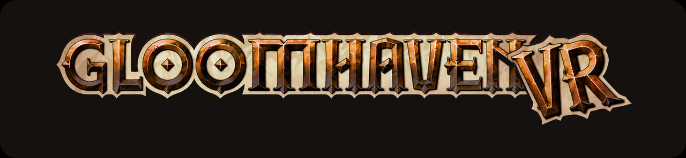

  <picture>
    <source media="(prefers-color-scheme: light)" srcset="docs/img/logo-onlight.png">
    
  </picture>

  A room-scale VR mod for <b>Gloomhaven (digital)</b> on PC. 
  The scenario becomes a diorama on a table you stand at, played with tracked hands.

  <a href="INSTALL.md"><b>Install →</b></a> &nbsp;·&nbsp;
  <a href="docs/PLAYING.md">Playing guide</a> &nbsp;·&nbsp;
  <a href="docs/PLAYING.md#known-limitations">Known limitations</a>

---

The mod runs on top of the existing game. Rules, saves and campaign progress are the game's own and
are not modified.

## Multiplayer

Supported for the full session, and every feature is built to work with other players in it. Each
VR player has a head mask, hands and their own control board; miniatures picked up, shared windows
moved and points made with a finger are visible to everyone.

Players without a headset join the same session on a flat screen and see VR actions as ordinary
moves. All VR players need the same mod version; peers on different versions are blocked with a
notice.

## Cards and miniatures

Turning the wrist palm-up opens the hand of ability cards as a fan. A card can be taken out, held
up to read and dropped into a slot on the control board; slot order is the initiative order.
Miniatures can be squeezed off the board, held, resized with the second hand and released back onto
their hex.

<table>
<tr>
<td width="50%"><video src="https://github.com/user-attachments/assets/265e8b02-5b8b-4732-aad8-2ba134bf4225" controls muted loop></video></td>
<td width="50%"><video src="https://github.com/user-attachments/assets/5bc45e99-89d1-4b3b-aa7d-47a74c184805" controls muted loop></video></td>
</tr>
</table>

The game's own windows — character sheets, the merchant, the story — become panels in the room that
can be grabbed by a bar, moved, resized and left where they are put. Between scenarios the campaign
map is a room with a table in it rather than a screen.

## Custom assets

Three pairs of hands, three head masks and three control boards, one dropdown each in the settings
and changeable mid-session. The choice is visible to the other players. All of them were modelled
for this project.

   
  <i>Leather glove · plate gauntlet · arcane glove</i>

   
  <i>Ironwatch · Runeveil · Grimhorn</i>

   
  <i>Oak · Steel · Bronze</i>

## Environments

Two rooms to play in, both built for this project: a candle-lit cellar and a night forest with a
real star catalogue overhead. Both carry firelight, ambient sound and occasional rare events, and
each of those has its own setting.

  
  

The rooms react to the scenario's element infusions. Fire lights the room and sets props burning,
Ice grows frost over floors, walls and trunks, Air moves flames and foliage, Earth brings up growth,
Light lifts the ambient level and Dark lowers it and puts the moon into a total eclipse. The effect
is applied at the edges of the room, not over the play area, and can be turned off or scaled in the
settings.

   
  <i>Same camera, element off on the left of each pair and on on the right.</i>

**Mixed reality** is an alternative to both rooms: the sky is replaced with a chroma-key colour so a
streaming app can composite the board and the table over the real room. With passthrough on the
built rooms and the sky are switched off, because they cannot be drawn over it.

## Requirements

**Gloomhaven (digital) for PC** (Steam or GOG) · a Windows PC that runs it · a **PC-VR headset with
two tracked controllers**. Room-scale or standing; a small play space is enough.

Developed and tested on a **Quest 3 over Virtual Desktop**. Installation is two archives extracted
into the game folder; one line in a config file disables the mod again.

### **[→ Install guide](INSTALL.md)**

---

<b>Credits and licence</b>

Built on the work of others:

- **[LCVR](https://github.com/DaXcess/LCVR)** and **[RepoXR](https://github.com/DaXcess/RepoXR)**
  (GPL-3.0) — the VR startup pattern, headset failover and finger curling this mod adapts.
- **[UUVR](https://github.com/Raicuparta/uuvr)** (GPL-3.0) — the flat-screen-in-VR pattern used
  where a world panel is not the right answer.
- **[SteamVR Unity Plugin](https://github.com/ValveSoftware/steamvr_unity_plugin)** by Valve
  (BSD-3-Clause) — the base hand models.
- **Demeo** (Resolution Games) — the interaction model this mod follows. No assets or code from it
  are used.
- The hands, the masks, the boards and the other built 3D assets were made for this project by its
  artist.

**Licence: GPL-3.0** — see [LICENSE](LICENSE). The mod ships **only its own code and its own
licensed artwork**; never game files, game assets or decompiled sources.

Not affiliated with Flaming Fowl Studios, Twin Sails Interactive, Asmodee or Cephalofair Games.
Gloomhaven and its artwork belong to their owners.

**Working on the mod?** [docs/DEVELOPING.md](docs/DEVELOPING.md)

