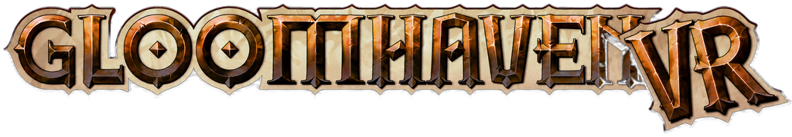
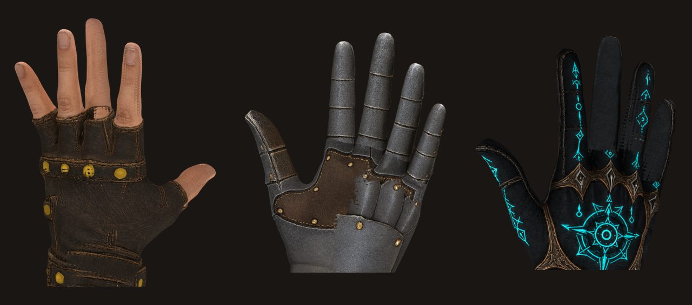
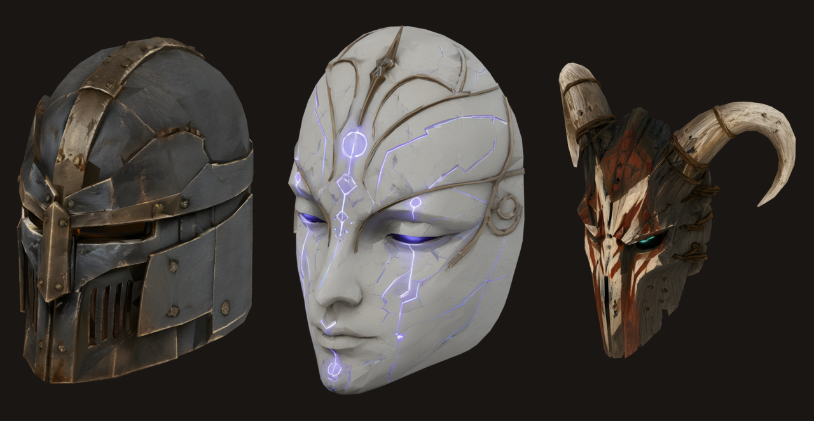
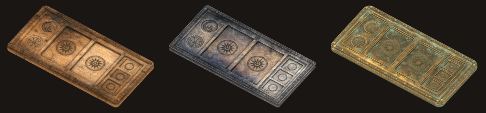

  <picture>
    <source media="(prefers-color-scheme: dark)" srcset="docs/img/logo-dark.png">
    
  </picture>

  <b>Play Gloomhaven (digital) as a room-scale VR board game.</b> 
  You stand at the table. You pick your cards up with your hands. 
  <b>And your friends can stand at it with you.</b>

---

GloomhavenVR is a mod for the PC version of **Gloomhaven (digital)**. It does not hang the flat
game on a big screen inside a headset. It rebuilds it as a tabletop you stand at.

The scenario is a lit diorama on the table in front of you. You lean over it to see round a
corner, you walk to the other end of it, you take the whole board in both hands and pull it
closer. Turn your palm up and your hand of ability cards fans out of it — pick one out with your
fingers, hold it up to your face to read it, drop it into a slot on the board beside you. Reach
into the scenario and the miniatures come up off their hexes. Between scenarios the campaign map
is not a screen either; it is a room with a table in it, and your party token walks the route it
travels.

Everything else is exactly the game you already have. Same rules, same saves, same campaign.

<!-- VIDEO: docs/img/overview.mp4 -->
> **[ VIDEO PLACEHOLDER — `docs/img/overview.mp4` ]**
> *The hero shot: standing at the table in a lit scenario, then dragging, rotating and zooming
> the board with the two-handed world grab.*

---

## Play it together, in VR

**This is the part that makes it a board game again.** Multiplayer is not a mode that survived the
port — it is the thing the whole mod is built around, and every feature in it was designed to
work with other people from the first line of code.

Sit two, three, four of you around the same table. You see each other: a mask where a face would
be, hands that point and gesture and reach, a control board of your own beside you with your
cards in it. When someone lifts a miniature off the board, everyone sees it lift. When someone
drags the story window to a new spot, it moves for everyone, because a shared window hangs in the
room and not in front of one person's eyes. Point at a hex and the others follow your finger.

**And the people who do not own a headset lose nothing.** They sit in the same game on a flat
screen, playing the game they already know, and everything you do in VR reaches them as an
ordinary move. Nobody has to buy anything for you to play in VR.

Everyone playing in VR needs the same version of the mod. That is the only rule.

<!-- VIDEO: docs/img/multiplayer.mp4 -->
> **[ VIDEO PLACEHOLDER — `docs/img/multiplayer.mp4` ]**
> *Two players at the same table: masks and hands, a miniature lifted and seen by both, a shared
> window dragged to a new place in the room.*

---

## What that looks like

**Your hand of cards lives in your palm.** Roll your wrist up, the fan opens, and you drop the
two cards you want into the slots on your control board — slot order is your initiative, exactly
like the physical game.

  

> *Palm rolls up, the card fan opens, a card is grabbed and dropped into a board slot; then the
> top or bottom half is poked to choose it.* — **[▶ play the clip](docs/img/card-fan.mp4)**

**You pick the miniatures up.** Squeeze one off the board, hold it up to see what it is, resize it
in mid-air with your other hand, and let go — it glides back down to its hex.

  

> *A miniature is picked off the board, held up, scaled with the second hand, and glides back
> to its hex when released.* — **[▶ play the clip](docs/img/figure-grab.mp4)**

**The game's windows become panels in the room.** Character sheets, the merchant, the story — grab
one by its bar, move it, resize it, park it where you want it. Where you put one is where it stays.

<!-- VIDEO: docs/img/windows.mp4 -->
> **[ VIDEO PLACEHOLDER — `docs/img/windows.mp4` ]**
> *A window opens in front of the player, is grabbed by its bar, moved and resized, then reeled
> closer with the thumbstick.*

**The campaign map is a room, not a menu.** The guildmaster buttons are physical caps on the table
rim. Press one and its window opens; press it again and it closes.

<!-- VIDEO: docs/img/map-room.mp4 -->
> **[ VIDEO PLACEHOLDER — `docs/img/map-room.mp4` ]**
> *The 3D campaign map room: pressing a table-rim cap to open a window, pointing at a location,
> the party token walking its route.*

---

## Make it yours — and let the others see it

The hands you reach with, the face you wear and the board at your side are all yours to pick, and
**the other players see your choice, not a default.** Every one of these was modelled for this
project; none of it is lifted from the game.

**Three pairs of hands.** They are your hands for the whole session — you will look at them more
than at anything else in the room.

  

> *Leather glove · Plate gauntlet · Arcane glove*

**Three masks.** In multiplayer this is your face — it is what the others look at across the table
while you think about your cards.

  

> *Ironwatch · Runeveil · Grimhorn*

**Three control boards.** This is the desk beside you that holds your two chosen cards, your round
counter and your buttons.

  

> *Oak · Steel · Bronze*

All nine are one dropdown each in the settings, changeable mid-session.

---

## And the room you play in

The flat game has a background. This one has a **place** — two of them, built by hand for this mod
and picked from a dropdown.

**A candle-lit cellar.** Rough masonry, a flagstone floor, crates and barrels going back into the
dark, a guttering candle on a table in the corner and a barred window with the moon behind it.
Water finds its way down and drips into a puddle; every so often a rat runs the length of the room
and through the moonbeam on its way to a hole.

  

**A moonlit night forest.** Trees that close over you, a real star catalogue overhead, moonlight
coming down through the canopy in shafts, ferns, fireflies, and a wood that is genuinely dark past
the clearing.

  

**And the room answers the game.** The six Gloomhaven elements are not just icons on a strip. Infuse
**Fire** and the cellar warms right to the ceiling while embers rise at the tree line. Infuse **Ice**
and frost grows out across the flagstones, up the walls and over the trunks. **Air** makes the
candles gust, the leaves shake and the puddles chop. **Earth** brings green up out of the dark.
**Light** lifts the whole wood — and **Dark** takes it away, hardens every flame to a small fierce
point, and walks the moon into a total eclipse until it hangs there copper-red. They layer: Light
and Dark at once do not cancel to grey, they give you a black room with a few unbearable sources in
it. Every element fades in and out over a second, breathes while it is waning, and blooms at the
walls and the tree line — the board itself stays exactly as readable as it was.

  

> *The same two cameras as the pictures above, with one element at full strength. It reacts to the
> real element board, so both players see the same room do the same thing at the same moment.*

**Or no built room at all — yours.** Switch on **mixed reality** and the sky is replaced with a flat
chroma-key colour your streaming app punches out, so the diorama, the table and your control board
float in your actual living room. It is an either/or, honestly: with passthrough on, the cellar and
the forest stand down, because a built room drawn over your real one looks like neither. Floating
text and panels get solid backings while it is on, so they stay readable against whatever is behind
them.

Both rooms hide rare apparitions you will hopefully not be looking at when they happen. Rooms,
ambience, apparitions and the element response all have their own off switches.

<!-- VIDEO: docs/img/environments.mp4 -->
> **[ VIDEO PLACEHOLDER — `docs/img/environments.mp4` ]**
> *The cellar and the night forest: firelight, the night sky, an element infusion changing the
> room, and the switch between environments in the settings.*

---

## What you need

- **Gloomhaven (digital) for PC**, v1.1.x — Steam or GOG.
- **A Windows PC** that already runs it, and a **PC-VR headset with two tracked controllers**.
  The game runs on the PC and you stream or tether the headset to it, as you would for any PC-VR
  title. It does not run on a standalone headset by itself.
- **Room-scale or standing.** A small space is fine — you can fly, pull the world over to you, and
  recentre yourself at any time.

Built and played on a **Quest 3 over Virtual Desktop**. Quest Link, Steam Link and SteamVR are the
other obvious ways in and *have not been tried yet* — if you get there first, say so.

Setup is two zip files extracted into the game folder, once.
**→ [Install guide](INSTALL.md)** — it also covers settings, updates, problems and uninstalling.

It installs alongside the normal game, writes nothing you cannot undo, and can be switched off
again with a single line in a text file to get the original game back.

---

## Rough edges

It is **pre-1.0** and it moves. The honest short list:

- Large, fully-revealed scenarios seen from above can hitch for a moment as the walls open up.
- With five windows open in the map room they can start to overlap, and the nearer one takes the
  clicks.
- A couple of the game's own messages still appear only on the flat monitor — you see the effect
  but not the sentence.
- Mixed reality and the built rooms are an either/or: with see-through on, the cellar, the forest
  and the sky stand down, because they cannot be drawn over passthrough and still look right.

[The full list is in the playing guide](docs/PLAYING.md#known-limitations) — it is longer, and none
of it is a surprise.

---

## Where to go next

- **[Install guide](INSTALL.md)** — what you need, how to install it, settings, updates,
  troubleshooting, uninstall.
- **[Playing guide](docs/PLAYING.md)** — every control, what the board, the panels and the map
  room do, multiplayer in full, and the complete list of rough edges.
- **[Working on the mod](docs/DEVELOPING.md)** — building from source, the asset pipeline, the
  hardware test scripts. Nothing in this README is needed to build it.

---

## Credits and licence

Built on the work of others:

- **[LCVR](https://github.com/DaXcess/LCVR)** and **[RepoXR](https://github.com/DaXcess/RepoXR)**
  (GPL-3.0) — the VR startup pattern, headset failover and finger curling this mod adapts.
- **[UUVR](https://github.com/Raicuparta/uuvr)** (GPL-3.0) — the flat-screen-in-VR pattern used
  where a world panel is not the right answer.
- **[SteamVR Unity Plugin](https://github.com/ValveSoftware/steamvr_unity_plugin)** by Valve
  (BSD-3-Clause) — the base hand models.
- **Demeo** (Resolution Games) — the interaction model this mod chases. No assets or code from
  it are used.
- The hands, the masks, the boards and the other built 3D assets were made for this project by its
  artist.

**Licence: GPL-3.0** — see [LICENSE](LICENSE). The mod ships **only its own code and its own
licensed artwork**; never game files, game assets or decompiled sources.

Not affiliated with Flaming Fowl Studios, Twin Sails Interactive, Asmodee or Cephalofair Games.
Gloomhaven and its artwork belong to their owners.
