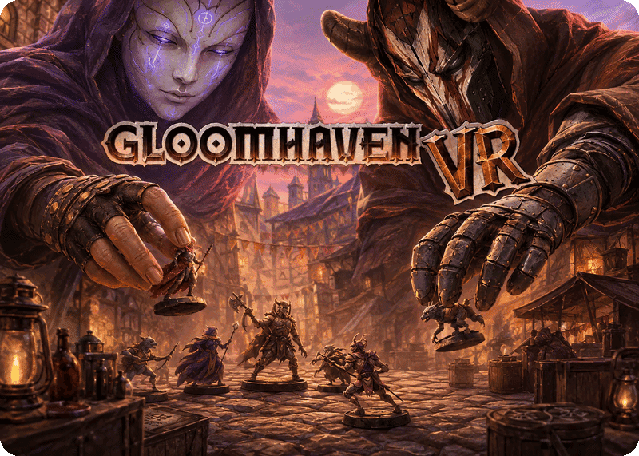
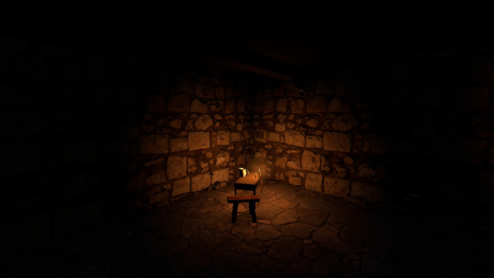
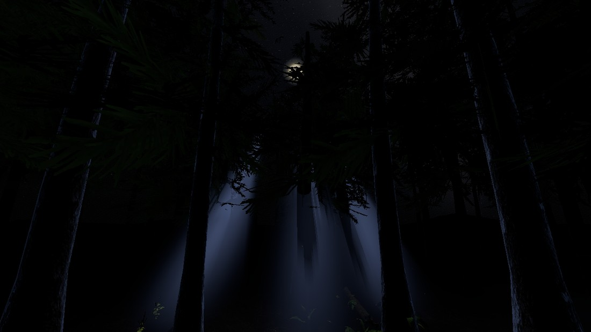
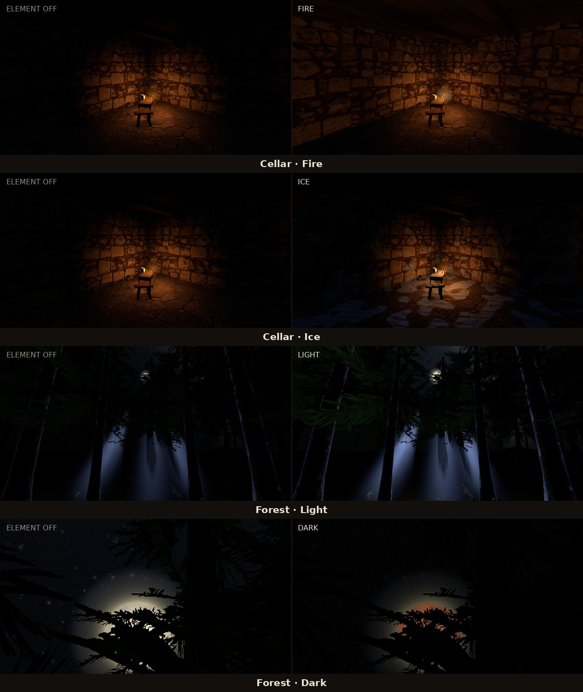
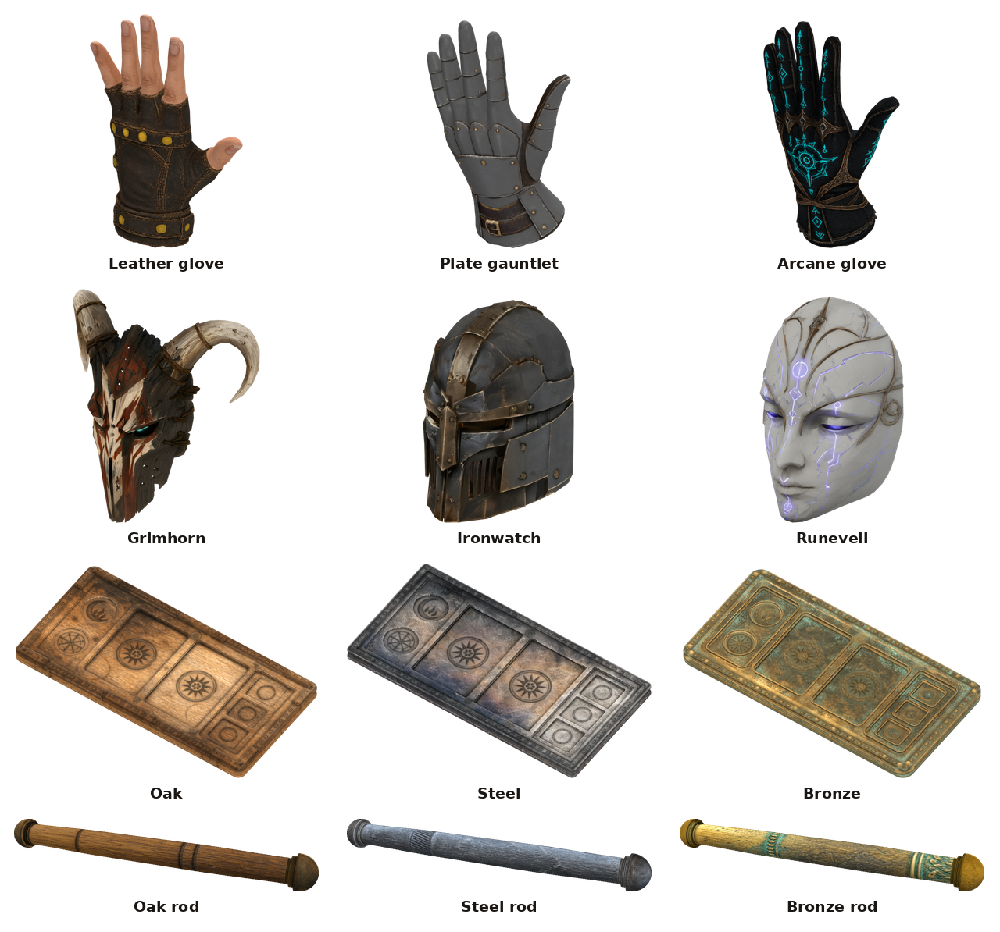

  

  
  
  
  

  

  &nbsp;<b>English</b>
  &nbsp;&nbsp;|&nbsp;&nbsp;
  <a href="README.de.md">&nbsp;Deutsch</a>

  <b><a href="https://store.steampowered.com/app/780290/Gloomhaven/">Gloomhaven (Digital)</a>, played standing at the table.</b> 
  A community VR mod: the cards fan out in your palm, the board lies in front of you, 
  and the other players are in the room with you.

  <a href="INSTALL.md"><b>Install →</b></a> &nbsp;·&nbsp;
  <a href="docs/PLAYING.md#the-controls">Controls</a> &nbsp;·&nbsp;
  <a href="docs/PLAYING.md">Playing guide</a>

---

<table>
<tr>
<td width="50%"><video src="https://github.com/user-attachments/assets/f23ad920-838c-4c2f-aba2-24378b3323e8" controls muted loop></video></td>
<td width="50%"><video src="https://github.com/user-attachments/assets/5bc45e99-89d1-4b3b-aa7d-47a74c184805" controls muted loop></video></td>
</tr>
</table>

**Pick a figure up and it comes off the board into your hand** — at whatever size you pull it to,
and its card comes with it: health, movement, attack, the modifiers, the turn it is about to take.
Put it back and it settles onto its hex.

- **Your hand of cards sits in your palm.** Turn it up, the fan opens, take a card with your
  fingers and drop it into a slot on the board.
- **A control board you carry with you.** Undo, the two rests, the piles, the decision drawer —
  one desk on a rod, placed wherever you want it.
- **Reach into the scenario.** Pick a miniature up to read its coming turn; take the whole board
  with both hands to drag, turn and zoom it.
- **The campaign map on a table.** Between scenarios you stand in a cellar over the map of
  Gloomhaven, with the quests hanging on the wall where you can read them.
- **Full VR multiplayer.** Masks, hands, boards and pointing fingers, visible to everyone — and
  players without a headset in the same game on a flat screen.
- **Rooms built for this mod.** A candle-lit cellar and a night forest under a real star catalogue,
  both reacting to the scenario's element infusions.
- **Mixed reality.** The sky drops away and the table stands in your real room.

## Everyone at the same table

Every VR player has a mask, hands and their own control board. Lifted miniatures, moved windows and
pointing fingers are visible to everyone, and players without a headset join the same game on a flat
screen.

  <video src="https://github.com/user-attachments/assets/df3e1980-e719-4b95-8832-bc7236431f14" width="720" controls muted loop></video>

## Your cards and your board

  <video src="https://github.com/user-attachments/assets/51b8518b-6bd9-4ab8-9699-a201e8bd1342" width="720" controls muted loop></video>

Your control board is a real desk in front of you: two recesses for the round's cards, keys you push
in with a fingertip, and a rod under it that carries the whole thing wherever you want it.
Every part of it is named on one labelled picture in the
[playing guide](docs/PLAYING.md#your-cards-and-your-board).

## The board in front of you

  <video src="https://github.com/user-attachments/assets/8ab499e0-0140-4e84-807b-1752b41cf625" width="720" controls muted loop></video>

Point the laser and pull the trigger to take a hex, an enemy, a door or a chest — or hold the grip
and touch it with a fingertip.

## The campaign map on a table

  <video src="https://github.com/user-attachments/assets/dadbad52-bde7-48bc-9518-b3a831096550" width="720" controls muted loop></video>

Between scenarios you stand in a cellar with the map of Gloomhaven spread out on the table in front
of you. Quests hang on the wall where you can read them, and unlocking one lights up the room.

## The room you play in

A candle-lit cellar or a night forest under a real star catalogue — both built for this project, both
with firelight, ambient sound and rare events.

  
  

**Mixed reality** drops the sky, so your streaming app can put the table in your real room.

### The rooms react to the elements

**The scenario's element infusions change the room**, at the edges rather than over the play area.
Fire sets props burning, Ice grows frost, Air moves flames and foliage, Earth brings up growth, Light
lifts the ambient level, Dark eclipses the moon.

   
  <i>Same camera, element off left and on right.</i>

## Hands, masks and boards

Three pairs of hands, three masks, three control boards — one dropdown each, changeable mid-session,
and the other players see your choice.

  

Every window and every board hangs from a turned rod and is moved by taking hold of it — with your
hand, or with the pointer from across the table. A board you look at across the table wears **its
owner's** rod, not yours.

## What you need, and how to install

**Gloomhaven (Digital)** for PC (Steam or GOG) · Windows · a PC-VR headset with two tracked
controllers · room-scale or standing. Developed on a **Quest 3 over Virtual Desktop**.

**[→ Install guide](INSTALL.md)** — two archives into the game folder. Then
[the controls](docs/PLAYING.md#the-controls) and the [playing guide](docs/PLAYING.md).

---

**Free, and staying free.** If the mod gave you a good evening at the table and you feel like saying
thanks, there is [a coffee](https://buymeacoffee.com/mcfredward).

<b>Credits and licence</b>

- **ARMA** and **JJ-Pueppi** — testers, over countless sessions in the headset. A great deal of what
  this page shows exists in its present shape because one of them put a headset on and said it was
  not right yet.
- **ARMA** also built the mod's 3D assets — the hands, the masks, the boards and the rest. They
  began as AI-generated shapes and became usable models in his hands: remodelled, cleaned up,
  re-rigged and textured in Blender until they hold up at arm's length in a headset, which is
  where a generated mesh normally falls apart.
- **[LCVR](https://github.com/DaXcess/LCVR)** and **[RepoXR](https://github.com/DaXcess/RepoXR)**
  (GPL-3.0) — the VR startup pattern, headset failover and finger curling this mod adapts.
- **[UUVR](https://github.com/Raicuparta/uuvr)** (GPL-3.0) — the flat-screen-in-VR pattern used
  where a world panel is not the right answer.
- **Demeo** (Resolution Games) — the interaction model this mod follows. No assets or code from it
  are used.

**Licence: GPL-3.0** — see [LICENSE](LICENSE). The mod ships **only its own code and its own
licensed artwork**; never game files, game assets or decompiled sources.

Not affiliated with Flaming Fowl Studios, Twin Sails Interactive, Asmodee or Cephalofair Games.
Gloomhaven and its artwork belong to their owners.

**Working on the mod?** [docs/DEVELOPING.md](docs/DEVELOPING.md)

