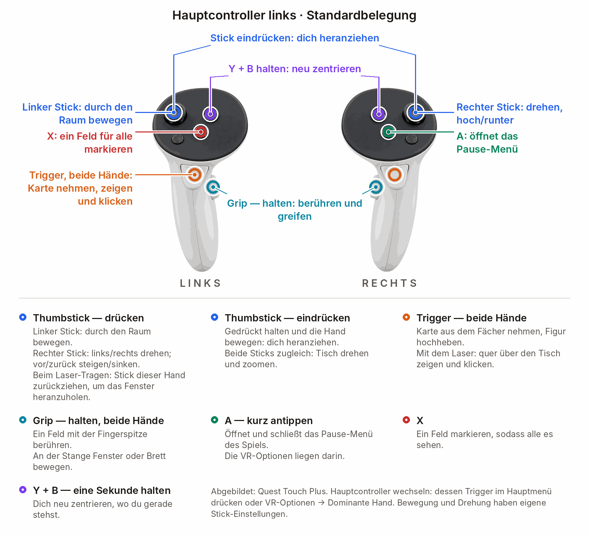

# GloomhavenVR — Spielanleitung

  <a href="PLAYING.md">&nbsp;English</a>
  &nbsp;&nbsp;|&nbsp;&nbsp;
  &nbsp;<b>Deutsch</b>

[Installation](../INSTALL.de.md) · [Steuerung](#die-steuerung) · [Rundenablauf](#karten-und-kontrollbrett)

## Die Steuerung

  

<b>Linker Hauptcontroller — Tastenbelegung anzeigen</b>

  

**Hauptcontroller wählen:** Drück im **Hauptmenü den Trigger** des gewünschten Controllers oder
wähle **VR Optionen ▸ Komfort ▸ Hände & Zielen ▸ Dominante Hand**. Der Laser wechselt auf diese
Hand, der Kartenfächer auf die andere. **A und X tauschen ihre Funktionen für Pause und Markieren.**
Fliegen bleibt standardmäßig links, Drehen rechts; beides lässt sich unter **Komfort** separat einstellen.

- **Gehaltene Figur skalieren:** Trigger der anderen Hand halten und die Hände auseinander oder zusammen bewegen.
- **45°-Drehschritte:** Unter **Komfort ▸ Drehen** einschalten.
- **Steigen/sinken:** Rechten Stick nach vorn/hinten drücken (standardmäßig an); ändern unter **Komfort ▸ Fortbewegung**.

Das interaktive Tutorial markiert die jeweilige Taste auf deinen Controllern.
Ein- und ausschalten unter **Komfort ▸ Hände & Zielen**.

## Karten und Kontrollbrett

**Linke Mulde = Initiative.** Lege deine Initiativkarte links und die zweite Karte rechts ab.

  

| Phase | Ablauf |
|---|---|
| **Auswahlphase** | Handfläche nach oben drehen, um den Fächer zu öffnen. Zwei Karten mit dem Trigger nehmen und auf das Brett legen; das linke Fach bestimmt die Initiative. **Bestätigen** drücken. Über die Porträts in der Initiativreihenfolge die Karten für jeden eigenen Charakter auswählen. |
| **Aktionsphase** | Ist dein Charakter am Zug, die obere oder untere Kartenaktion wählen, Ziele auswählen und verfügbare Gegenstände nutzen. Entscheidungen treffen und den Zug am Brett beenden. |
| **Charaktere ansehen** | In der Auswahlphase zwischen eigenen Charakteren wechseln. In der Aktionsphase über die Initiativreihenfolge **jeden Charakter** ansehen: auch fremde und solche, die gerade nicht am Zug sind. Karten, Gegenstände und Entscheidungen bleiben einsehbar. Aktionen sind auf eigene Charaktere und die aktuellen Spielregeln beschränkt. |

**Handkarten sortieren:** Eine Karte nehmen, über die gewünschte Lücke im Fächer halten und
loslassen. Das geht bei eigenen Charakteren auf der Kampagnenkarte und in beiden Szenariophasen.
Die Reihenfolge bleibt beim Szenariostart erhalten und ist für Mitspieler sichtbar.
Abgeworfene Karten bei der langen Rast lassen sich nicht umsortieren.

Das Brett **folgt dir standardmäßig**; über **Folgen/Fixiert** kannst du umschalten. **Y + B**
halten, um dich neu zu zentrieren und das Brett neben dir zurückzusetzen. Fremde Bretter werden
standardmäßig durchsichtig, wenn sie das Szenario verdecken. Gespeicherte Einstellungen gelten weiter.

Die Stapel für **abgeworfene Karten**, **verbrannte Karten** und **Gegenstände** öffnen sich als
Fächer. Auf dem Brett liegen auch **aktive Karten**, **Rückgängig**, **Überspringen**, Rast-Tasten
und der Entscheidungsbereich.

[Video: Karten und Kontrollbrett](../README.de.md#karten-kontrollbrett-und-tisch)

## Das Szenario-Brett

Ein Feld, einen Gegner, eine Tür oder eine Truhe mit **Laser + Trigger** auswählen oder **Grip**
halten und mit der Fingerspitze berühren. Eine Figur mit dem Trigger hochheben, um ihre Werte und
ihren geplanten Zug zu sehen. Das Szenario mit beiden Händen greifen, verschieben, drehen und skalieren.

## Fenster

Ein Fenster direkt oder mit dem Laser an der oberen Stange greifen und verschieben. Beim Halten
mit dem Laser bewegt der **Stick derselben Hand** das Fenster näher oder weiter weg.
Mit beiden Händen an der Stange die Größe ändern; über das **X** das Fenster schließen.

| Zeichen am Fenster | Wer sieht es? |
|---|---|
|  **Geteilt** (im Spiel blau pulsierend) | Alle. Geteilte Fenster und die Seiten der Geschichte bleiben synchron. Das Symbol sitzt oben rechts, unter dem Schließen-**X**, sofern vorhanden. |
| **Kein Symbol: lokal** | Nur du. |

## Die Kampagnenkarte

[Video: Kampagnenkarte](../README.de.md#die-kampagnenkarte)

Auf einen Ort zeigen, um dessen Auftragsschild einzublenden. Die Gildenmeister-Tasten liegen am
Tischrand. Für die originale flache Karte **Umgebung & Ton ▸ Kampagnenkarte ▸ Originale 2D-Karte** aktivieren.

## Umgebungen

  
  

In den VR Optionen **Keller**, **Nachtwald**, **Standard**-Himmel des Spiels, **Aus (schwarz)** oder
**Mixed Reality** wählen. Elemente beeinflussen Licht und Umgebung.
Seltene Erscheinungen lassen sich unter **Umgebung & Ton ▸ Grusel** reduzieren oder abschalten.

## Mehrspieler

[Video: VR-Mehrspieler](../README.de.md#vollwertiger-vr-mehrspieler)

- VR-Spieler brauchen dieselbe Mod-Version; [gemeinsam aktualisieren](../INSTALL.de.md#updates).
  Spieler ohne Mod können am flachen Bildschirm mitspielen.
- Andere Spieler sehen deine Hände, Maske, gehaltenen Objekte und ein Live-Abbild deines Bretts.
  Im Szenario sind fremde Fächer, Handkarten und abgelegte Karten **in der Auswahlphase verdeckt**
  und **in der Aktionsphase offen**. Fremde Verbrennungsflüge bei kurzer Rast bleiben verdeckt.
- **Eigene Karten bleiben sichtbar.** Auf der **3D-Kampagnenkarte** sind alle Karten für alle offen.
