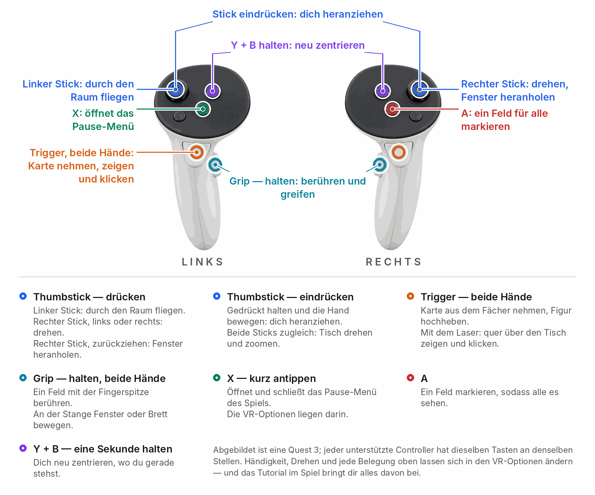
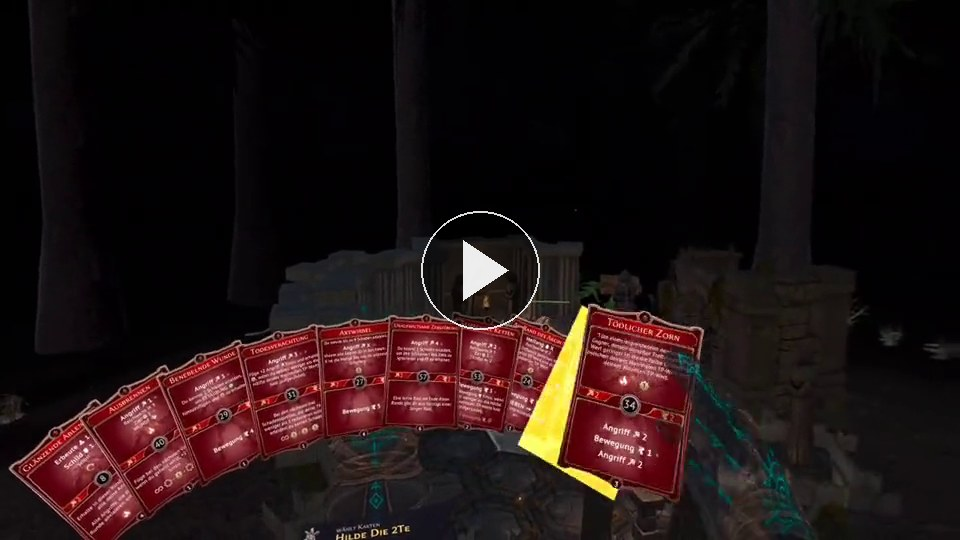
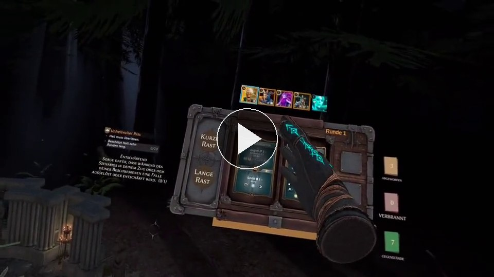
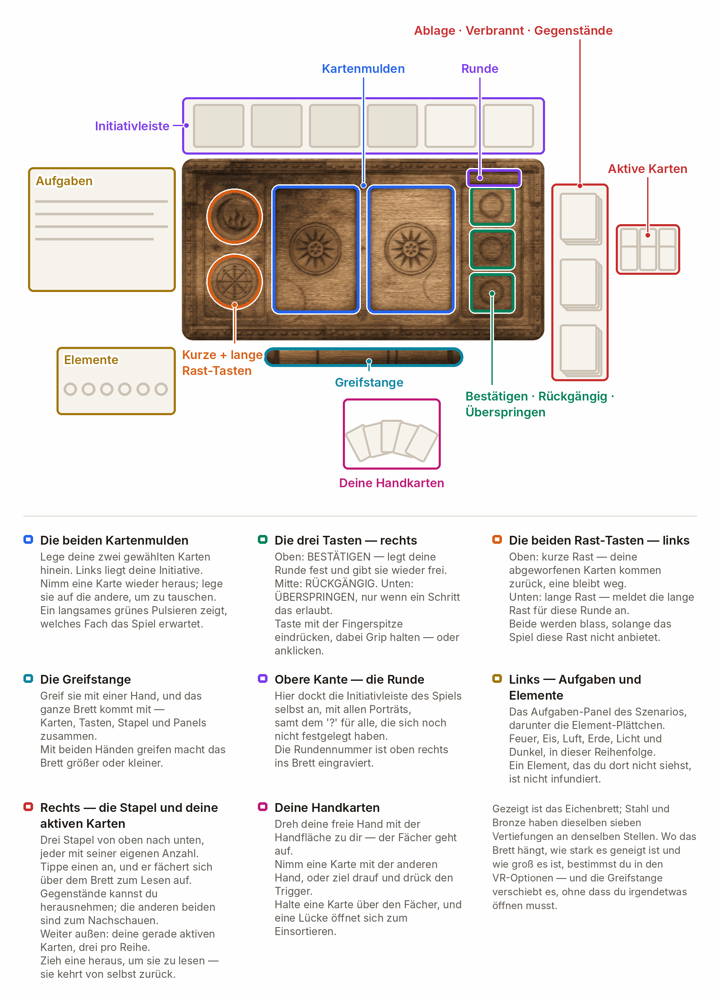
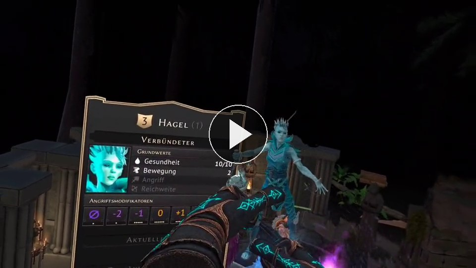
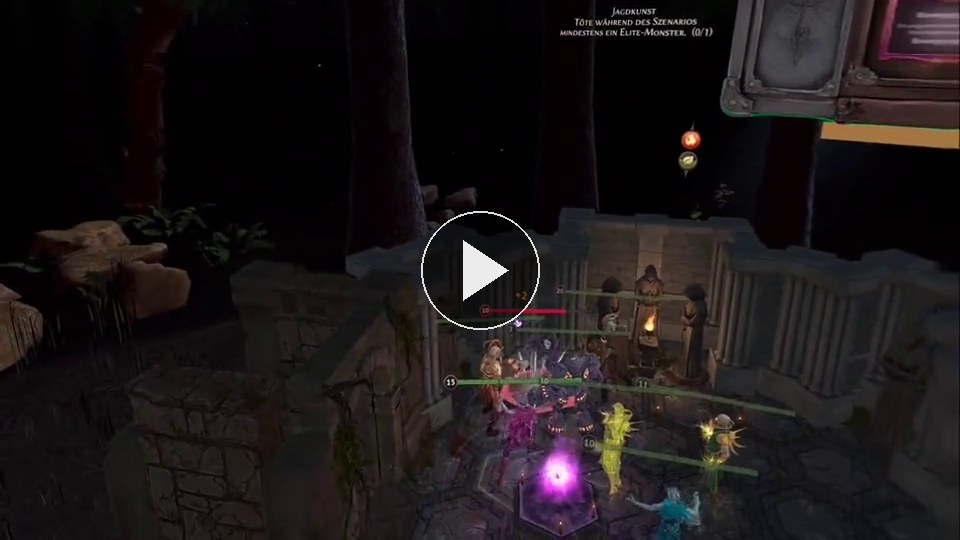
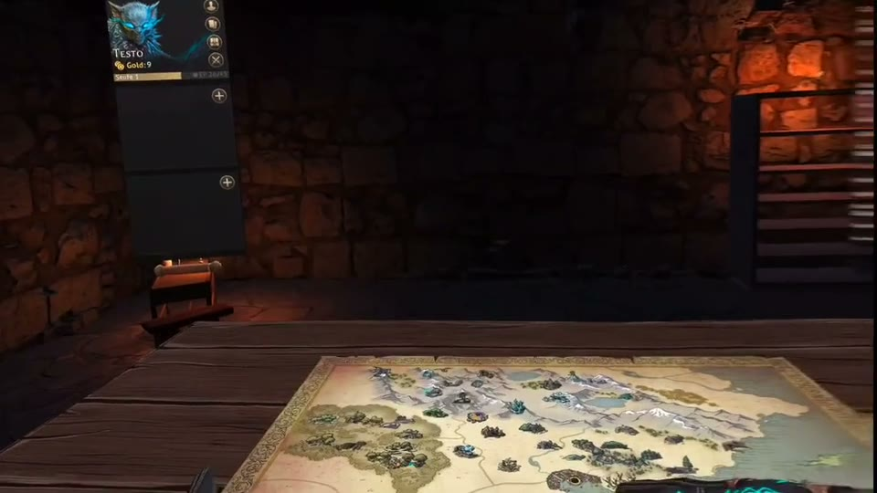

# GloomhavenVR — Spielanleitung

  <a href="PLAYING.md">&nbsp;English</a>
  &nbsp;&nbsp;|&nbsp;&nbsp;
  &nbsp;<b>Deutsch</b>

Noch nicht installiert? → [Installationsanleitung](../INSTALL.de.md)

---

## Die Steuerung

  

**Du musst das nicht lernen.** Das Tutorial macht aus deinen Händen den Controller, den du
tatsächlich hältst, und lässt für jede der vierzehn Steuerungen die passende Taste aufleuchten — in
der Reihenfolge, in der sie nützlich werden. Abschalten unter **Komfort ▸ Hände & Zielen**.

<table>
<tr><td>

**🎬 VIDEO-PLATZHALTER 3 von 6 — `tutorial.mp4` — hier ist noch nichts, an dieser Stelle wird bislang nichts angezeigt.**

**Was der Clip zeigen muss** (12 s): wie deine Hände zu dem Controller werden, den du wirklich
in der Hand hältst, und wie eine Taste nach der anderen aufleuchtet, sobald die jeweilige Steuerung
gebraucht wird. Danach ist klar: die vierzehn Belegungen oben werden beigebracht, nicht auswendig
gelernt.

**So füllst du ihn:** leg `tutorial.mp4` und `tutorial-poster.jpg` in `docs/img/` und lösch dann
diesen Kasten samt der zwei Kommentar-Markierungen um die fertige Auszeichnung darunter — die zeigt
schon auf beide Dateien. Derselbe Clip kommt an dieselbe Stelle in `PLAYING.md`. Auftrag:
[VIDEO-SHOTLIST.md](VIDEO-SHOTLIST.md) (englisch) · Schnitt und Kodierung:
[img/README.md](img/README.md#encoding-a-new-clip) (englisch).

</td></tr>
</table>

<!-- READY MARKUP for tutorial.mp4 — delete this line and the closing marker once the files are in place

  

-->

Drei Sachen, die das Bild nicht zeigen kann:

- **Eine gehaltene Figur größer oder kleiner machen** — mit einer Hand halten, den **Trigger der anderen Hand** ziehen, Hände auseinander oder zusammen.
- **45°-Sprünge statt fließendem Drehen** — **Komfort ▸ Drehen**.
- **Steigen und sinken** auf dem rechten Stick — standardmäßig aus, einschalten unter **Komfort**.

---

## Deine Karten und dein Brett

  
  

Dreh die Handfläche nach oben, und deine Hand **fächert sich davor auf**. Nimm eine Karte mit dem
Trigger und leg sie in einen Slot deines Kontrollbretts — die Reihenfolge der Slots ist deine
Initiative, genau wie im echten Spiel. Beide Karten drin, dann **Bestätigen** drücken. Wenn du am
Zug bist, **tipp die obere oder untere Hälfte** einer gespielten Karte an, um die Hälfte zu wählen.

Auf dem Brett neben dir liegen außerdem Rückgängig, die Marken für kurze und lange Rast,
Überspringen, die Entscheidungs-Schublade, eine Mulde für Gegenstände und die Stapel für Ablage,
Verbranntes und Gegenstände — jeder klappt als Fächer auf, über dem Brett oder in der Handfläche.

  

---

## Das Brett vor dir

  
  

Zeig mit dem Laser darauf und drück den Trigger, um ein Feld, einen Gegner, eine Tür oder eine Truhe
auszuwählen — oder halt den **Grip** und berühr es mit der Fingerspitze. Der Grip muss mit, und zwar
mit Absicht: so wählt eine Hand, die nur über das Brett streicht, nie etwas aus.

**Heb eine Figur hoch** — mit dem Trigger — und du siehst ihren kommenden Zug.

---

## Fenster

<table>
<tr><td>

**🎬 VIDEO-PLATZHALTER 4 und 5 von 6 — `windows.mp4` und `grab-rod.mp4` — hier ist noch nichts, an dieser Stelle wird bislang nichts angezeigt.**

**Was die Clips zeigen müssen** (12 s und 8–10 s, nebeneinander): ein Spielfenster, an seiner
Stange gegriffen, verschoben, in der Größe geändert, mit dem Stick näher herangeholt, während der
Strahl es hält, und über sein X geschlossen — und daneben das Kontrollbrett, das an der Stange
darunter woandershin getragen wird, einmal mit der Hand und einmal mit dem Strahl quer über den
Tisch. Eine Idee, zweimal gezeigt: alles im Raum hängt an einer Stange.

**So füllst du sie:** leg alle vier Dateien — `windows.mp4`, `windows-poster.jpg`,
`grab-rod.mp4`, `grab-rod-poster.jpg` — in `docs/img/` und lösch dann diesen Kasten samt der zwei
Kommentar-Markierungen um die fertige Auszeichnung darunter. Dasselbe Paar kommt an dieselbe Stelle
in `PLAYING.md`. Auftrag: [VIDEO-SHOTLIST.md](VIDEO-SHOTLIST.md) (englisch) · Schnitt und
Kodierung: [img/README.md](img/README.md#encoding-a-new-clip) (englisch).

</td></tr>
</table>

<!-- READY MARKUP for windows.mp4 + grab-rod.mp4 — delete this line and the closing marker once the files are in place

  
  

-->

Die Fenster des Spiels — Charakterbögen, Händler, Dialoge, die Geschichte — werden zu **Tafeln im
Raum**. Greif die Stange oben, um eine zu bewegen, ihre Größe zu ändern oder sie über ihr X zu
schließen, und hol sie mit dem Stick näher heran oder schieb sie weg, während der Laser sie hält. Wo
du eine hinstellst, da bleibt sie.

---

## Die Kampagnenkarte

  

Zwischen den Szenarien ist die Karte ein **Raum mit einem Tisch darin**. Die Gildenmeister-Tasten
sind echte Kappen am Tischrand, zeig auf einen Ort, um sein Auftragsschild zu sehen, und dein
Gruppenmarker läuft die Strecke wirklich ab. Lieber die alte flache Karte?
**Umgebung & Ton ▸ Kampagnenkarte ▸ Originale 2D-Karte**.

---

## Der Raum, in dem du spielst

  
  

<table>
<tr><td>

**🎬 VIDEO-PLATZHALTER 6 von 6 — `environments.mp4` — hier ist noch nichts, an dieser Stelle wird bislang nichts angezeigt.**

**Was der Clip zeigen muss** (15 s): was die zwei Standbilder darüber nicht können — die Räume
in Bewegung. Feuerschein und Tropfen im Keller, Mondstrahlen und bewegtes Blattwerk im Wald, eine
Elementinfusion, die den Raum umfärbt, und der Wechsel der Umgebung in den Einstellungen.

**So füllst du ihn:** leg `environments.mp4` und `environments-poster.jpg` in `docs/img/` und
lösch dann diesen Kasten samt der zwei Kommentar-Markierungen um die fertige Auszeichnung darunter.
Derselbe Clip kommt an dieselbe Stelle in `PLAYING.md`. Auftrag:
[VIDEO-SHOTLIST.md](VIDEO-SHOTLIST.md) (englisch) · Schnitt und Kodierung:
[img/README.md](img/README.md#encoding-a-new-clip) (englisch).

</td></tr>
</table>

<!-- READY MARKUP for environments.mp4 — delete this line and the closing marker once the files are in place

  

-->

Ein kerzenbeleuchteter **Keller**, ein **Nachtwald** unter einem echten Sternkatalog, der
**Standard**-Look des Spiels oder **Aus (schwarz)**. Beide gebauten Räume haben Feuerschein,
Tropfen, Mondstrahlen und leisen räumlichen Klang.

In beiden stecken außerdem seltene Erscheinungen — ein Gesicht am vergitterten Fenster, jemand im
Dunkel des Treppenschachts, Augen, die im Unterholz blinzeln. Nie über dem Brett, nie zwei
gleichzeitig, und alle in einer Sitzung sehen dieselbe im selben Moment. Regeln oder abschalten
unter **Umgebung ▸ Grusel**; diese Entscheidung gilt nur für dich.

---

## Mehrspieler

<table>
<tr><td>

**🎬 VIDEO-PLATZHALTER 2 von 6 — `multiplayer.mp4` — hier ist noch nichts, an dieser Stelle wird bislang nichts angezeigt.**

**Was der Clip zeigen muss** (15 s): der Tisch von der anderen Seite. Maske und Hände eines
zweiten Spielers mit echten Fingerhaltungen, sein gespiegeltes Kontrollbrett daneben, eine Miniatur,
die er hochhebt, und ein geteiltes Fenster, das einer von euch an eine andere Stelle im Raum zieht.
**Das ist derselbe Clip, auf den die README wartet** — einmal aufnehmen, zweimal benutzen.

**So füllst du ihn:** leg `multiplayer.mp4` und `multiplayer-poster.jpg` in `docs/img/` und
lösch dann diesen Kasten samt der zwei Kommentar-Markierungen um die fertige Auszeichnung darunter.
Die README braucht dieselbe Datei noch auf dem zweiten Weg, hochgeladen über ein
GitHub-Kommentarfeld — siehe den Platzhalter dort. Derselbe Clip kommt an dieselbe Stelle in
`PLAYING.md`. Auftrag: [VIDEO-SHOTLIST.md](VIDEO-SHOTLIST.md) (englisch).

</td></tr>
</table>

<!-- READY MARKUP for multiplayer.mp4 — delete this line and the closing marker once the files are in place

  

-->

- **Alle in einer VR-Sitzung brauchen dieselbe Version.** Passt sie nicht, blockiert die Mod mit
  einem Hinweis, statt die Sitzung still schiefgehen zu lassen —
  [gemeinsam aktualisieren](../INSTALL.de.md#updates).
- **Wer die Mod gar nicht hat, spielt ganz normal mit.** Nichts, was die Mod sendet, ändert den
  Spielzustand.
- **Was die anderen von dir sehen:** Kopf und beide Hände mit echten Fingerhaltungen, deine Maske
  und deinen Handstil, was du gerade hältst (Karten immer als Rückseiten), die Anzahl deiner
  Fächerkarten und ein Live-Abbild deines Kontrollbretts.
- **Was ihr teilt:** Kartenfenster (mit einem kleinen Abzeichen in der Ecke), das Geschichtsfenster
  auf derselben Seite für alle, und eine Uhr — damit dieselben Umgebungsgeräusche und dieselben
  Erscheinungen bei allen im selben Moment am selben Ort passieren.
