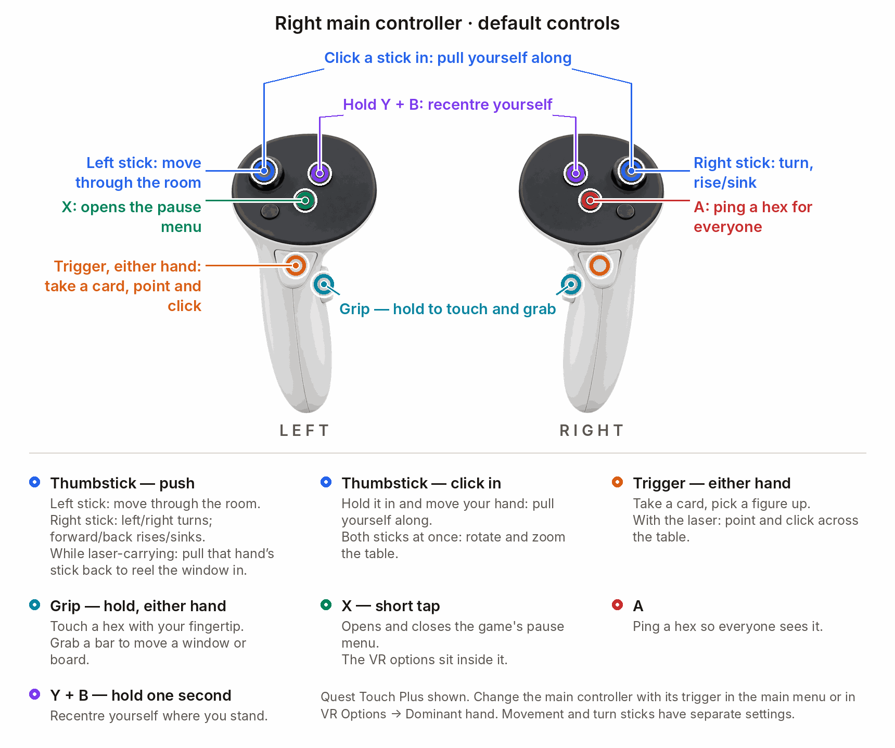
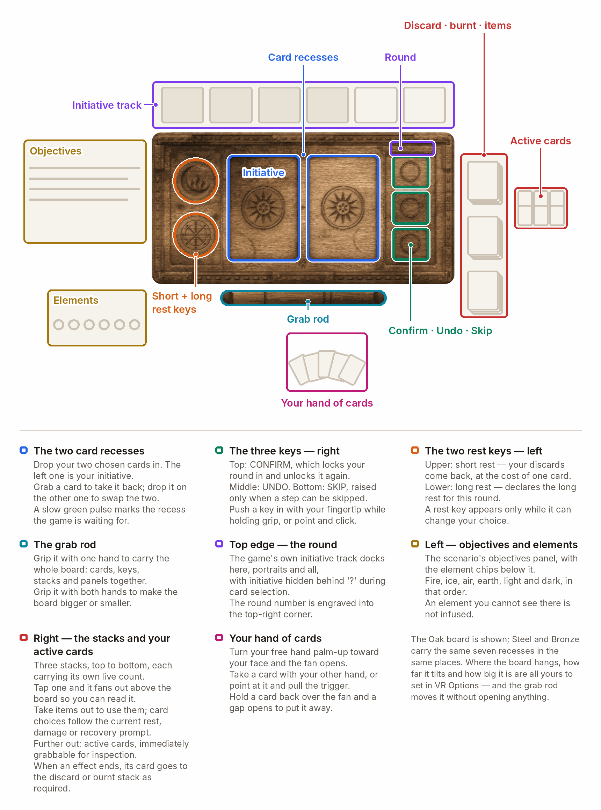

# GloomhavenVR — playing guide

  &nbsp;<b>English</b>
  &nbsp;&nbsp;|&nbsp;&nbsp;
  <a href="PLAYING.de.md">&nbsp;Deutsch</a>

Not installed yet? → [install guide](../INSTALL.md)

  

## The controls

  

**You do not have to learn this.** The tutorial turns your hands into the controller you are actually
holding and lights up the key for each of the fourteen controls, in the order they become useful.
Switch it off under **Comfort ▸ Hands & aiming**.

<table>
<tr><td>

**🎬 VIDEO PLACEHOLDER 1 of 4 — `tutorial.mp4` — this spot is still empty, nothing renders here yet.**

**What it has to show** (12 s): your hands turning into the controller you are actually
holding, and one key after another lighting up as each control becomes useful. Afterwards the reader
knows the fourteen bindings on the picture above are taught, not memorised.

**How you fill it:** record it, then **upload the mp4 in a GitHub issue or comment box** and send
the maintainer the `user-attachments` link it hands back. Paste that link over `PASTE_UUID_HERE` in
the ready-made markup directly below, then delete this box and the two comment markers around it.
The same clip goes into the same spot in `PLAYING.de.md`. **Do not commit the mp4** — a video served
from a repo path does not play on GitHub, which is why every committed clip was removed on
2026-09-07. Brief: [VIDEO-SHOTLIST.md](VIDEO-SHOTLIST.md) · cutting and encoding:
[img/README.md](img/README.md#encoding-a-new-clip).

</td></tr>
</table>

<!-- READY MARKUP for tutorial.mp4 — delete this line and the closing marker once the link is pasted in

  <video src="https://github.com/user-attachments/assets/PASTE_UUID_HERE" width="720" controls muted loop></video>

-->

Three more that the picture cannot show:

- **Resize a held figure** — hold it in one hand, pull the **other hand's trigger**, move your hands apart or together.
- **45° snap turning** instead of a smooth one — **Comfort ▸ Turning**.
- **Rise and sink** on the right stick — off by default, switch it on under **Comfort**.

  

## Your cards and your board

› **The board in motion** is on the front page: [Your cards and your board](../README.md#your-cards-and-your-board).

Turn your palm up and your hand **fans out in front of it**. Take a card with the trigger and drop
it into a slot on your control board — slot order is your initiative, exactly like the physical
game. Both cards in, press **CONFIRM**. On your turn, **poke the top or bottom half** of a played
card to choose which half you use.

The board beside you also carries undo, the short and long rest discs, skip, the decision drawer, a
recess for using items, and the discard, burnt and item piles — each opens as a fan you can read
above the board or in your palm.

  

  

## The board in front of you

› **Reaching into the board, and lifting a figure**, are on the front page: [The board in front of you](../README.md#the-board-in-front-of-you).

Point the laser and pull the trigger to pick a hex, an enemy, a door or a chest — or hold the
**grip** and touch it with a fingertip. The grip is required on purpose, so a hand that merely
sweeps across the board never selects anything.

**Pick a figure up** with the trigger to see its coming turn.

  

## Windows

<table>
<tr><td>

**🎬 VIDEO PLACEHOLDERS 2 and 3 of 4 — `windows.mp4` and `grab-rod.mp4` — this spot is still empty, nothing renders here yet.**

**What they have to show** (12 s and 8–10 s, side by side): a game window grabbed by its bar,
moved, resized, reeled closer with the stick while the laser holds it, then closed with its X — and
beside it the control board carried to a new place by the rod under it, once with the hand and once
with the laser from across the table. One idea, shown twice: everything in the room hangs from a rod.

**How you fill it:** record BOTH, then **upload each mp4 in a GitHub issue or comment box** and send
the maintainer the two `user-attachments` links it hands back. Paste them over `PASTE_WINDOWS_UUID`
and `PASTE_GRAB_ROD_UUID` in the ready-made markup directly below — they are a side-by-side pair, so
the markup is a two-cell table and each clip renders at half the column — then delete this box and
the two comment markers around it.
The same clip goes into the same spot in `PLAYING.de.md`. **Do not commit the mp4** — a video served
from a repo path does not play on GitHub, which is why every committed clip was removed on
2026-09-07. Brief: [VIDEO-SHOTLIST.md](VIDEO-SHOTLIST.md) · cutting and encoding:
[img/README.md](img/README.md#encoding-a-new-clip).

</td></tr>
</table>

<!-- READY MARKUP for windows.mp4 + grab-rod.mp4 — delete this line and the closing marker once the link is pasted in
<table>
<tr>
<td width="50%"><video src="https://github.com/user-attachments/assets/PASTE_WINDOWS_UUID" controls muted loop></video></td>
<td width="50%"><video src="https://github.com/user-attachments/assets/PASTE_GRAB_ROD_UUID" controls muted loop></video></td>
</tr>
</table>
-->

The game's windows — character sheets, the merchant, dialogs, the story — become **panels in the
room**. Grab the bar at the top to move one, resize it, or close it with its X, and reel it closer
and further with the stick while the laser holds it. Where you put one is where it stays.

  

## The campaign map

› **The map room in motion** is on the front page: [The campaign map on a table](../README.md#the-campaign-map-on-a-table).

Between scenarios the map is a **room with a table in it**. The guildmaster buttons are physical
caps on the table rim, point at a location to see its quest placard, and your party token walks the
route it travels. Prefer the original flat map? **World & sound ▸ Campaign map ▸ Original 2D map**.

  

## The room you play in

  
  

<table>
<tr><td>

**🎬 VIDEO PLACEHOLDER 4 of 4 — `environments.mp4` — this spot is still empty, nothing renders here yet.**

**What it has to show** (15 s): what the two stills above cannot — the rooms in motion.
Firelight and drips in the cellar, moonbeams and moving foliage in the forest, an element infusion
fading the room over, and the environment switched in the settings.

**How you fill it:** record it, then **upload the mp4 in a GitHub issue or comment box** and send
the maintainer the `user-attachments` link it hands back. Paste that link over `PASTE_UUID_HERE` in
the ready-made markup directly below, then delete this box and the two comment markers around it.
The same clip goes into the same spot in `PLAYING.de.md`. **Do not commit the mp4** — a video served
from a repo path does not play on GitHub, which is why every committed clip was removed on
2026-09-07. Brief: [VIDEO-SHOTLIST.md](VIDEO-SHOTLIST.md) · cutting and encoding:
[img/README.md](img/README.md#encoding-a-new-clip).

</td></tr>
</table>

<!-- READY MARKUP for environments.mp4 — delete this line and the closing marker once the link is pasted in

  <video src="https://github.com/user-attachments/assets/PASTE_UUID_HERE" width="720" controls muted loop></video>

-->

A candle-lit **cellar**, a **moonlit forest** under a real star catalogue, the game's own **Default**
look, or **Off (black)**. Both built rooms have firelight, drips, moonbeams and quiet spatial
ambience.

They also hide rare apparitions — a face at the barred window, someone in the dark of the stair
shaft, eyes that blink in the undergrowth. Never over the board, never two at once, and everyone in
a session sees the same one at the same moment. Dial or switch them off under **World ▸ Creepy**;
that choice is yours alone.

  

## Multiplayer

› **A session with three players** is on the front page: [Everyone at the same table](../README.md#everyone-at-the-same-table).

- **Everyone in a VR session must run the same version.** A mismatch is blocked with a dialog rather
  than allowed to go quietly wrong — [update together](../INSTALL.md#updating).
- **Players without the mod play with you normally.** Nothing the mod sends changes game state.
- **What others see of you:** your head and both hands with real finger poses, your mask and hand
  style, whatever you are holding (cards always as backs), your fan counts, and a live mirror of
  your control board.
- **What you share:** map windows (marked by a small badge in the corner), the story window on the
  same page for everyone, and one clock — so the same ambient sounds and the same apparitions
  happen at the same moment in the same place for everybody.
