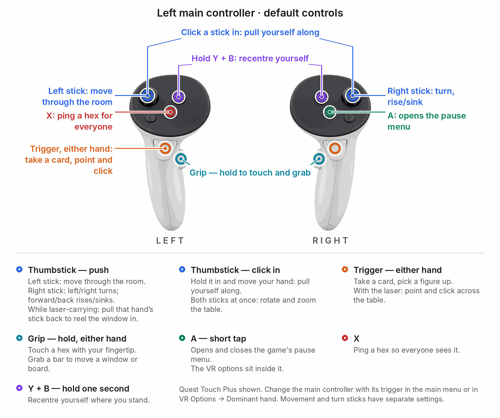

# GloomhavenVR — playing guide

  &nbsp;<b>English</b>
  &nbsp;&nbsp;|&nbsp;&nbsp;
  <a href="PLAYING.de.md">&nbsp;Deutsch</a>

[Install guide](../INSTALL.md) · [Controls](#the-controls) · [Round flow](#cards-and-the-control-board)

## The controls

  

<b>Left main controller — show button map</b>

  

**Choose your main controller:** press that controller's **trigger in the main menu**, or use
**VR Options ▸ Comfort ▸ Hands & aiming ▸ Dominant hand**. The laser moves to that hand;
the card fan moves to the other. **A and X swap their pause/ping functions.** The default flight
and turning sticks stay left and right respectively; configure those separately under **Comfort**.

- **Resize a held figure:** hold the other hand's trigger and move your hands apart or together.
- **45° snap turns:** enable under **Comfort ▸ Turning**.
- **Rise/sink:** push the right stick forward/back (on by default); change under **Comfort ▸ Locomotion**.

The interactive tutorial highlights each control on your controllers. Toggle it under
**Comfort ▸ Hands & aiming**.

## Cards and the control board

**Left recess = initiative.** Put your initiative card on the left and the second card on the right.

  

| Phase | What to do |
|---|---|
| **Selection** | Turn your palm up to open the fan. Take two cards with the trigger and place them in the board slots; the left slot sets initiative. Press **Confirm**. Click portraits in the initiative order to select the cards for each character you control. |
| **Action** | On your character's turn, select the top or bottom card action, choose targets and use available items. Resolve decisions and end the turn on the board. |
| **Inspect characters** | During selection, switch between characters you control. During the action phase, click **any character** in the initiative order to inspect their cards, items and decisions, including other players' characters and characters whose turn it is not. Actions remain limited to characters you control and the current game rules. |

**Sort your hand:** lift a card, hold it over the desired gap in your fan and release. This works
for your own characters on the campaign map and in both scenario phases; the order carries into
the scenario and other players see it. Long-rest discard choices cannot be reordered.

The board **follows you by default**; use its **Follow/Fixed** control to change that. Hold
**Y + B** to recenter yourself and reset the board beside you. Other players' boards become
transparent by default while covering the scenario. Existing saved settings remain in effect.

The **discard**, **burnt** and **item** piles open as fans. The board also holds **active cards**,
**Undo**, **Skip**, rest buttons and the decision area.

[Watch: cards and control board](../README.md#cards-the-control-board-and-the-table)

## The scenario board

Select a hex, enemy, door or chest with the **laser + trigger**, or hold **grip** and touch it with
a fingertip. Pick up a figure with the trigger to inspect its stats and planned turn.
Use both hands to grab, move, turn and scale the scenario.

## Windows

Move a window by grabbing its top bar directly or with the laser. While holding it with the laser,
use **that hand's stick** to move it closer or farther away. Grip the bar with both hands to resize
the window; use its **X** to close it.

| Mark on the window | Who sees it? |
|---|---|
|  **Shared** (pulses blue in game) | Everyone. Shared windows and story pages stay synchronized. The symbol sits at the top right, below the close **X** when present. |
| **No symbol: local** | Only you. |

## The campaign map

[Watch: campaign map](../README.md#the-campaign-map)

Point at a location to show its quest placard. Guildmaster buttons sit on the table rim.
For the original flat map, enable **World & sound ▸ Campaign map ▸ Original 2D map**.

## Environments

  
  

Choose **Cellar**, **Night forest**, the game's **Default** sky, **Off (black)** or **Mixed reality**
in VR Options. Elements affect the room's lighting and scenery.
Rare ambient apparitions can be reduced or disabled under **World & sound ▸ Creepy**.

## Multiplayer

[Watch: VR multiplayer](../README.md#full-vr-multiplayer)

- VR players need the same mod version; [update together](../INSTALL.md#updating).
  Players without the mod can join on a flat screen.
- Other players see your hands, mask, held objects and a live copy of your control board.
  In scenarios, remote fans, held cards and placed cards are **covered during selection** and
  **open during the action phase**. Remote short-rest burn flights stay covered.
- **Your own cards remain visible.** In the **3D campaign map**, all cards are visible to everyone.
