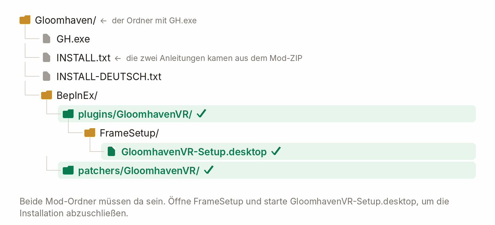

# GloomhavenVR — Installation auf Steam Frame

<p align="center">
  <a href="INSTALL-STEAM-FRAME.md">&nbsp;English</a>
  &nbsp;&nbsp;|&nbsp;&nbsp;
  &nbsp;<b>Deutsch</b>
</p>

<p align="center">
  
</p>

Mit dieser Anleitung installierst du GloomhavenVR **direkt auf der Steam Frame**. Läuft Gloomhaven
auf einem Windows-PC und wird zum Headset gestreamt, nutze die
[PC-VR-Installationsanleitung](INSTALL.de.md).

Du brauchst Gloomhaven aus Steam auf der Frame, zwei getrackte Controller mit Thumbsticks und
zwei Downloads:
**BepInEx 5.4.23.5 für Windows x64** und das **aktuelle GloomhavenVR-Release-ZIP**. Gloomhaven
läuft auf der Frame als Windows-Spiel über Proton. Deshalb ist das Windows-Archiv von BepInEx
das richtige.

## 1. Desktop öffnen und Gloomhaven finden

Öffne in der unteren Leiste der Frame den Starter **+** und wähle **Desktop**. Öffne den
Dateimanager **Dolphin**. Falls versteckte Ordner fehlen, wähle in dessen Menü **Show Hidden
Files** oder drücke **Strg+H**. Die beiden Ansichten unten zeigen diese Schritte nacheinander.

<p align="center">
  
</p>

Öffne in Dolphin den Ordner, in dem `GH.exe` liegt. In der Standard-Steam-Bibliothek ist das:

```text
/home/steamos/.local/share/Steam/steamapps/common/Gloomhaven
```

Die Screenshots zeigen den gleichwertigen Pfad `.steam/steam`. Verwendest du eine andere
Steam-Bibliothek, findest du den Ordner in Steam über **Gloomhaven → Verwalten → Lokale Dateien
durchsuchen**. Lass dieses Gloomhaven-Fenster offen: Beide ZIP-Archive gehören in genau
diesen Ordner.
Die Screenshots zeigen eine erneute Installation; deshalb sind schon vor dem Kopieren einige
Dateien vorhanden.

## 2. Archive herunterladen und öffnen

Lade in Chromium oder einem anderen Browser auf der Frame diese Dateien herunter:

1. **`BepInEx_win_x64_5.4.23.5.zip`** vom
   [BepInEx-Release 5.4.23.5](https://github.com/BepInEx/BepInEx/releases/tag/v5.4.23.5).
2. **`GloomhavenVR-<version>.zip`** vom
   [aktuellen GloomhavenVR-Release](https://github.com/McFredward/GloomhavenVR/releases/latest).

Die Dateien sollten unter **Downloads** liegen. Öffne das BepInEx-ZIP in Dolphin. Falls die
Frame nach einer App fragt, wähle wie im Bild **Dolphin**.

<p align="center">
  
</p>

## 3. BepInEx in den Spielordner kopieren

Markiere im geöffneten BepInEx-ZIP **den gesamten Inhalt** (`Strg+A`). Mit Controllern kannst
du in Dolphins Menü **Select Files and Folders** wählen und jeden Eintrag markieren. Wähle
im Kontextmenü **Copy**, wechsle zum Gloomhaven-Fenster mit `GH.exe` und wähle an einer
freien Stelle des Ordners **Paste**. Das obere Bild zeigt **Copy**, das untere **Paste**.

<p align="center">
  
</p>

Danach liegen `BepInEx/` und `winhttp.dll` neben `GH.exe`. Kopiere den **Inhalt** des Archivs,
nicht die ZIP-Datei oder einen zusätzlichen umschließenden Ordner.

## 4. Mod in denselben Ordner kopieren

Öffne `GloomhavenVR-<version>.zip` in Dolphin. Markiere die drei enthaltenen Einträge —
`BepInEx/`, `INSTALL.txt` und `INSTALL-DEUTSCH.txt` — und kopiere sie. Füge sie in
**denselben Gloomhaven-Ordner** ein. Falls Dolphin fragt, führe die `BepInEx`-Ordner
zusammen und überschreibe ältere Mod-Dateien.

<p align="center">
  
</p>

Prüfe das Ergebnis, bevor du das Setup startest. Die grünen Pfade in der Grafik zeigen
die beiden Mod-Ordner und die Setup-Datei für den nächsten Schritt.

<p align="center">
  
</p>

## 5. Frame-Setup ausführen

Öffne im Gloomhaven-Ordner `BepInEx/plugins/GloomhavenVR/FrameSetup/` und doppelklicke auf
**`GloomhavenVR-Setup.desktop`**. Wähle **Execute**, falls Dolphin nachfragt. Im Bild ist die
Datei in ihrem Ordner markiert.

<p align="center">
  
</p>

Das Setup richtet BepInEx für das ursprüngliche Steam-Spiel ein und fügt einen separaten
Eintrag **GloomhavenVR** mit Bildern zur VR-Bibliothek hinzu. Steam startet eventuell neu,
damit der Eintrag erscheint. Der ursprüngliche Eintrag **Gloomhaven** bleibt für Flat-Spiel
verfügbar; beide verwenden dieselbe Spielinstallation und dieselben Spielstände. Falls du
noch keine VR-Auflösung gewählt hast, schlägt das Setup zudem 3408 Pixel pro Auge in
SteamVR vor. Starte SteamVR neu, wenn die neue Einstellung nicht sofort wirkt.

Bietet Dolphin kein **Execute** an oder findet das Setup eine andere Steam-Bibliothek nicht,
öffne im Gloomhaven-Ordner ein Terminal und gib ein:

```bash
bash ./BepInEx/plugins/GloomhavenVR/FrameSetup/install-steam-frame.sh --game-path .
```

## 6. Spiel starten

Kehre zur Spielebibliothek der Frame zurück und starte **GloomhavenVR**. Du solltest das VR-Menü
sehen und am Tisch stehen. Für Flat-Spiel kannst du den ursprünglichen Eintrag **Gloomhaven**
starten.

Deine Spielstände und deine Kampagne bleiben erhalten. Vor der Änderung von
`GH_Data/boot.config` sichert das Setup die Datei als
`GH_Data/boot.config.gloomhavenvr-backup`.

## Grafikeinstellungen

In **VR-Optionen → Grafik** haben Gras, Bäume/Büsche und andere Szenario-Dekoration
eigene Prozentregler. Neue Frame-Profile beginnen mit 0%, PC mit 100%. Alle drei
auf 100% stellen die ursprünglichen Details wieder her.

**Detail der Spielfiguren (%)** und **Detail der Gegnerfiguren (%)** wählen bei kleineren
Werten gröbere Original-Meshes. **Figurenkleidung simulieren** steuert zusätzliche
Stoffphysik. **Sparsame Szenario-Erzeugung** wirkt ab dem nächsten Szenarioladen.
Frame beginnt mit weniger Figurendetails, ausgeschalteter Stoffsimulation und sparsamer
Erzeugung. Alle Regler funktionieren auch auf PC; gespeicherte Werte bleiben erhalten.

## Updates

Wenn ein neueres Release verfügbar ist, bietet das VR-Hauptmenü ein Update an. Du kannst auch
das neue Release-ZIP in denselben Gloomhaven-Ordner entpacken und `BepInEx` erneut
zusammenführen. Im Mehrspieler brauchen alle VR-Spieler denselben Mod-Build.

## Fehlersuche

| Was du siehst | Was du machst |
|---|---|
| GloomhavenVR fehlt in Steam | Starte `GloomhavenVR-Setup.desktop` erneut. Steam muss eventuell neu starten. |
| Dolphin bietet kein **Execute** an | Nutze den Terminal-Befehl aus Schritt 5. |
| Die Mod wird nicht geladen | Prüfe die beiden grünen Mod-Ordner in der Grafik und starte das Setup erneut. |
| GloomhavenVR startet flat oder schließt sich | Bewahre `BepInEx/LogOutput.log` dieses Starts auf und melde das Problem. |
| Das Spiel startet gar nicht mehr | Stelle `GH_Data/boot.config` aus `GH_Data/boot.config.gloomhavenvr-backup` wieder her. |

Bewahre bei einem Setup-Problem
`BepInEx/plugins/GloomhavenVR/FrameSetup/steam-frame-setup.log` auf. Bei einem Problem im
Spiel bewahre `BepInEx/LogOutput.log` vom betroffenen Durchlauf auf und beschreibe, was du
gerade gemacht hast.

## Deinstallieren

Entferne die Verknüpfung **GloomhavenVR** aus Steam. Lösche
`/home/steamos/.local/share/GloomhavenVR/`, `BepInEx/plugins/GloomhavenVR/` und
`BepInEx/patchers/GloomhavenVR/`. Stelle `GH_Data/boot.config` aus
`boot.config.gloomhavenvr-backup` wieder her, falls das Backup vorhanden ist. Entfernst du
auch BepInEx, lösche dessen `WINEDLLOVERRIDES`-Startoption aus den Steam-Eigenschaften des
Originalspiels.
