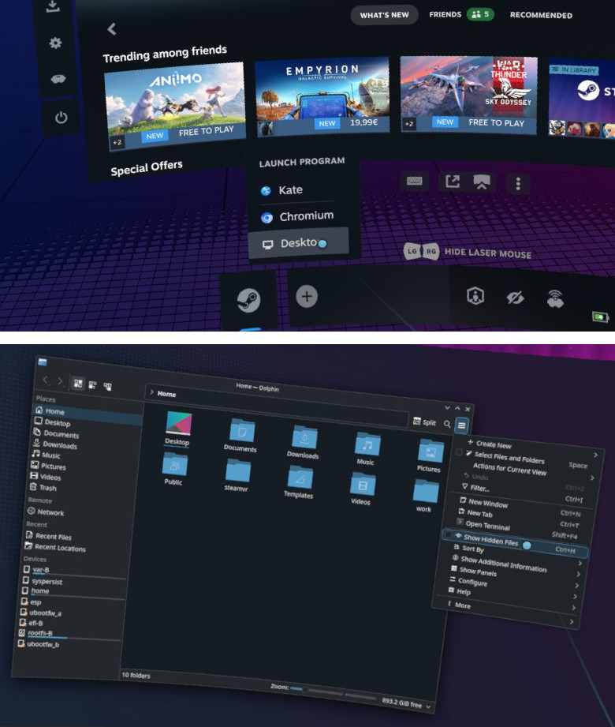
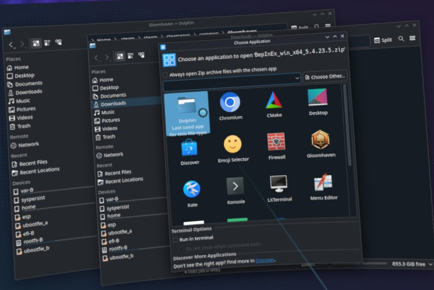
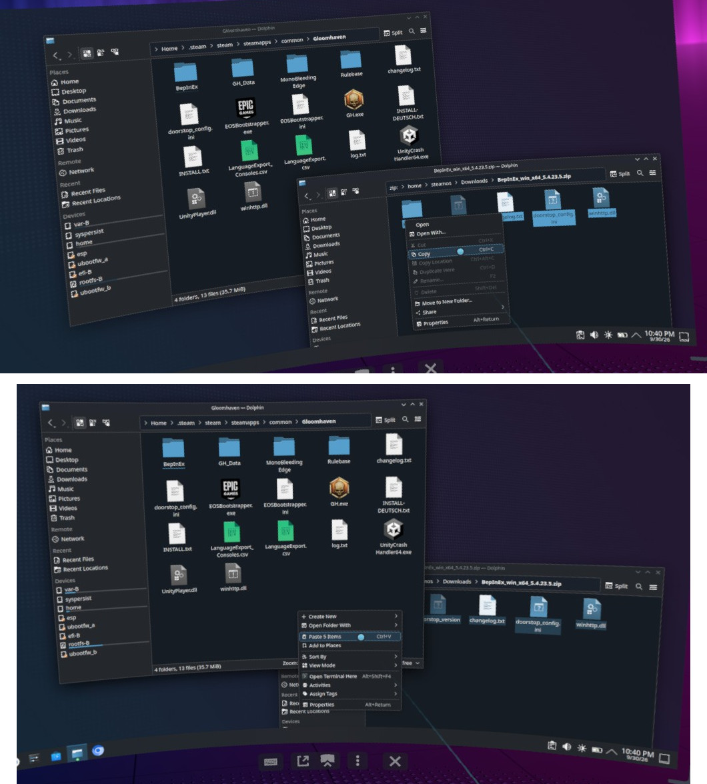
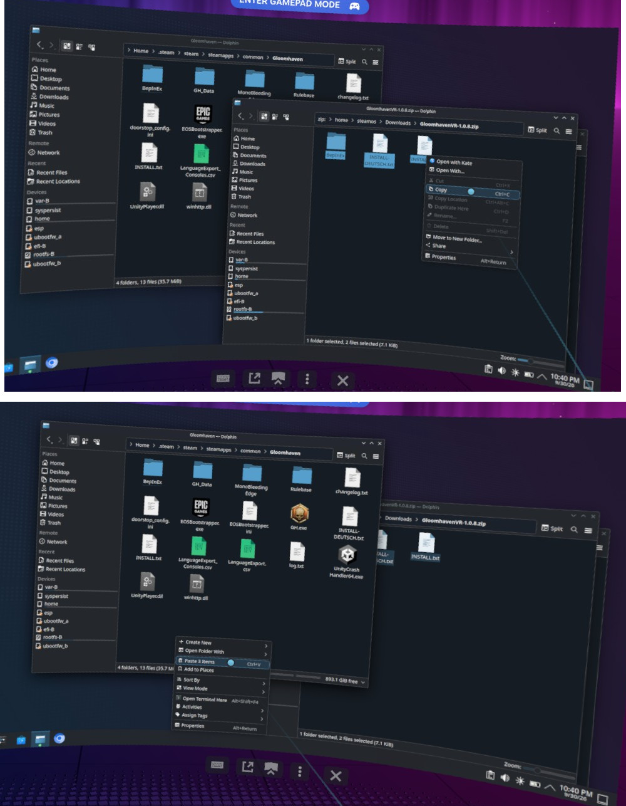
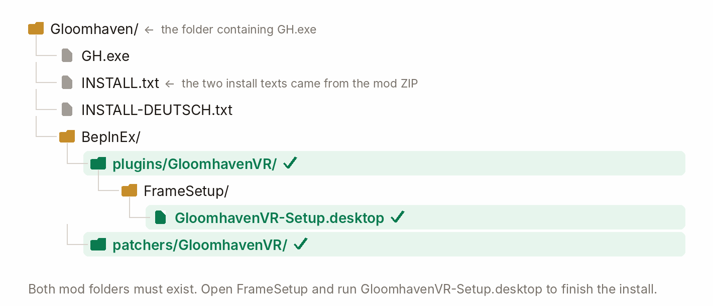
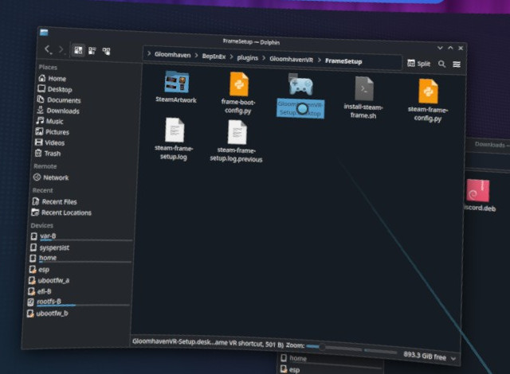

# GloomhavenVR — Steam Frame install guide

<p align="center">
  &nbsp;<b>English</b>
  &nbsp;&nbsp;|&nbsp;&nbsp;
  <a href="INSTALL-STEAM-FRAME.de.md">&nbsp;Deutsch</a>
</p>

<p align="center">
  
</p>

This guide installs GloomhavenVR **directly on the Steam Frame**. If Gloomhaven runs on a Windows
PC and streams to your headset, use the [PC VR install guide](INSTALL.md).

You need Gloomhaven installed from Steam on the Frame, two tracked controllers with thumbsticks,
and two downloads:
**BepInEx 5.4.23.5 for Windows x64** and the **latest GloomhavenVR release ZIP**. Gloomhaven is a
Windows game running through Proton on the Frame, so the Windows BepInEx archive is the right one.

## 1. Open Desktop and find Gloomhaven

On the Frame's bottom bar, open the **+** launcher and choose **Desktop**. Open **Dolphin**, the
file manager. If hidden folders are not visible, open Dolphin's menu and choose **Show Hidden
Files**, or press **Ctrl+H**. The two views below show those actions in order.

<p align="center">
  
</p>

In Dolphin, open the folder containing `GH.exe`. In the default Steam library it is:

```text
/home/steamos/.local/share/Steam/steamapps/common/Gloomhaven
```

The screenshots show the equivalent `.steam/steam` path. If you use another Steam library, find
the folder through **Gloomhaven → Manage → Browse local files** in Steam. Keep this Gloomhaven
window open; both ZIP archives go into this same folder.
The screenshots were taken during a reinstall, so some files are already present before copying.

## 2. Download and open the archives

In Chromium or another browser on the Frame, download:

1. **`BepInEx_win_x64_5.4.23.5.zip`** from the
   [BepInEx 5.4.23.5 release](https://github.com/BepInEx/BepInEx/releases/tag/v5.4.23.5).
2. **`GloomhavenVR-<version>.zip`** from the
   [latest GloomhavenVR release](https://github.com/McFredward/GloomhavenVR/releases/latest).

The files should appear in **Downloads**. Open the BepInEx ZIP in Dolphin. If the Frame asks
which app should open it, choose **Dolphin**, as shown here.

<p align="center">
  
</p>

## 3. Copy BepInEx into the game

In the open BepInEx ZIP, select **everything inside the archive** (`Ctrl+A`). With controllers,
you can use Dolphin's **Select Files and Folders** menu and select each item. Choose **Copy**
from the context menu, switch to the Gloomhaven window with `GH.exe`, then choose **Paste**
in an empty part of that folder. The upper image shows **Copy**; the lower one shows **Paste**.

<p align="center">
  
</p>

The result includes `BepInEx/` and `winhttp.dll` beside `GH.exe`. Copy the archive's **contents**,
not the ZIP file or an extra enclosing folder.

## 4. Copy the mod into the same folder

Open `GloomhavenVR-<version>.zip` in Dolphin. Select its three items — `BepInEx/`,
`INSTALL.txt`, and `INSTALL-DEUTSCH.txt` — and copy them. Paste them into the **same Gloomhaven
folder**. If Dolphin asks, merge the `BepInEx` folders and overwrite older mod files.

<p align="center">
  
</p>

Check the result before running setup. The green paths in this diagram are the two mod folders
and the setup file you need next.

<p align="center">
  
</p>

## 5. Run the Frame setup

In the Gloomhaven folder, open `BepInEx/plugins/GloomhavenVR/FrameSetup/` and double-click
**`GloomhavenVR-Setup.desktop`**. Choose **Execute** if Dolphin asks. The screenshot shows the
file selected in its folder.

<p align="center">
  
</p>

The setup configures BepInEx for the original Steam game and adds a separate **GloomhavenVR**
entry with artwork to the VR library. Steam may restart to show the new entry. The original
**Gloomhaven** entry remains available for flat play; both entries use the same installed game
and saves. The setup also suggests a 3408-pixel per-eye SteamVR resolution if you have not
chosen one already. Restart SteamVR if that new setting does not take effect at once.

If Dolphin offers no **Execute** option or setup cannot find a different Steam library, open a
terminal in the Gloomhaven folder and run:

```bash
bash ./BepInEx/plugins/GloomhavenVR/FrameSetup/install-steam-frame.sh --game-path .
```

## 6. Start the game

Return to the Frame's game library and launch **GloomhavenVR**. You should see the VR menu and
stand at the table. You can launch the original **Gloomhaven** entry for flat play.

Your saves and campaign remain in place. Before changing `GH_Data/boot.config`, the setup
backs it up as `GH_Data/boot.config.gloomhavenvr-backup`.

## Graphics settings

In **VR Options → Graphics**, grass, trees/bushes and other scenario decoration have
separate percentage controls. Fresh standalone Frame profiles start at 0%; PC starts
at 100%. Set all three to 100% for the original detail.

**Player figure detail (%)** and **Enemy figure detail (%)** select coarser original
meshes at lower values. **Simulate figure clothing** controls additional cloth physics.
**Reduced scenario generation** takes effect when you next load a scenario. Frame starts
with lower figure detail, clothing simulation off and reduced generation on. All controls
also work on PC; saved choices are retained.

## Updating

When a newer release is available, the VR main menu offers an update. You can also extract the
new release ZIP into the same Gloomhaven folder and merge `BepInEx` again. All VR players in a
multiplayer session need the same mod build.

## Troubleshooting

| What you see | What to do |
|---|---|
| GloomhavenVR is missing from Steam | Run `GloomhavenVR-Setup.desktop` again. Steam may need to restart. |
| Dolphin does not offer **Execute** | Use the terminal command in step 5. |
| The mod does not load | Check the two green mod folders in the diagram, then run setup again. |
| GloomhavenVR starts flat or closes | Keep `BepInEx/LogOutput.log` from that launch and report the problem. |
| The game no longer starts | Restore `GH_Data/boot.config` from `GH_Data/boot.config.gloomhavenvr-backup`. |

For a setup problem, keep `BepInEx/plugins/GloomhavenVR/FrameSetup/steam-frame-setup.log`.
For an in-game problem, keep `BepInEx/LogOutput.log` from the affected run and describe what
you were doing.

## Uninstall

Remove the **GloomhavenVR** shortcut from Steam. Delete
`/home/steamos/.local/share/GloomhavenVR/`, `BepInEx/plugins/GloomhavenVR/`, and
`BepInEx/patchers/GloomhavenVR/`. Restore `GH_Data/boot.config` from
`boot.config.gloomhavenvr-backup` if that backup exists. If you also remove BepInEx, remove
its `WINEDLLOVERRIDES` launch option from the original game's Steam properties.
