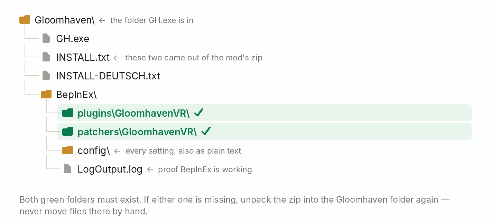

# GloomhavenVR — install guide

  &nbsp;<b>English</b>
  &nbsp;&nbsp;|&nbsp;&nbsp;
  <a href="INSTALL.de.md">&nbsp;Deutsch</a>

  

## What you need

| | |
|---|---|
| **Game** | Gloomhaven (digital) — Steam, GOG or Epic Games Store; tested with 1.1.8307.0 |
| **VR setup** | Windows PC VR; a headset and two tracked controllers with thumbsticks |
| **Loader** | BepInEx 5.4.23.5 (x64) — step 1 installs it, once |

> The game runs on your Windows PC and streams or tethers to your headset. For local play on
> Steam Frame, use the separate [Steam Frame install guide](INSTALL-STEAM-FRAME.md).

  

## 1. Install BepInEx

1. Download **`BepInEx_win_x64_5.4.23.5.zip`** from the
   [BepInEx release page](https://github.com/BepInEx/BepInEx/releases/tag/v5.4.23.5).
2. Extract it into your **Gloomhaven folder** — the one with `GH.exe` in it.
   *(Steam: right-click the game → Manage → Browse local files.)*
3. Start the game once, then quit. Check that `BepInEx/LogOutput.log` exists.

  

## 2. Install the mod

Get **`GloomhavenVR-<version>.zip`** from the
[releases page](https://github.com/McFredward/GloomhavenVR/releases) and extract it into the **same**
folder, letting Windows merge `BepInEx/`. Then check these two folders exist:

  

  

## 3. Set your OpenXR runtime

Only one **OpenXR runtime** can be active at a time, and it has to be yours *before* you start the
game. Set it in whichever app you stream with:

- **Virtual Desktop** — pick **VDXR** in the Virtual Desktop streamer settings.
- **Quest Link / Air Link** — Meta Quest Link app → Settings → General → OpenXR Runtime → *Set as active*.
- **Steam Link / SteamVR** — SteamVR Settings → OpenXR → *Set SteamVR as OpenXR runtime*.

  

## 4. Start the game

Put the headset on and launch the game the way you normally do. You should be standing at the table.

> **The game may close and reopen once when the mod enables its rendering settings.**
> This is expected, usually on the first installation; it does not happen on every update.

Your saves, your campaign and your settings are not touched.

The mod changes the rendering settings in `GH_Data/boot.config` and keeps the original beside it as
`boot.config.gloomhavenvr-backup`. If the game ever refuses to start, copy that back over
`boot.config`.

  

## Updating

The mod checks for updates once per session in the VR main menu. If a newer release is available,
choose **Ignore** or **Update** in the update panel.

Press Update and it downloads the release archive, swaps the files, closes the game and starts it again.
**Your saves, your campaign and your settings are not touched.**

- **If the download or validation fails, installed files are unchanged.**
  The panel reports the error; install by hand instead.
- **The old version is kept** in `BepInEx/GloomhavenVR-update/backup/` until the new one has started
  successfully. While that backup exists, you can copy those two folders back to restore it.
- **All VR players in a multiplayer session need the same mod build.** A dialog blocks mismatched versions.
  Update together.

  

## Settings

You can change everything from inside the headset. Open the separate **VR Options** entry from the
main menu or pause menu. Changes apply straight away and are saved for you.

| Tab | What is in it |
|---|---|
| **Comfort** | Turning, locomotion, world grab and zoom, hands, aiming |
| **Picture** | Presentation, windows & panels, mixed reality, the desktop monitor |
| **Board & cards** | Control board, figures, cards, piles & hints |
| **Panels** | Panels & readouts, health bars, the 2D screen, pointing, text entry |
| **Avatar & multiplayer** | Your hand style and head mask, and playing together |
| **World & sound** | Environment, the apparitions, sound, visibility, the campaign map |
| **Advanced** | The deep twin of all of the above, plus every single setting |

The mod's text follows the game's language: **English and German**; anything else falls back to
English.

To disable the VR mod, set `[General] Enabled = false` in
`BepInEx/config/dev.gloomhavenvr.cfg`. Settings are also stored in the mod’s files under
`BepInEx/config/`.

  

## Troubleshooting

| What you see | What to do |
|---|---|
| Headset black, or the game runs flat on the monitor | Check step 3. Then add `-force-d3d11` to the game's launch options |
| "VR could not start, something is missing" | Part of the zip did not land. Unpack it into the Gloomhaven folder again |
| The wrong runtime is picked, or none is | Set `[General] RuntimeOverride` to your runtime's JSON file, e.g. `…\SteamVR\steamxr_win64.json` |
| The game will not start at all | Copy `GH_Data/boot.config.gloomhavenvr-backup` over `GH_Data/boot.config` |
| An update left the mod broken | Copy the two folders out of `BepInEx/GloomhavenVR-update/backup/` back over the installed ones |

To report a problem, include `BepInEx/LogOutput.log`, what you were doing, your headset and
streaming app. Keep the log from the affected run. For a repeatable issue, set
`[General] LogLevel = Debug` and reproduce it for a more detailed log.

  

## Uninstall

Delete `BepInEx/plugins/GloomhavenVR/` and `BepInEx/patchers/GloomhavenVR/`, plus
`BepInEx/GloomhavenVR-update/` if it is there. Restore `GH_Data/boot.config` from
`boot.config.gloomhavenvr-backup` to undo the rendering change. Deleting all of `BepInEx/` removes
the loader too.

These are optional and do nothing without the mod: `GH_Data/Plugins/x86_64/UnityOpenXR.dll`,
`GH_Data/Plugins/x86_64/openxr_loader.dll`, `GH_Data/UnitySubsystems/UnityOpenXR/`.

  

A short version of this page ships inside the release zip as `INSTALL.txt`.
